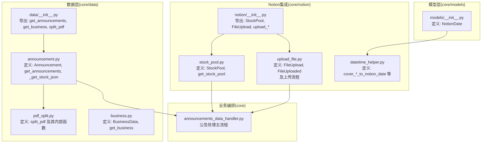
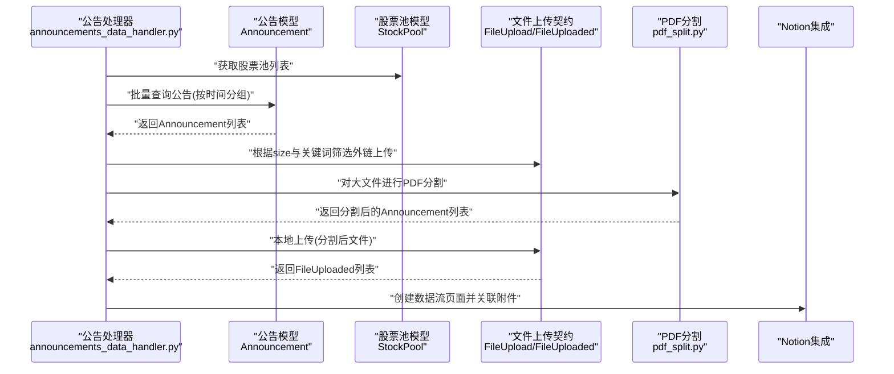
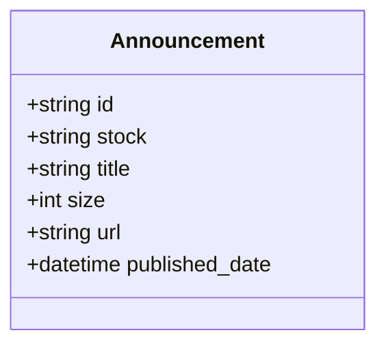
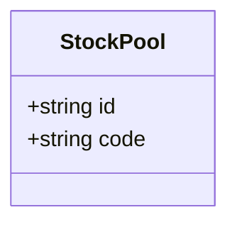
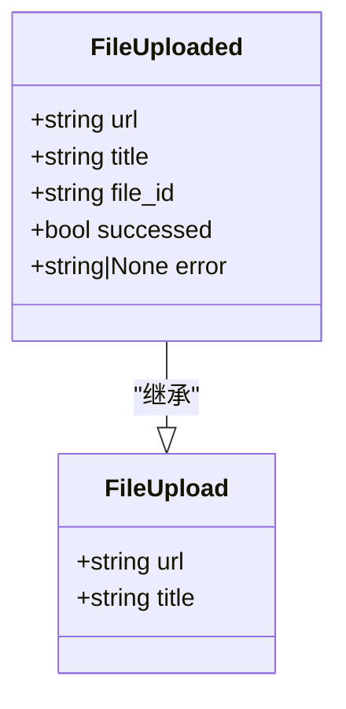
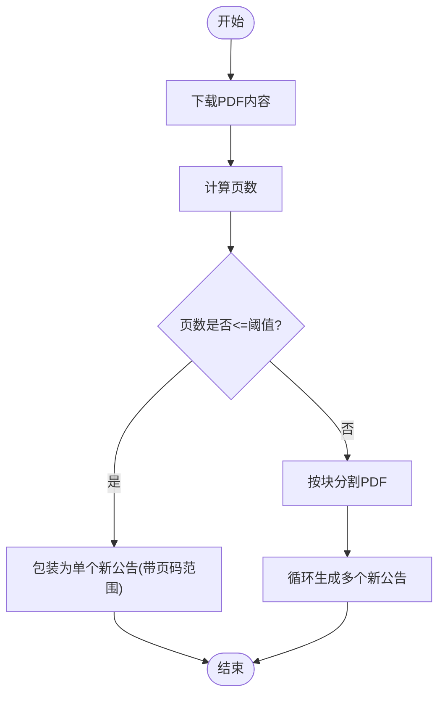
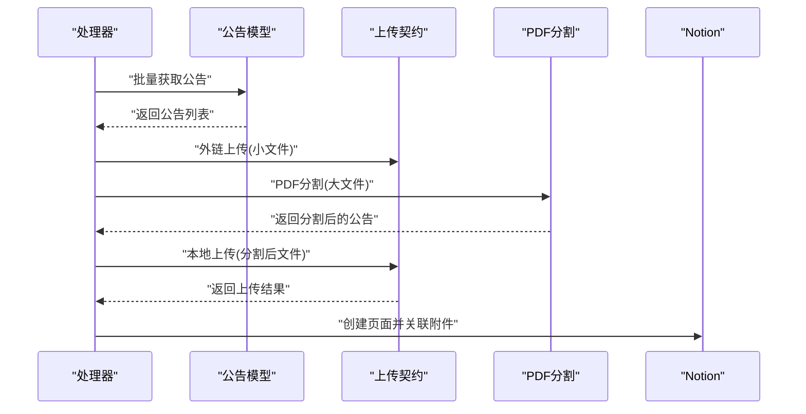
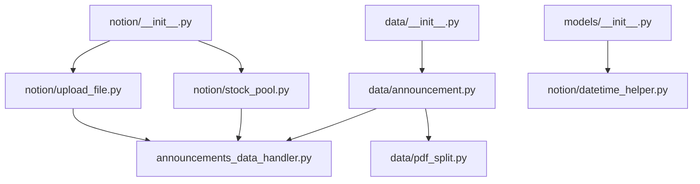

# 数据模型定义

<cite>
**本文引用的文件**
- [core/data/announcement.py](file://core/data/announcement.py)
- [core/data/pdf_split.py](file://core/data/pdf_split.py)
- [core/data/business.py](file://core/data/business.py)
- [core/data/__init__.py](file://core/data/__init__.py)
- [core/models/__init__.py](file://core/models/__init__.py)
- [core/notion/stock_pool.py](file://core/notion/stock_pool.py)
- [core/notion/upload_file.py](file://core/notion/upload_file.py)
- [core/notion/__init__.py](file://core/notion/__init__.py)
- [core/announcements_data_handler.py](file://core/announcements_data_handler.py)
- [core/notion/datetime_helper.py](file://core/notion/datetime_helper.py)
</cite>

## 目录
1. [简介](#简介)
2. [项目结构](#项目结构)
3. [核心组件](#核心组件)
4. [架构总览](#架构总览)
5. [详细组件分析](#详细组件分析)
6. [依赖关系分析](#依赖关系分析)
7. [性能考量](#性能考量)
8. [故障排查指南](#故障排查指南)
9. [结论](#结论)
10. [附录](#附录)

## 简介
本文件聚焦于数据模型定义模块，系统性阐述以下核心数据结构与流程：
- Announcement：公告信息的数据模型，用于承载公告的标识、股票关联、标题、文件大小、下载地址与发布时间等关键字段。
- StockPool：股票池的数据模型，用于描述股票在数据源中的唯一标识与其代码。
- FileUpload/FileUploaded：文件上传的数据契约，用于描述待上传文件与上传结果的结构化信息。

文档将结合实际代码路径，说明字段设计、类型注解、序列化/反序列化思路、模型间关系与依赖、在公告处理、股票池管理与文件上传中的具体应用，并给出最佳实践与排障建议。

## 项目结构
数据模型相关代码主要分布在以下位置：
- core/data：公告、业务、PDF分割等数据层模型与工具
- core/models：类型别名与通用类型定义
- core/notion：Notion集成（股票池、文件上传、内容构建等）
- core/announcements_data_handler：公告数据处理主流程，串联数据模型与Notion集成

图表来源
- [core/data/announcement.py](file://core/data/announcement.py#L12-L141)
- [core/data/pdf_split.py](file://core/data/pdf_split.py#L15-L128)
- [core/data/business.py](file://core/data/business.py#L16-L96)
- [core/data/__init__.py](file://core/data/__init__.py#L1-L6)
- [core/models/__init__.py](file://core/models/__init__.py#L1-L8)
- [core/notion/stock_pool.py](file://core/notion/stock_pool.py#L10-L52)
- [core/notion/upload_file.py](file://core/notion/upload_file.py#L17-L180)
- [core/notion/__init__.py](file://core/notion/__init__.py#L1-L23)
- [core/announcements_data_handler.py](file://core/announcements_data_handler.py#L21-L116)
- [core/notion/datetime_helper.py](file://core/notion/datetime_helper.py#L12-L38)

章节来源
- [core/data/__init__.py](file://core/data/__init__.py#L1-L6)
- [core/notion/__init__.py](file://core/notion/__init__.py#L1-L23)

## 核心组件
本节对三个核心数据模型进行深入解析，包括字段定义、类型注解、验证规则、序列化/反序列化思路与使用场景。

- Announcement（公告模型）
  - 字段与类型
    - id: str（公告唯一标识）
    - stock: str（股票代码或名称）
    - title: str（公告标题）
    - size: int（文件大小，单位KB）
    - url: str（下载链接）
    - published_date: datetime（发布时间）
  - 设计理念
    - 使用命名元组确保不可变性与轻量结构，便于跨模块传递与缓存。
    - 字段覆盖公告处理所需的关键信息，便于后续在Notion中建立关系与索引。
  - 验证规则
    - 通过调用方约束：如在获取公告时会过滤特定标题类型；在上传前按size阈值分流。
  - 序列化/反序列化
    - 作为数据传输载体，通常通过构造函数直接实例化；在需要持久化时可转为字典或JSON（由上层逻辑决定）。
  - 使用示例（路径）
    - 构造与使用：[Announcement构造与字段赋值](file://core/data/announcement.py#L101-L111)
    - 过滤与清洗：[标题过滤与URL拼接](file://core/data/announcement.py#L95-L111)

- StockPool（股票池模型）
  - 字段与类型
    - id: str（股票在数据源中的唯一标识）
    - code: str（股票代码）
  - 设计理念
    - 精简结构，便于从数据源查询后快速映射为对象列表。
  - 验证规则
    - 通过环境变量读取数据源ID，若为空则返回空列表；异常统一记录日志并向上抛出。
  - 序列化/反序列化
    - 通过属性访问与zip组合生成列表，适合在流程中直接消费。
  - 使用示例（路径）
    - 从数据源查询并构造：[get_stock_pool与StockPool构造](file://core/notion/stock_pool.py#L33-L48)

- FileUpload / FileUploaded（文件上传契约）
  - 字段与类型
    - FileUpload：url: str, title: str
    - FileUploaded：在FileUpload基础上扩展 file_id: str, successed: bool, error: str | None
  - 设计理念
    - TypedDict定义契约，明确上传前后字段差异；继承扩展体现“上传完成”后的结果态。
  - 验证规则
    - 上传流程中通过轮询状态判断成功/失败；失败时记录错误信息。
  - 序列化/反序列化
    - 通过字典解包（**file_info）与字段合并，形成最终结果对象。
  - 使用示例（路径）
    - 本地文件上传与轮询：[_upload_internal_and_wait与轮询](file://core/notion/upload_file.py#L64-L96)
    - 外链上传与轮询：[_upload_external_and_wait与轮询](file://core/notion/upload_file.py#L124-L150)
    - 结果聚合与统计：[upload_files_with_local与upload_files_with_url](file://core/notion/upload_file.py#L28-L61)

章节来源
- [core/data/announcement.py](file://core/data/announcement.py#L12-L34)
- [core/data/announcement.py](file://core/data/announcement.py#L101-L111)
- [core/notion/stock_pool.py](file://core/notion/stock_pool.py#L10-L21)
- [core/notion/stock_pool.py](file://core/notion/stock_pool.py#L33-L48)
- [core/notion/upload_file.py](file://core/notion/upload_file.py#L17-L26)
- [core/notion/upload_file.py](file://core/notion/upload_file.py#L64-L96)
- [core/notion/upload_file.py](file://core/notion/upload_file.py#L124-L150)
- [core/notion/upload_file.py](file://core/notion/upload_file.py#L28-L61)

## 架构总览
下图展示了数据模型在公告处理流程中的角色与交互：

图表来源
- [core/announcements_data_handler.py](file://core/announcements_data_handler.py#L21-L116)
- [core/data/announcement.py](file://core/data/announcement.py#L36-L112)
- [core/data/pdf_split.py](file://core/data/pdf_split.py#L15-L73)
- [core/notion/stock_pool.py](file://core/notion/stock_pool.py#L23-L52)
- [core/notion/upload_file.py](file://core/notion/upload_file.py#L28-L61)

## 详细组件分析

### Announcement 组件分析
- 数据结构与字段
  - 不可变命名元组，字段覆盖公告全生命周期关键信息。
- 关键流程
  - 获取公告：按股票列表与日期区间查询，组装Announcement列表。
  - 股票映射：通过缓存的股票JSON映射股票代码与机构ID。
  - 过滤与清洗：剔除摘要/英文版/图文版等非正文类型。
- 复杂度与性能
  - 查询阶段为O(n)遍历与拼装；分页查询按totalpages迭代，总体受网络与接口限制。
- 错误处理
  - 对不支持的股票类型抛出异常；网络请求异常由上层捕获并记录日志。
- 使用示例（路径）
  - 查询与构造：[get_announcements与Announcement构造](file://core/data/announcement.py#L36-L112)
  - 股票映射缓存：[_get_stock_json与LRU缓存](file://core/data/announcement.py#L115-L141)

图表来源
- [core/data/announcement.py](file://core/data/announcement.py#L12-L34)

章节来源
- [core/data/announcement.py](file://core/data/announcement.py#L36-L141)

### StockPool 组件分析
- 数据结构与字段
  - 不可变命名元组，仅包含id与code两个字段。
- 关键流程
  - 从环境变量读取数据源ID，查询数据源并解析为StockPool列表。
  - 异常统一记录日志并向上抛出，便于上层处理。
- 使用示例（路径）
  - 查询与构造：[get_stock_pool与StockPool构造](file://core/notion/stock_pool.py#L23-L48)

图表来源
- [core/notion/stock_pool.py](file://core/notion/stock_pool.py#L10-L21)

章节来源
- [core/notion/stock_pool.py](file://core/notion/stock_pool.py#L23-L52)

### FileUpload / FileUploaded 组件分析
- 数据结构与字段
  - FileUpload：url, title
  - FileUploaded：在FileUpload基础上扩展file_id, successed, error
- 关键流程
  - 本地上传：下载文件内容，直接上传至数据源，轮询状态直至完成。
  - 外链上传：提交外链，轮询状态直至完成。
  - 轮询策略：指数退避，最多等待固定时长。
- 使用示例（路径）
  - 本地上传与轮询：[_upload_internal_and_wait与轮询](file://core/notion/upload_file.py#L64-L96)
  - 外链上传与轮询：[_upload_external_and_wait与轮询](file://core/notion/upload_file.py#L124-L150)
  - 结果聚合与统计：[upload_files_with_local与upload_files_with_url](file://core/notion/upload_file.py#L28-L61)

图表来源
- [core/notion/upload_file.py](file://core/notion/upload_file.py#L17-L26)

章节来源
- [core/notion/upload_file.py](file://core/notion/upload_file.py#L28-L180)

### PDF分割与数据模型关系
- 功能概述
  - 对超过页数阈值的PDF进行分块，生成多个带页码范围的新公告对象，便于后续上传与索引。
- 关键流程
  - 下载PDF → 计算页数 → 分块 → 为每块生成新的Announcement对象。
- 与模型的关系
  - 输入输出均为Announcement列表，保持与公告处理流程的无缝衔接。
- 使用示例（路径）
  - 分割与生成新公告：[split_pdf与Announcement构造](file://core/data/pdf_split.py#L15-L73)

图表来源
- [core/data/pdf_split.py](file://core/data/pdf_split.py#L15-L73)

章节来源
- [core/data/pdf_split.py](file://core/data/pdf_split.py#L15-L128)

### 公告处理主流程（编排）
- 流程概述
  - 按股票池分组获取公告 → 外链与本地上传分流 → PDF分割（针对大文件） → 创建数据流页面并关联附件。
- 关键点
  - 时间分组：基于上次更新时间聚合请求，减少接口调用。
  - 条件上传：按size与关键词决定外链或本地上传。
  - 结果合并：将上传结果与原始公告一一对应，创建页面。
- 使用示例（路径）
  - 主流程与任务编排：[process_announcements_data_for_stock_list](file://core/announcements_data_handler.py#L21-L116)

图表来源
- [core/announcements_data_handler.py](file://core/announcements_data_handler.py#L21-L116)

章节来源
- [core/announcements_data_handler.py](file://core/announcements_data_handler.py#L21-L116)

## 依赖关系分析
- 模块内聚与耦合
  - Announcement与PDF分割存在直接依赖：split_pdf接收Announcement列表并返回新的Announcement列表。
  - 公告处理主流程同时依赖Announcement、StockPool、FileUpload/FileUploaded与Notion集成。
- 外部依赖
  - httpx用于HTTP请求；pymupdf用于PDF处理；pandas/akshare用于业务数据抓取。
- 导出与可见性
  - data/__init__.py导出get_announcements、get_business、split_pdf；notion/__init__.py导出StockPool、FileUpload及相关上传函数。

图表来源
- [core/data/announcement.py](file://core/data/announcement.py#L1-L141)
- [core/data/pdf_split.py](file://core/data/pdf_split.py#L1-L128)
- [core/announcements_data_handler.py](file://core/announcements_data_handler.py#L1-L116)
- [core/notion/stock_pool.py](file://core/notion/stock_pool.py#L1-L52)
- [core/notion/upload_file.py](file://core/notion/upload_file.py#L1-L180)
- [core/models/__init__.py](file://core/models/__init__.py#L1-L8)
- [core/notion/datetime_helper.py](file://core/notion/datetime_helper.py#L1-L38)
- [core/notion/__init__.py](file://core/notion/__init__.py#L1-L23)
- [core/data/__init__.py](file://core/data/__init__.py#L1-L6)

章节来源
- [core/data/__init__.py](file://core/data/__init__.py#L1-L6)
- [core/notion/__init__.py](file://core/notion/__init__.py#L1-L23)

## 性能考量
- 网络与I/O
  - 公告查询与文件下载为瓶颈，建议合理设置并发与重试策略；PDF分割与上传采用异步与并发聚合。
- 缓存与复用
  - 股票映射使用LRU缓存，避免重复拉取；Notion轮询采用指数退避，平衡成功率与等待时间。
- 内存与CPU
  - PDF分割在内存中操作，注意控制单次分割块大小与页数，避免内存峰值过高。
- 建议
  - 在高并发场景下，对HTTP客户端连接池与PDF处理进行限流与资源回收。
  - 对上传失败的文件进行重试队列与失败归档，便于后续补传。

## 故障排查指南
- 常见问题与定位
  - 股票类型不支持：检查股票类型参数与映射接口返回。
  - 数据源ID缺失：确认环境变量是否正确设置。
  - 上传失败：查看轮询返回的错误信息，区分网络/格式/权限等问题。
  - PDF分割异常：检查PDF页数与分块策略，必要时回退为整文件处理。
- 日志与监控
  - 关键路径均记录INFO/ERROR日志，便于定位问题。
  - 上传完成后统计成功/失败数量，辅助评估整体健康度。
- 排障步骤（路径）
  - 股票池查询异常：[get_stock_pool异常处理](file://core/notion/stock_pool.py#L49-L51)
  - 上传失败日志与错误提取：[_upload_internal_and_wait/_upload_external_and_wait](file://core/notion/upload_file.py#L82-L96)
  - 轮询超时与错误：[_poll_upload_status](file://core/notion/upload_file.py#L153-L176)

章节来源
- [core/notion/stock_pool.py](file://core/notion/stock_pool.py#L49-L51)
- [core/notion/upload_file.py](file://core/notion/upload_file.py#L82-L96)
- [core/notion/upload_file.py](file://core/notion/upload_file.py#L153-L176)

## 结论
本文围绕Announcement、StockPool、FileUpload/FileUploaded三大数据模型，结合实际代码路径，系统阐述了字段设计、类型注解、验证与序列化思路、模型间关系与依赖，以及在公告处理、股票池管理与文件上传中的具体应用。通过合理的数据模型与流程编排，实现了从数据采集、清洗、分割到页面创建的完整闭环。建议在生产环境中配合缓存、并发与重试机制，持续优化性能与稳定性。

## 附录
- 类型别名
  - NotionDate：字符串类型的NewType，用于统一Notion日期存储格式。
- 日期转换
  - cover_datetime_to_notion_date：将datetime/date转换为NotionDate字符串。
  - cover_notion_date_to_datetime：将NotionDate字符串还原为datetime对象。
- 导出清单
  - data/__init__.py导出：get_announcements、get_business、split_pdf
  - notion/__init__.py导出：StockPool、FileUpload、upload_files_with_local、upload_files_with_url

章节来源
- [core/models/__init__.py](file://core/models/__init__.py#L1-L8)
- [core/notion/datetime_helper.py](file://core/notion/datetime_helper.py#L12-L38)
- [core/data/__init__.py](file://core/data/__init__.py#L1-L6)
- [core/notion/__init__.py](file://core/notion/__init__.py#L1-L23)