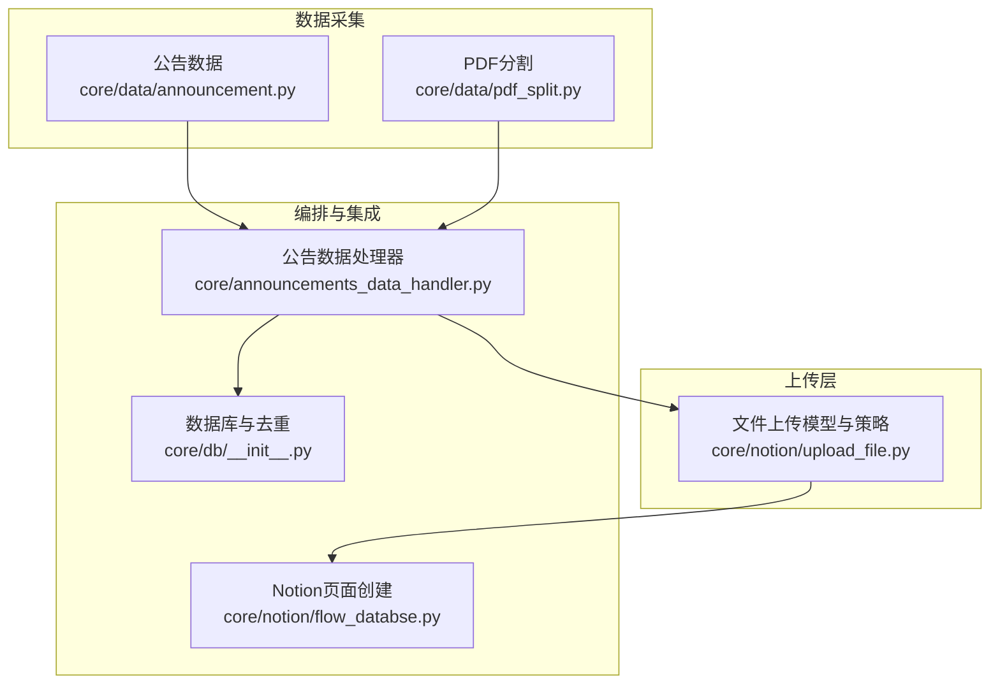
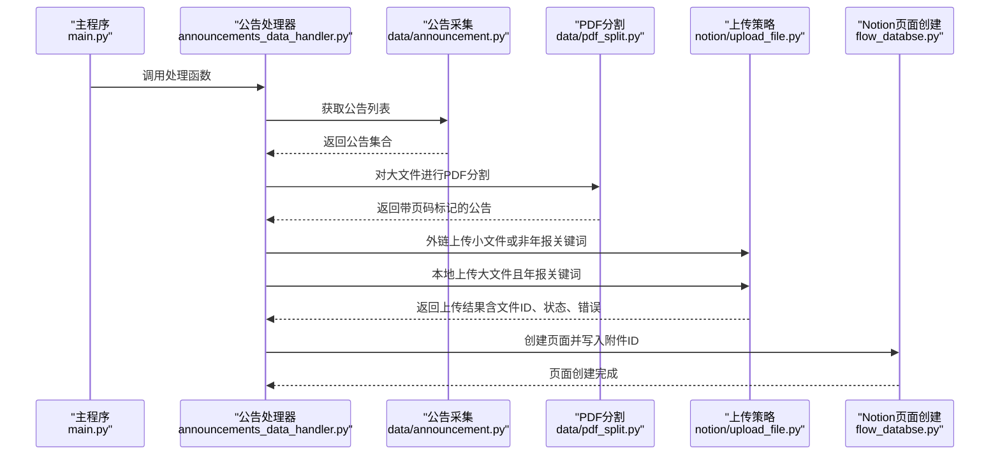
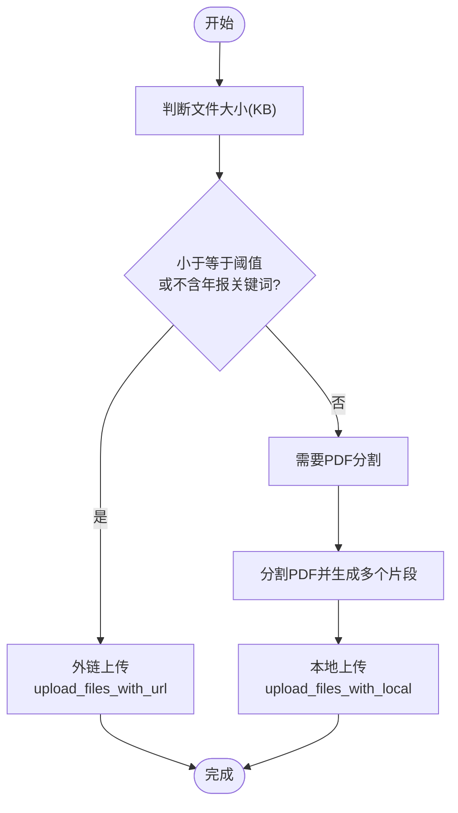
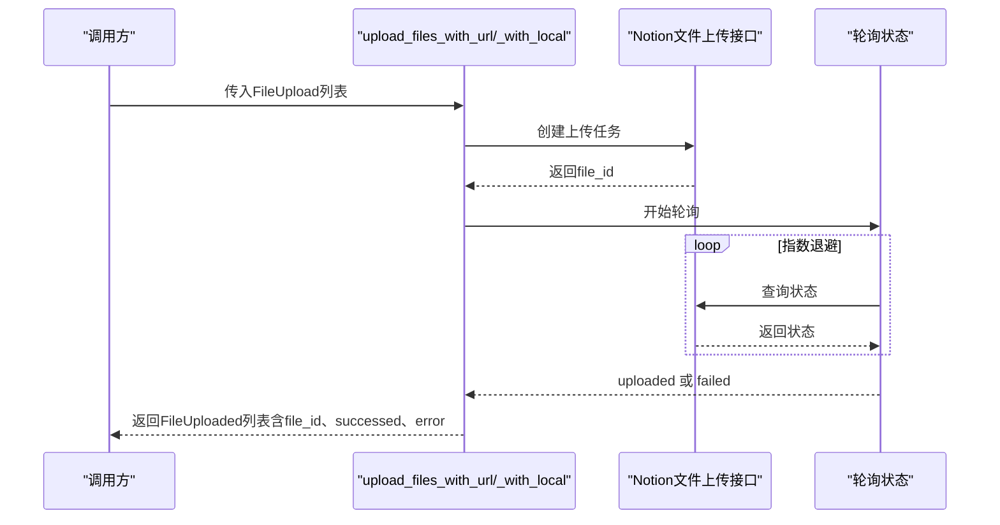
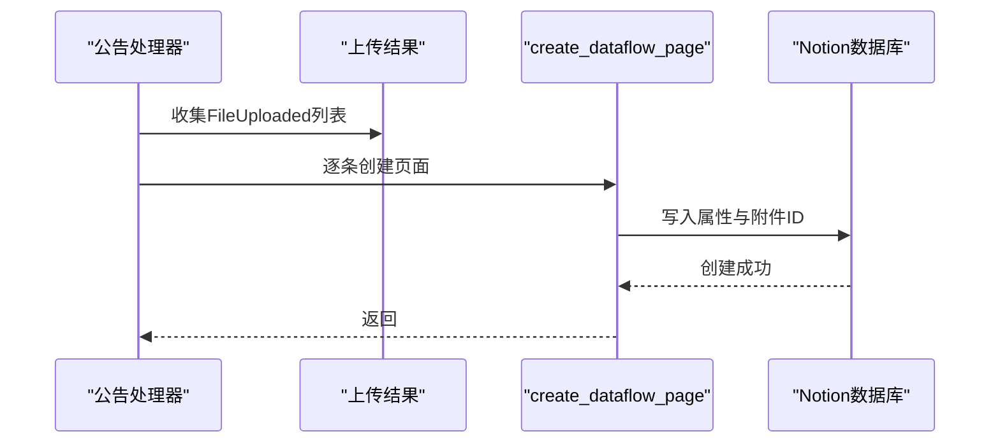
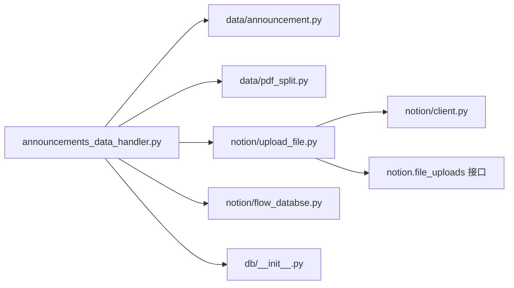

# 文件上传数据模型

<cite>
**本文引用的文件**
- [core/notion/upload_file.py](file://core/notion/upload_file.py)
- [core/data/announcement.py](file://core/data/announcement.py)
- [core/data/pdf_split.py](file://core/data/pdf_split.py)
- [core/announcements_data_handler.py](file://core/announcements_data_handler.py)
- [core/notion/flow_databse.py](file://core/notion/flow_databse.py)
- [core/db/__init__.py](file://core/db/__init__.py)
- [core/notion/client.py](file://core/notion/client.py)
- [main.py](file://main.py)
</cite>

## 目录
1. [简介](#简介)
2. [项目结构](#项目结构)
3. [核心组件](#核心组件)
4. [架构总览](#架构总览)
5. [详细组件分析](#详细组件分析)
6. [依赖关系分析](#依赖关系分析)
7. [性能考量](#性能考量)
8. [故障排查指南](#故障排查指南)
9. [结论](#结论)
10. [附录](#附录)

## 简介
本文件围绕“文件上传数据模型”展开，系统性阐述以下内容：
- FileUpload 数据结构的设计与字段定义（文件URL、文件名等）
- 文件上传策略选择机制（外链上传与本地上传）
- 文件上传在公告处理流程中的作用及与 Notion 数据库的集成
- 文件类型判断、错误处理与重试机制
- 提供可追溯的代码片段路径，便于快速定位实现细节

## 项目结构
本项目采用按功能域划分的模块化组织方式，文件上传相关能力集中在 core/notion/upload_file.py；公告数据采集与PDF分割在 core/data 下；最终页面创建与 Notion 集成在 core/notion 下。

图表来源
- [core/data/announcement.py](file://core/data/announcement.py#L1-L141)
- [core/data/pdf_split.py](file://core/data/pdf_split.py#L1-L128)
- [core/notion/upload_file.py](file://core/notion/upload_file.py#L1-L179)
- [core/announcements_data_handler.py](file://core/announcements_data_handler.py#L1-L116)
- [core/notion/flow_databse.py](file://core/notion/flow_databse.py#L1-L67)
- [core/db/__init__.py](file://core/db/__init__.py#L1-L218)

章节来源
- [core/data/announcement.py](file://core/data/announcement.py#L1-L141)
- [core/data/pdf_split.py](file://core/data/pdf_split.py#L1-L128)
- [core/notion/upload_file.py](file://core/notion/upload_file.py#L1-L179)
- [core/announcements_data_handler.py](file://core/announcements_data_handler.py#L1-L116)
- [core/notion/flow_databse.py](file://core/notion/flow_databse.py#L1-L67)
- [core/db/__init__.py](file://core/db/__init__.py#L1-L218)

## 核心组件
- FileUpload 数据结构：用于描述待上传文件的最小信息单元，包含文件URL与标题。
- FileUploaded 结构：在 FileUpload 基础上扩展了上传结果字段（文件ID、成功标志、错误信息）。
- 上传策略：
  - 外链上传：通过 Notion 文件上传接口的 external_url 模式，直接引用远端URL。
  - 本地上传：先下载文件内容，再以二进制流形式上传至 Notion。
- 策略选择与编排：根据公告标题关键词与文件大小，决定走外链还是本地上传，并并发调度。
- 状态轮询与重试：对上传任务进行轮询，指数退避重试，直至完成或超时。
- 与 Notion 集成：将上传得到的文件ID写入资讯流数据库页面的“附件”字段。

章节来源
- [core/notion/upload_file.py](file://core/notion/upload_file.py#L17-L26)
- [core/notion/upload_file.py](file://core/notion/upload_file.py#L40-L61)
- [core/notion/upload_file.py](file://core/notion/upload_file.py#L124-L150)
- [core/notion/upload_file.py](file://core/notion/upload_file.py#L153-L176)
- [core/announcements_data_handler.py](file://core/announcements_data_handler.py#L69-L93)
- [core/notion/flow_databse.py](file://core/notion/flow_databse.py#L25-L66)

## 架构总览
下图展示了从公告采集到页面创建的完整流程，重点体现文件上传策略的选择与执行。

图表来源
- [main.py](file://main.py#L20-L35)
- [core/announcements_data_handler.py](file://core/announcements_data_handler.py#L21-L116)
- [core/data/announcement.py](file://core/data/announcement.py#L36-L112)
- [core/data/pdf_split.py](file://core/data/pdf_split.py#L15-L73)
- [core/notion/upload_file.py](file://core/notion/upload_file.py#L28-L61)
- [core/notion/flow_databse.py](file://core/notion/flow_databse.py#L25-L66)

## 详细组件分析

### FileUpload 数据结构设计
- 设计要点
  - TypedDict 定义最小必要字段：url（文件URL）、title（文件标题）。
  - FileUploaded 继承自 FileUpload，新增 file_id（Notion 文件ID）、successed（是否成功）、error（错误信息）。
- 字段语义
  - url：用于外链上传或本地下载的来源地址。
  - title：用于生成最终上传后的文件名（通常附加“.PDF”后缀）。
  - file_id：上传成功后由 Notion 返回的文件唯一标识。
  - successed/error：用于状态追踪与错误处理。
- 复杂度与性能
  - 该结构为轻量级数据载体，不引入额外计算开销。
  - 与异步并发上传配合，避免阻塞主线程。

章节来源
- [core/notion/upload_file.py](file://core/notion/upload_file.py#L17-L26)

### 文件上传策略选择机制
- 选择规则
  - 小于等于阈值（KB）或不含年报关键词的公告，走外链上传。
  - 大于阈值且包含年报关键词的公告，先进行PDF分割，再走本地上传。
- 适用场景
  - 外链上传：文件较小、网络稳定、无需本地缓存时优先使用，减少带宽与I/O。
  - 本地上传：大文件或长文档（如年报），通过分片上传提升成功率与稳定性。

图表来源
- [core/announcements_data_handler.py](file://core/announcements_data_handler.py#L69-L93)
- [core/data/pdf_split.py](file://core/data/pdf_split.py#L15-L73)
- [core/notion/upload_file.py](file://core/notion/upload_file.py#L28-L61)

章节来源
- [core/announcements_data_handler.py](file://core/announcements_data_handler.py#L69-L93)
- [core/data/pdf_split.py](file://core/data/pdf_split.py#L15-L73)

### 上传流程与状态跟踪
- 外链上传流程
  - 调用 Notion 文件上传接口，mode=external_url，传入 external_url。
  - 轮询上传状态，直到 uploaded 或 failed。
  - 记录 file_id、successed、error。
- 本地上传流程
  - 下载文件内容为二进制流。
  - 调用 Notion 文件上传接口，传入 filename 与 content。
  - 轮询上传状态，记录结果。
- 状态轮询与重试
  - 指数退避间隔：1, 2, 4, 8, 16 秒，最多尝试固定次数。
  - 超时返回失败并携带“轮询超时”错误。

图表来源
- [core/notion/upload_file.py](file://core/notion/upload_file.py#L40-L61)
- [core/notion/upload_file.py](file://core/notion/upload_file.py#L124-L150)
- [core/notion/upload_file.py](file://core/notion/upload_file.py#L153-L176)

章节来源
- [core/notion/upload_file.py](file://core/notion/upload_file.py#L40-L61)
- [core/notion/upload_file.py](file://core/notion/upload_file.py#L124-L150)
- [core/notion/upload_file.py](file://core/notion/upload_file.py#L153-L176)

### 与 Notion 数据库的集成
- 页面创建
  - 使用 create_dataflow_page 接口创建资讯流页面，将上传得到的文件ID写入“附件”字段。
- 关联关系
  - 页面属性包含标题、发布时间、来源接口、数据类型、关联股票等。
  - “附件”字段通过 file_upload.id 指向上传成功的文件ID。
- 错误处理
  - 页面创建异常会被捕获并记录日志，不影响其他页面的创建。

图表来源
- [core/announcements_data_handler.py](file://core/announcements_data_handler.py#L99-L115)
- [core/notion/flow_databse.py](file://core/notion/flow_databse.py#L25-L66)

章节来源
- [core/announcements_data_handler.py](file://core/announcements_data_handler.py#L99-L115)
- [core/notion/flow_databse.py](file://core/notion/flow_databse.py#L25-L66)

### 文件类型判断与分割
- 文件类型判断
  - 通过公告标题关键词（如“年度报告/年报/中期”）识别是否需要分割。
- 分割策略
  - 将长PDF按固定块大小切分，生成多个片段并更新标题中的页码范围。
  - 估算每个片段的大小（KB），保持原始URL不变，便于后续上传与溯源。

章节来源
- [core/data/pdf_split.py](file://core/data/pdf_split.py#L15-L73)
- [core/data/pdf_split.py](file://core/data/pdf_split.py#L92-L127)

### 错误处理与重试机制
- 上传失败
  - 外链/本地上传均会在轮询失败时记录错误信息，并在返回结构中标注失败。
- 轮询超时
  - 达到最大尝试次数仍未完成，返回“轮询超时”错误。
- PDF分割失败
  - 若分割过程出现异常，记录错误并保留原始公告，避免丢失数据。

章节来源
- [core/notion/upload_file.py](file://core/notion/upload_file.py#L138-L146)
- [core/notion/upload_file.py](file://core/notion/upload_file.py#L175-L176)
- [core/data/pdf_split.py](file://core/data/pdf_split.py#L68-L71)

## 依赖关系分析
- 模块耦合
  - announcements_data_handler 依赖 data/announcement、data/pdf_split、notion/upload_file、notion/flow_databse。
  - upload_file 依赖 notion.client 与 notion.file_uploads 接口。
- 外部依赖
  - httpx：HTTP客户端，用于下载与调用远程接口。
  - pymupdf：PDF处理库，用于分割与页数统计。
- 数据库与去重
  - db/__init__.py 提供去重与更新时间记录能力，辅助增量处理。

图表来源
- [core/announcements_data_handler.py](file://core/announcements_data_handler.py#L1-L16)
- [core/notion/upload_file.py](file://core/notion/upload_file.py#L1-L11)
- [core/notion/client.py](file://core/notion/client.py#L1-L6)
- [core/notion/flow_databse.py](file://core/notion/flow_databse.py#L1-L12)
- [core/db/__init__.py](file://core/db/__init__.py#L1-L218)

章节来源
- [core/announcements_data_handler.py](file://core/announcements_data_handler.py#L1-L16)
- [core/notion/upload_file.py](file://core/notion/upload_file.py#L1-L11)
- [core/notion/client.py](file://core/notion/client.py#L1-L6)
- [core/notion/flow_databse.py](file://core/notion/flow_databse.py#L1-L12)
- [core/db/__init__.py](file://core/db/__init__.py#L1-L218)

## 性能考量
- 并发上传
  - 使用 asyncio.gather 并发执行多个上传任务，显著缩短总耗时。
- 指数退避
  - 轮询采用指数退避，避免频繁请求导致Notion接口压力过大。
- 分片上传
  - 对大文件进行PDF分片，降低单次上传失败概率，提升整体成功率。
- I/O优化
  - 本地上传前先下载至内存缓冲区，减少磁盘I/O；分片后复用缓冲区，降低内存峰值。

章节来源
- [core/notion/upload_file.py](file://core/notion/upload_file.py#L28-L37)
- [core/notion/upload_file.py](file://core/notion/upload_file.py#L51-L61)
- [core/notion/upload_file.py](file://core/notion/upload_file.py#L153-L176)
- [core/data/pdf_split.py](file://core/data/pdf_split.py#L92-L127)

## 故障排查指南
- 无法找到环境变量
  - 确认 .env 文件存在且包含 NOTION_TOKEN 与 FLOW_DATABASE。
- 上传失败
  - 查看返回结构中的 error 字段，结合日志定位问题（如网络异常、Notion接口限制）。
- 轮询超时
  - 检查目标文件是否可达、网络是否稳定；适当增加最大尝试次数或调整退避间隔。
- PDF分割失败
  - 检查源PDF是否损坏或加密；确认pymupdf版本兼容性。
- 页面创建失败
  - 检查数据库连接与表结构初始化是否完成；核对 TYPE_MAPPING 与页面模板字段。

章节来源
- [core/notion/flow_databse.py](file://core/notion/flow_databse.py#L22-L22)
- [core/notion/upload_file.py](file://core/notion/upload_file.py#L175-L176)
- [core/data/pdf_split.py](file://core/data/pdf_split.py#L68-L71)
- [core/db/__init__.py](file://core/db/__init__.py#L62-L94)

## 结论
本文档系统梳理了文件上传数据模型的设计与实现，明确了 FileUpload/FileUploaded 的字段语义，解释了外链与本地两种上传策略的选择逻辑与适用场景，并展示了其在公告处理流程中的关键作用。通过并发上传、指数退避与PDF分片等机制，系统在保证可靠性的同时提升了性能。建议在生产环境中结合日志与监控，持续优化阈值与重试策略，以适配不同网络与数据规模。

## 附录
- 快速参考（代码片段路径）
  - FileUpload 定义：[core/notion/upload_file.py](file://core/notion/upload_file.py#L17-L26)
  - 外链上传入口：[core/notion/upload_file.py](file://core/notion/upload_file.py#L40-L61)
  - 本地上传入口：[core/notion/upload_file.py](file://core/notion/upload_file.py#L28-L37)
  - 上传状态轮询：[core/notion/upload_file.py](file://core/notion/upload_file.py#L153-L176)
  - 策略选择与编排：[core/announcements_data_handler.py](file://core/announcements_data_handler.py#L69-L93)
  - PDF分割实现：[core/data/pdf_split.py](file://core/data/pdf_split.py#L15-L73)
  - 页面创建与附件写入：[core/notion/flow_databse.py](file://core/notion/flow_databse.py#L25-L66)
  - 主程序入口：[main.py](file://main.py#L20-L35)