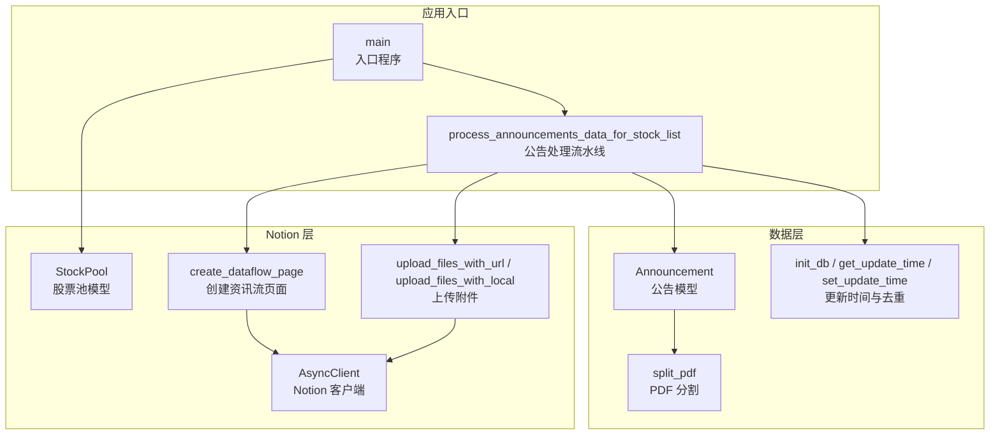
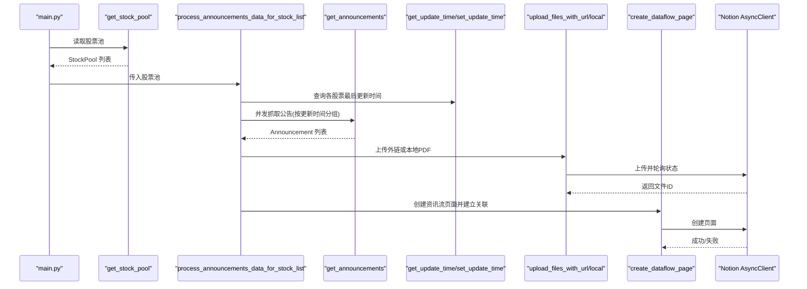
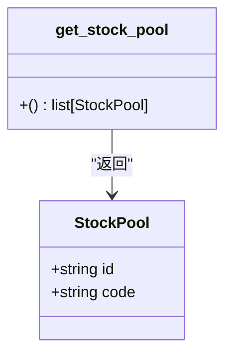
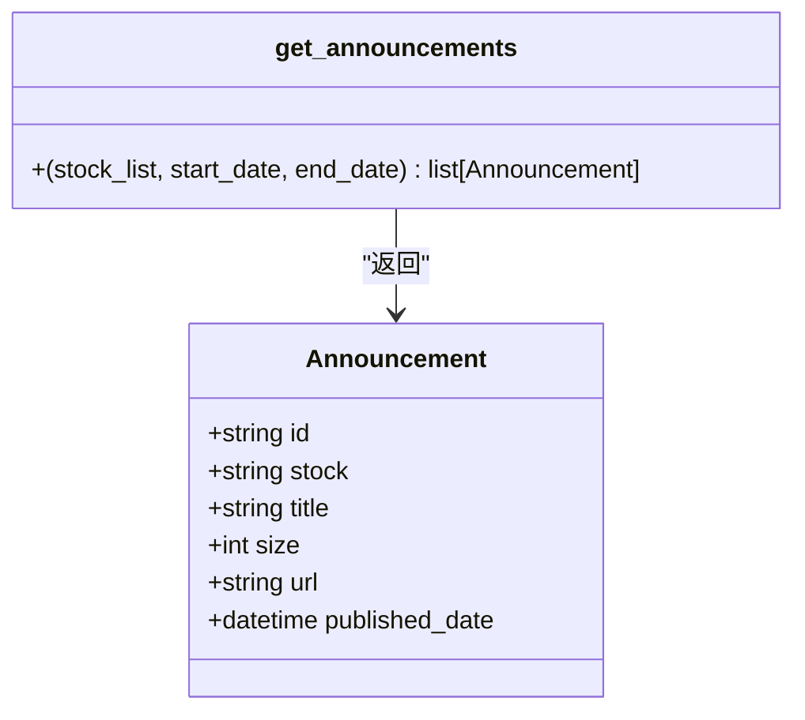
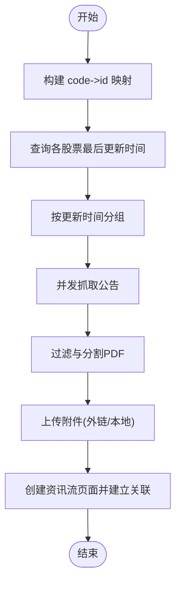
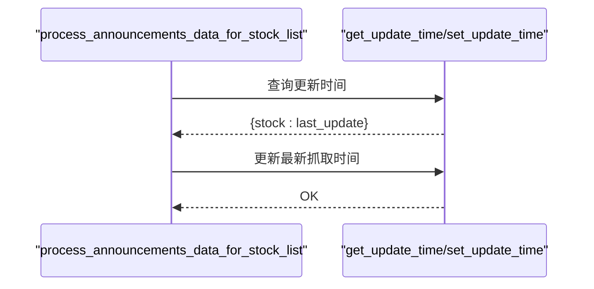
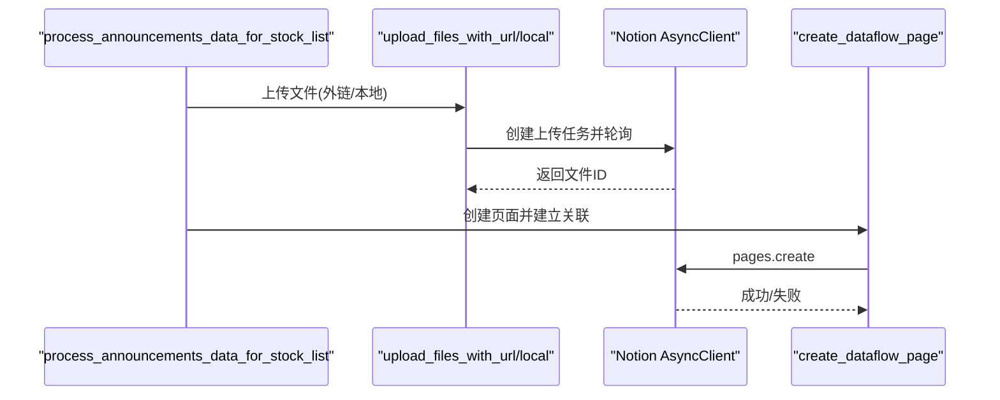
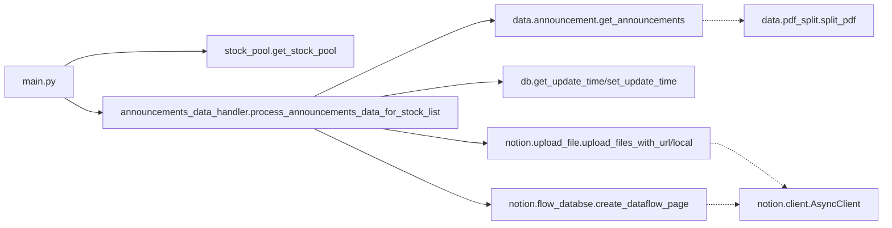

# 股票池数据模型

<cite>
**本文引用的文件**
- [stock_pool.py](file://core/notion/stock_pool.py)
- [announcement.py](file://core/data/announcement.py)
- [announcements_data_handler.py](file://core/announcements_data_handler.py)
- [flow_databse.py](file://core/notion/flow_databse.py)
- [upload_file.py](file://core/notion/upload_file.py)
- [pdf_split.py](file://core/data/pdf_split.py)
- [db/__init__.py](file://core/db/__init__.py)
- [client.py](file://core/notion/client.py)
- [main.py](file://main.py)
</cite>

## 目录
1. [引言](#引言)
2. [项目结构](#项目结构)
3. [核心组件](#核心组件)
4. [架构总览](#架构总览)
5. [详细组件分析](#详细组件分析)
6. [依赖关系分析](#依赖关系分析)
7. [性能考量](#性能考量)
8. [故障排查指南](#故障排查指南)
9. [结论](#结论)
10. [附录](#附录)

## 引言
本文件围绕“股票池数据模型”展开，系统性阐述股票池数据结构的设计与实现，解释其在公告数据批量获取与处理流程中的作用，以及与公告数据之间的关联关系。文档提供面向初学者的易懂说明与面向资深开发者的深度技术细节，包括数据验证、类型注解、并发与性能优化建议，并通过图示展示关键流程。

## 项目结构
该项目采用分层模块化组织，核心围绕 Notion 数据源与公告抓取、处理、上传与页面创建展开。与股票池数据模型直接相关的关键模块如下：
- 股票池数据模型：定义股票池实体与读取逻辑
- 公告数据模型：定义公告实体与抓取逻辑
- 公告处理流水线：基于股票池批量抓取公告、上传附件、创建 Notion 页面
- 数据持久化：维护各股票的更新时间与去重哈希
- Notion 客户端与上传：对外链与本地分割后的 PDF 进行上传并轮询状态

图表来源
- [stock_pool.py](file://core/notion/stock_pool.py#L10-L52)
- [announcement.py](file://core/data/announcement.py#L12-L141)
- [announcements_data_handler.py](file://core/announcements_data_handler.py#L21-L116)
- [flow_databse.py](file://core/notion/flow_databse.py#L25-L67)
- [upload_file.py](file://core/notion/upload_file.py#L28-L180)
- [pdf_split.py](file://core/data/pdf_split.py#L15-L128)
- [db/__init__.py](file://core/db/__init__.py#L62-L217)
- [client.py](file://core/notion/client.py#L1-L6)
- [main.py](file://main.py#L20-L39)

章节来源
- [main.py](file://main.py#L1-L40)
- [stock_pool.py](file://core/notion/stock_pool.py#L1-L52)
- [announcement.py](file://core/data/announcement.py#L1-L141)
- [announcements_data_handler.py](file://core/announcements_data_handler.py#L1-L116)
- [flow_databse.py](file://core/notion/flow_databse.py#L1-L67)
- [upload_file.py](file://core/notion/upload_file.py#L1-L180)
- [pdf_split.py](file://core/data/pdf_split.py#L1-L128)
- [db/__init__.py](file://core/db/__init__.py#L1-L218)
- [client.py](file://core/notion/client.py#L1-L6)

## 核心组件
- 股票池模型 StockPool：以不可变命名元组形式承载股票唯一标识与股票代码，用于后续公告抓取与页面创建时的关联映射。
- 公告模型 Announcement：以不可变命名元组形式承载公告的唯一标识、所属股票、标题、文件大小、下载链接、发布时间等字段，支撑批量抓取与页面创建。
- 股票池读取 get_stock_pool：从 Notion 数据源查询股票池，解析返回结果，构造 StockPool 列表。
- 公告抓取 get_announcements：根据股票列表与日期区间批量抓取公告，过滤非正文版本并转换为 Announcement 列表。
- 公告处理流水线 process_announcements_data_for_stock_list：整合更新时间、并发抓取、附件上传、PDF 分割、页面创建。
- 数据持久化：维护 update_records 表记录各股票的最后更新时间；通过哈希避免重复数据入库。
- Notion 上传与页面创建：对外链与本地 PDF 进行上传并轮询状态，最终在资讯流数据库创建页面并建立与股票的关联。

章节来源
- [stock_pool.py](file://core/notion/stock_pool.py#L10-L52)
- [announcement.py](file://core/data/announcement.py#L12-L141)
- [announcements_data_handler.py](file://core/announcements_data_handler.py#L21-L116)
- [db/__init__.py](file://core/db/__init__.py#L62-L217)
- [flow_databse.py](file://core/notion/flow_databse.py#L25-L67)
- [upload_file.py](file://core/notion/upload_file.py#L28-L180)
- [pdf_split.py](file://core/data/pdf_split.py#L15-L128)

## 架构总览
下图展示了从入口程序到公告处理流水线的整体调用关系，以及与数据库、Notion 客户端、PDF 分割与上传模块的交互。

图表来源
- [main.py](file://main.py#L20-L39)
- [stock_pool.py](file://core/notion/stock_pool.py#L23-L52)
- [announcements_data_handler.py](file://core/announcements_data_handler.py#L21-L116)
- [announcement.py](file://core/data/announcement.py#L36-L112)
- [db/__init__.py](file://core/db/__init__.py#L153-L217)
- [upload_file.py](file://core/notion/upload_file.py#L28-L180)
- [flow_databse.py](file://core/notion/flow_databse.py#L25-L67)
- [client.py](file://core/notion/client.py#L1-L6)

## 详细组件分析

### 股票池数据模型 StockPool
- 设计要点
  - 使用不可变命名元组，保证数据一致性与线程安全。
  - 字段包含：id（Notion 页面 ID）、code（股票代码）。
- 用途
  - 作为公告抓取与页面创建的关联键，将公告与对应股票建立关系。
- 读取流程
  - 从环境变量读取股票池数据库 ID。
  - 调用 Notion 数据源查询接口，解析 results 中的 id 与“股票代码”字段，封装为 StockPool 列表。
- 类型注解与验证
  - 返回值为 list[StockPool]，字段类型为 str。
  - 异常统一捕获并记录日志后上抛。

图表来源
- [stock_pool.py](file://core/notion/stock_pool.py#L10-L52)

章节来源
- [stock_pool.py](file://core/notion/stock_pool.py#L10-L52)

### 公告数据模型 Announcement
- 设计要点
  - 使用不可变命名元组，字段覆盖公告唯一标识、所属股票、标题、文件大小、下载链接、发布时间。
- 用途
  - 作为公告抓取结果的标准化载体，贯穿上传与页面创建环节。
- 抓取与转换
  - 支持按股票列表与日期区间批量抓取，过滤摘要/英文版/图文版等非正文版本。
  - 将返回的 JSON 结构映射为 Announcement 对象，统一时间戳与 URL 格式。

图表来源
- [announcement.py](file://core/data/announcement.py#L12-L141)

章节来源
- [announcement.py](file://core/data/announcement.py#L12-L141)

### 公告处理流水线 process_announcements_data_for_stock_list
- 输入输出
  - 输入：list[StockPool]（股票池）
  - 输出：无（副作用：上传附件、创建 Notion 页面）
- 关键步骤
  - 构建 code->id 映射，用于页面创建时的关联。
  - 查询各股票的最后更新时间，按更新时间分组，减少接口调用次数。
  - 并发抓取公告，过滤与分割大文件，上传附件并轮询状态。
  - 逐条创建资讯流页面，建立与股票的关联关系。
- 性能与并发
  - 使用 asyncio.gather 并发抓取与上传，显著提升吞吐。
  - 按更新时间分组，避免重复抓取历史数据。

图表来源
- [announcements_data_handler.py](file://core/announcements_data_handler.py#L21-L116)
- [db/__init__.py](file://core/db/__init__.py#L153-L217)
- [pdf_split.py](file://core/data/pdf_split.py#L15-L128)
- [upload_file.py](file://core/notion/upload_file.py#L28-L180)
- [flow_databse.py](file://core/notion/flow_databse.py#L25-L67)

章节来源
- [announcements_data_handler.py](file://core/announcements_data_handler.py#L21-L116)
- [db/__init__.py](file://core/db/__init__.py#L153-L217)

### 数据持久化与去重
- 更新时间管理
  - 通过 get_update_time 查询各股票的最后更新时间；缺失则插入默认记录。
  - 通过 set_update_time 更新最新抓取时间，确保后续增量抓取。
- 哈希去重
  - 对数据内容计算哈希，存入 hash 表；仅当哈希不存在时才继续处理，避免重复入库。

图表来源
- [db/__init__.py](file://core/db/__init__.py#L153-L217)

章节来源
- [db/__init__.py](file://core/db/__init__.py#L62-L217)

### Notion 上传与页面创建
- 上传策略
  - 外链文件：upload_files_with_url，直接创建 external_url 上传任务并轮询状态。
  - 本地分割文件：upload_files_with_local，下载后上传，支持分片命名。
- 页面创建
  - create_dataflow_page 接收标题、发布时间、来源接口、数据类型、关联股票、附件 ID、原文链接与正文内容，创建资讯流页面。

图表来源
- [upload_file.py](file://core/notion/upload_file.py#L28-L180)
- [flow_databse.py](file://core/notion/flow_databse.py#L25-L67)
- [client.py](file://core/notion/client.py#L1-L6)

章节来源
- [upload_file.py](file://core/notion/upload_file.py#L28-L180)
- [flow_databse.py](file://core/notion/flow_databse.py#L25-L67)
- [client.py](file://core/notion/client.py#L1-L6)

## 依赖关系分析
- 组件耦合
  - 入口 main 依赖 get_stock_pool 与公告处理流水线。
  - 公告处理流水线依赖公告抓取、数据库、上传与页面创建模块。
  - 股票池与公告模型是跨模块共享的基础数据结构。
- 外部依赖
  - Notion AsyncClient：异步客户端，负责数据库查询与页面/文件上传。
  - httpx：异步 HTTP 客户端，用于公告抓取与文件下载。
  - pymupdf：PDF 分割与页数统计。
  - aiosqlite：SQLite 异步访问，用于更新时间与哈希管理。

图表来源
- [main.py](file://main.py#L20-L39)
- [stock_pool.py](file://core/notion/stock_pool.py#L23-L52)
- [announcements_data_handler.py](file://core/announcements_data_handler.py#L21-L116)
- [announcement.py](file://core/data/announcement.py#L36-L112)
- [db/__init__.py](file://core/db/__init__.py#L153-L217)
- [upload_file.py](file://core/notion/upload_file.py#L28-L180)
- [flow_databse.py](file://core/notion/flow_databse.py#L25-L67)
- [pdf_split.py](file://core/data/pdf_split.py#L15-L128)
- [client.py](file://core/notion/client.py#L1-L6)

章节来源
- [main.py](file://main.py#L1-L40)
- [stock_pool.py](file://core/notion/stock_pool.py#L1-L52)
- [announcement.py](file://core/data/announcement.py#L1-L141)
- [announcements_data_handler.py](file://core/announcements_data_handler.py#L1-L116)
- [db/__init__.py](file://core/db/__init__.py#L1-L218)
- [upload_file.py](file://core/notion/upload_file.py#L1-L180)
- [flow_databse.py](file://core/notion/flow_databse.py#L1-L67)
- [pdf_split.py](file://core/data/pdf_split.py#L1-L128)
- [client.py](file://core/notion/client.py#L1-L6)

## 性能考量
- 并发与批量化
  - 使用 asyncio.gather 并发抓取公告与上传文件，显著降低总耗时。
  - 按更新时间分组，合并同一时间段内的股票查询，减少接口调用次数。
- I/O 优化
  - PDF 分割采用内存缓冲与分块策略，避免磁盘频繁 IO。
  - 上传轮询采用指数退避策略，平衡成功率与资源占用。
- 存储与去重
  - 通过哈希去重避免重复入库，减少后续处理开销。
  - SQLite 异步连接与批量写入，降低数据库压力。

[本节为通用性能建议，无需列出章节来源]

## 故障排查指南
- 环境变量
  - 确认 STOCK_POOL 与 FLOW_DATABASE 已正确配置，否则查询与页面创建会失败。
- 日志定位
  - 关注 get_stock_pool、get_announcements、upload_files_with_url/local、create_dataflow_page 的日志输出，定位异常阶段。
- 常见问题
  - 公告抓取为空：检查股票列表是否为空、日期区间是否合理、目标网站接口可用性。
  - 上传失败：查看轮询状态与错误信息，确认 Notion Token 权限与网络连通性。
  - 页面创建失败：检查数据类型映射、关联字段是否存在、数据库 ID 是否正确。

章节来源
- [stock_pool.py](file://core/notion/stock_pool.py#L33-L51)
- [announcement.py](file://core/data/announcement.py#L53-L112)
- [upload_file.py](file://core/notion/upload_file.py#L153-L176)
- [flow_databse.py](file://core/notion/flow_databse.py#L59-L66)

## 结论
股票池数据模型以不可变命名元组的形式简洁地承载了股票的唯一标识与代码，为公告抓取、附件上传与页面创建提供了稳定的关联键。结合数据库的更新时间管理与哈希去重机制，公告处理流水线实现了高效、可扩展的自动化流程。通过并发与批量化策略，系统在保证正确性的前提下显著提升了吞吐能力。

[本节为总结性内容，无需列出章节来源]

## 附录

### 股票池数据模型字段说明
- id：Notion 页面 ID，用于页面创建与关联。
- code：股票代码，用于公告抓取与映射。

章节来源
- [stock_pool.py](file://core/notion/stock_pool.py#L19-L20)

### 公告数据模型字段说明
- id：公告唯一标识。
- stock：公告所属股票代码。
- title：公告标题。
- size：文件大小（KB）。
- url：公告文件下载链接。
- published_date：公告发布时间。

章节来源
- [announcement.py](file://core/data/announcement.py#L28-L33)

### 代码示例路径（不含具体代码内容）
- 股票池读取
  - [get_stock_pool 函数](file://core/notion/stock_pool.py#L23-L52)
- 公告抓取
  - [get_announcements 函数](file://core/data/announcement.py#L36-L112)
- 公告处理流水线
  - [process_announcements_data_for_stock_list 函数](file://core/announcements_data_handler.py#L21-L116)
- 数据库更新时间
  - [get_update_time 函数](file://core/db/__init__.py#L153-L185)
  - [set_update_time 函数](file://core/db/__init__.py#L188-L215)
- 附件上传
  - [upload_files_with_url 函数](file://core/notion/upload_file.py#L40-L61)
  - [upload_files_with_local 函数](file://core/notion/upload_file.py#L28-L37)
- PDF 分割
  - [split_pdf 函数](file://core/data/pdf_split.py#L15-L73)
- 页面创建
  - [create_dataflow_page 函数](file://core/notion/flow_databse.py#L25-L67)