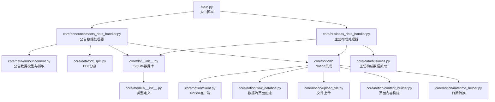
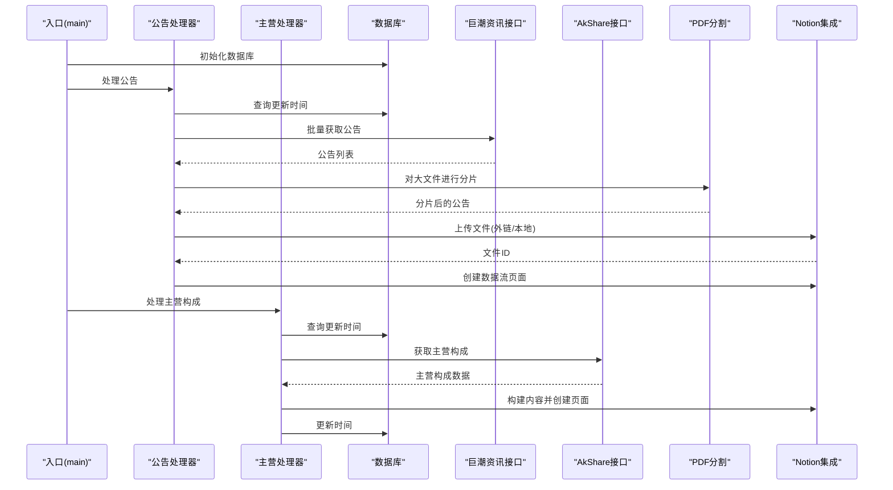
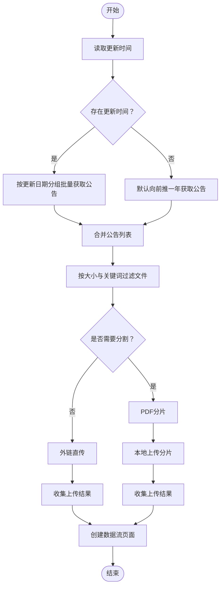
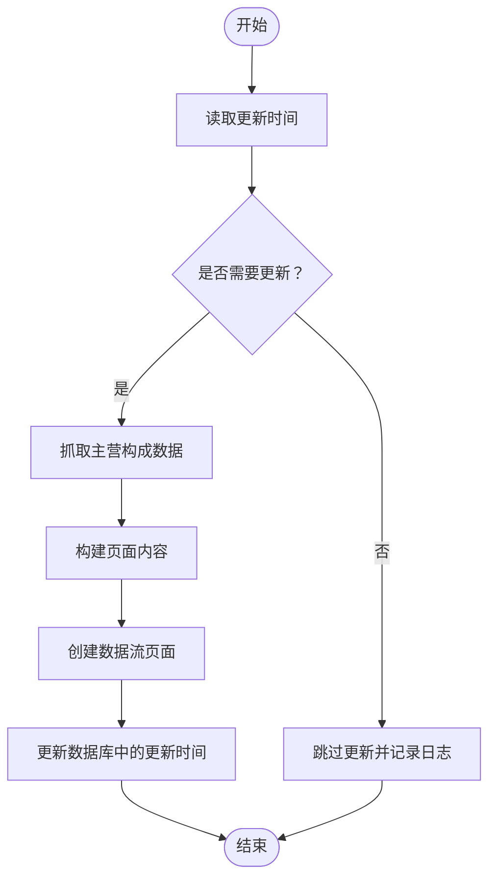
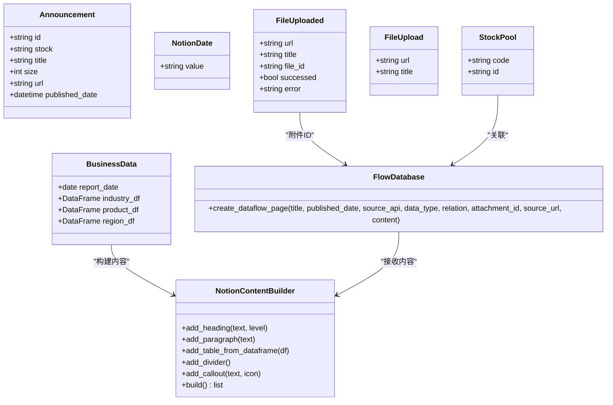
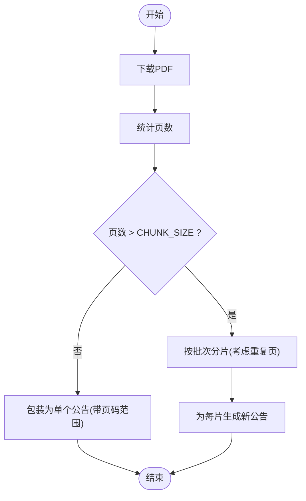
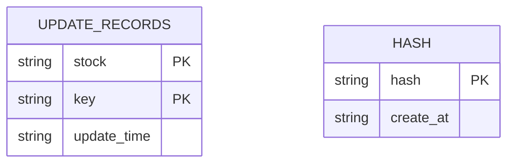
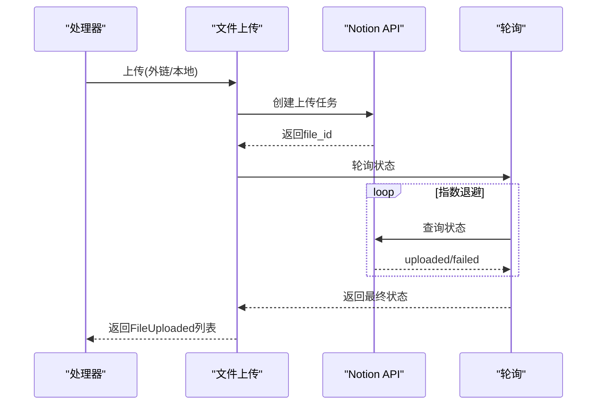
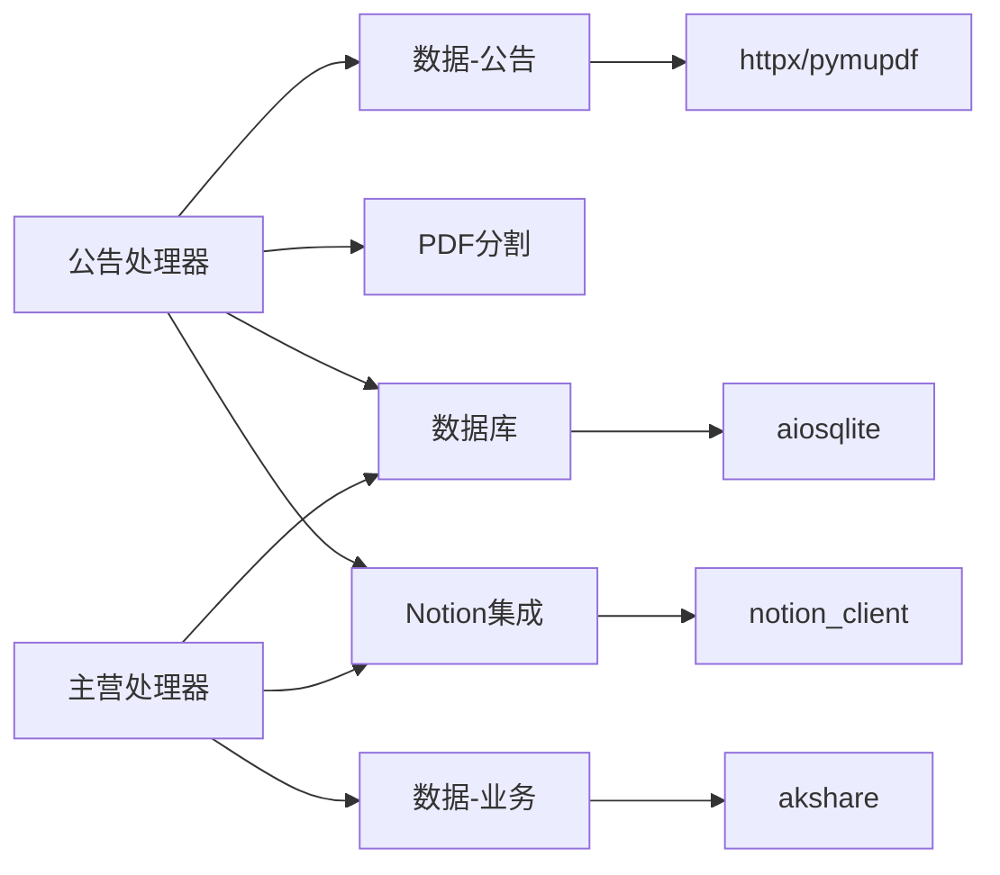

# 核心模块详解

<cite>
**本文引用的文件**
- [main.py](file://main.py)
- [announcements_data_handler.py](file://core/announcements_data_handler.py)
- [business_data_handler.py](file://core/business_data_handler.py)
- [announcement.py](file://core/data/announcement.py)
- [business.py](file://core/data/business.py)
- [pdf_split.py](file://core/data/pdf_split.py)
- [__init__.py](file://core/db/__init__.py)
- [client.py](file://core/notion/client.py)
- [content_builder.py](file://core/notion/content_builder.py)
- [flow_databse.py](file://core/notion/flow_databse.py)
- [upload_file.py](file://core/notion/upload_file.py)
- [datetime_helper.py](file://core/notion/datetime_helper.py)
- [__init__.py](file://core/models/__init__.py)
- [test_announcements_data_handler.py](file://tests/test_announcements_data_handler.py)
- [test_business_data_handler.py](file://tests/test_business_data_handler.py)
- [test_pdf_split.py](file://tests/test_pdf_split.py)
</cite>

## 目录
1. [简介](#简介)
2. [项目结构](#项目结构)
3. [核心组件](#核心组件)
4. [架构总览](#架构总览)
5. [详细组件分析](#详细组件分析)
6. [依赖关系分析](#依赖关系分析)
7. [性能考量](#性能考量)
8. [故障排查指南](#故障排查指南)
9. [结论](#结论)
10. [附录](#附录)

## 简介
本技术文档聚焦于股票公告自动化系统的核心模块，围绕公告数据处理、PDF文件分割、数据库管理与Notion集成四大主题，系统阐述模块职责、调用关系、接口契约、数据模型与配置要点。文档既面向初学者提供清晰的流程图解，也为资深开发者提供代码级依赖与实现细节的参考。

## 项目结构
系统采用按功能域划分的目录组织方式，核心模块位于 core 目录下，测试用例集中在 tests 目录，入口脚本位于根目录。

图表来源
- [main.py](file://main.py#L20-L36)
- [announcements_data_handler.py](file://core/announcements_data_handler.py#L1-L116)
- [business_data_handler.py](file://core/business_data_handler.py#L1-L108)
- [announcement.py](file://core/data/announcement.py#L1-L141)
- [business.py](file://core/data/business.py#L1-L96)
- [pdf_split.py](file://core/data/pdf_split.py#L1-L128)
- [__init__.py](file://core/db/__init__.py#L1-L218)
- [client.py](file://core/notion/client.py#L1-L6)
- [flow_databse.py](file://core/notion/flow_databse.py#L1-L67)
- [upload_file.py](file://core/notion/upload_file.py#L1-L180)
- [content_builder.py](file://core/notion/content_builder.py#L1-L103)
- [datetime_helper.py](file://core/notion/datetime_helper.py#L1-L39)
- [__init__.py](file://core/models/__init__.py#L1-L8)

章节来源
- [main.py](file://main.py#L1-L40)

## 核心组件
- 公告数据处理器：负责批量获取公告、按条件分流上传（外链直传或本地分割上传）、创建Notion数据流页面。
- 主营构成处理器：按半年周期判断更新需求，抓取主营构成数据，构建页面内容并创建数据流页面。
- 数据层（公告/业务）：封装对外接口（巨潮资讯、AkShare），定义领域模型（公告、主营构成）。
- PDF分割模块：根据页数阈值对大文件进行分片，生成带页码范围的新公告对象。
- 数据库模块：维护更新时间记录与去重哈希表，提供异步连接管理。
- Notion集成：封装客户端、文件上传、页面创建、内容构建与日期转换工具。

章节来源
- [announcements_data_handler.py](file://core/announcements_data_handler.py#L1-L116)
- [business_data_handler.py](file://core/business_data_handler.py#L1-L108)
- [announcement.py](file://core/data/announcement.py#L12-L34)
- [business.py](file://core/data/business.py#L16-L31)
- [pdf_split.py](file://core/data/pdf_split.py#L15-L73)
- [__init__.py](file://core/db/__init__.py#L153-L215)
- [flow_databse.py](file://core/notion/flow_databse.py#L25-L67)
- [upload_file.py](file://core/notion/upload_file.py#L28-L61)
- [content_builder.py](file://core/notion/content_builder.py#L1-L103)
- [datetime_helper.py](file://core/notion/datetime_helper.py#L12-L38)

## 架构总览
系统采用“数据抓取 → 数据处理 → 文件上传 → 页面创建”的流水线式架构。公告与主营构成两条主线共享数据库与Notion集成层，形成统一的增量更新与去重机制。

图表来源
- [main.py](file://main.py#L20-L36)
- [announcements_data_handler.py](file://core/announcements_data_handler.py#L21-L116)
- [business_data_handler.py](file://core/business_data_handler.py#L17-L68)
- [announcement.py](file://core/data/announcement.py#L36-L112)
- [business.py](file://core/data/business.py#L33-L96)
- [pdf_split.py](file://core/data/pdf_split.py#L15-L73)
- [flow_databse.py](file://core/notion/flow_databse.py#L25-L67)

## 详细组件分析

### 公告数据处理器（公告自动化主流程）
职责
- 根据股票池与更新时间，分组批量拉取公告。
- 对小于阈值或不含特定关键词的公告走外链直传；对大文件且含关键词的公告进行PDF分片后本地上传。
- 为每个公告创建Notion数据流页面，建立与股票的关联。

关键流程与决策
- 更新时间分组：将已有更新时间的股票按最后更新日期聚合，减少重复请求。
- 文件分流策略：基于文件大小与标题关键词决定上传路径。
- 并发控制：使用异步任务并发抓取、上传与页面创建，提升吞吐。

图表来源
- [announcements_data_handler.py](file://core/announcements_data_handler.py#L21-L116)
- [pdf_split.py](file://core/data/pdf_split.py#L15-L73)
- [upload_file.py](file://core/notion/upload_file.py#L28-L61)
- [flow_databse.py](file://core/notion/flow_databse.py#L25-L67)

章节来源
- [announcements_data_handler.py](file://core/announcements_data_handler.py#L18-L116)
- [test_announcements_data_handler.py](file://tests/test_announcements_data_handler.py#L29-L367)

接口与参数
- process_announcements_data_for_stock_list(stock_list: list[StockPool]) -> None
  - 输入：股票池（包含代码与ID）
  - 输出：无（副作用：创建Notion页面与上传文件）
  - 关键内部调用：
    - get_update_time：查询各股票的公告更新时间
    - get_announcements：批量抓取公告
    - split_pdf：对大文件进行分片
    - upload_files_with_url / upload_files_with_local：文件上传
    - create_dataflow_page：创建数据流页面

返回值与副作用
- 返回None；副作用包括：向Notion写入页面、上传文件、更新数据库记录。

错误处理
- PDF分片失败时保留原始公告，避免中断整体流程。
- 上传失败记录错误日志，不影响其他并发任务。

### 主营构成处理器（定期数据更新）
职责
- 判断是否需要更新（按半年周期，仅在季度末之后才允许更新）。
- 抓取主营构成数据，构建页面内容（按行业/产品/地区三张表）。
- 创建数据流页面并更新数据库中的更新时间。

图表来源
- [business_data_handler.py](file://core/business_data_handler.py#L17-L68)
- [business.py](file://core/data/business.py#L33-L96)
- [content_builder.py](file://core/notion/content_builder.py#L39-L79)
- [flow_databse.py](file://core/notion/flow_databse.py#L25-L67)

章节来源
- [business_data_handler.py](file://core/business_data_handler.py#L17-L108)
- [test_business_data_handler.py](file://tests/test_business_data_handler.py#L103-L324)

接口与参数
- process_business_data_for_stock_list(stock_list: list[StockPool]) -> None
  - 输入：股票池
  - 输出：无
  - 关键内部调用：
    - get_update_time：查询更新时间
    - _should_update_half_year：判断是否允许更新
    - get_business：抓取主营构成
    - create_dataflow_page：创建页面
    - set_update_time：更新时间

返回值与副作用
- 返回None；副作用：创建页面、更新数据库。

### 数据模型与领域模型
公告模型（Announcement）
- 字段：id、stock、title、size(KB)、url、published_date(datetime)
- 用途：承载从巨潮资讯抓取的公告信息，贯穿抓取、分流、上传与页面创建流程。

主营构成模型（BusinessData）
- 字段：report_date(date)、industry_df(DataFrame)、product_df(DataFrame)、region_df(DataFrame)
- 用途：承载主营构成的三类统计表，供内容构建器渲染为Notion表格。

图表来源
- [announcement.py](file://core/data/announcement.py#L12-L34)
- [business.py](file://core/data/business.py#L16-L31)
- [__init__.py](file://core/models/__init__.py#L3-L3)
- [upload_file.py](file://core/notion/upload_file.py#L17-L26)
- [content_builder.py](file://core/notion/content_builder.py#L1-L103)
- [flow_databse.py](file://core/notion/flow_databse.py#L25-L67)

章节来源
- [announcement.py](file://core/data/announcement.py#L12-L34)
- [business.py](file://core/data/business.py#L16-L31)
- [__init__.py](file://core/models/__init__.py#L1-L8)
- [upload_file.py](file://core/notion/upload_file.py#L17-L26)
- [content_builder.py](file://core/notion/content_builder.py#L1-L103)
- [flow_databse.py](file://core/notion/flow_databse.py#L14-L20)

### PDF文件分割（大文件处理）
目标
- 将超过页数阈值的PDF按固定批次大小进行分片，生成带页码范围的新公告对象，便于后续本地上传与页面展示。

关键参数
- CHUNK_SIZE：单片最大页数
- REP_SIZE：相邻片之间的重复页数，用于平滑过渡
- 依据：公告大小与标题关键词决定是否进入分割流程

图表来源
- [pdf_split.py](file://core/data/pdf_split.py#L15-L73)
- [test_pdf_split.py](file://tests/test_pdf_split.py#L160-L310)

章节来源
- [pdf_split.py](file://core/data/pdf_split.py#L11-L73)
- [test_pdf_split.py](file://tests/test_pdf_split.py#L19-L310)

### 数据库管理（更新时间与去重）
职责
- 维护 update_records 表：记录每只股票的公告与主营构成更新时间。
- 维护 hash 表：基于内容计算哈希，实现幂等与去重。
- 提供异步连接管理，保证并发安全。

接口
- get_update_time(stocks: list[str], key: "business"|"announcements") -> dict[str, NotionDate | None]
- set_update_time(stock: str, key: "business"|"announcements", update_time: NotionDate | None) -> None
- check_hash(data_list: list[HashContent]) -> list[HashContent]
- save_hash(data_list: list[HashContent]) -> None

图表来源
- [__init__.py](file://core/db/__init__.py#L77-L94)
- [__init__.py](file://core/db/__init__.py#L153-L215)

章节来源
- [__init__.py](file://core/db/__init__.py#L1-L218)

### Notion集成（客户端、上传、页面创建、内容构建）
- 客户端：通过环境变量加载Token，初始化异步客户端。
- 文件上传：支持外链直传与本地分片上传，内置轮询等待上传完成。
- 页面创建：根据数据类型映射选择属性，写入标题、时间、来源、关联、附件与正文。
- 内容构建：提供标题、段落、表格、分隔线、Callout等块的构建方法。
- 日期转换：统一为UTC+8的ISO格式字符串，保证跨系统一致性。

图表来源
- [upload_file.py](file://core/notion/upload_file.py#L124-L177)
- [flow_databse.py](file://core/notion/flow_databse.py#L25-L67)
- [datetime_helper.py](file://core/notion/datetime_helper.py#L12-L38)
- [client.py](file://core/notion/client.py#L1-L6)

章节来源
- [upload_file.py](file://core/notion/upload_file.py#L1-L180)
- [flow_databse.py](file://core/notion/flow_databse.py#L1-L67)
- [content_builder.py](file://core/notion/content_builder.py#L1-L103)
- [datetime_helper.py](file://core/notion/datetime_helper.py#L1-L39)
- [client.py](file://core/notion/client.py#L1-L6)

## 依赖关系分析
- 模块耦合
  - 公告处理器依赖数据抓取、PDF分割、数据库与Notion集成模块。
  - 主营处理器依赖业务数据抓取、数据库与Notion集成模块。
  - 数据库与Notion集成向上提供通用能力，向下被两类处理器复用。
- 外部依赖
  - httpx：异步HTTP客户端（抓取、上传）
  - pymupdf：PDF解析与分片
  - aiosqlite：异步SQLite
  - notion_client：Notion API客户端
  - akshare：主营构成数据抓取
- 循环依赖
  - 未发现循环导入；模块间通过函数调用解耦。

图表来源
- [announcements_data_handler.py](file://core/announcements_data_handler.py#L7-L16)
- [business_data_handler.py](file://core/business_data_handler.py#L4-L12)
- [announcement.py](file://core/data/announcement.py#L6-L7)
- [business.py](file://core/data/business.py#L10-L11)
- [upload_file.py](file://core/notion/upload_file.py#L6-L7)
- [pdf_split.py](file://core/data/pdf_split.py#L4-L5)
- [__init__.py](file://core/db/__init__.py#L7-L8)
- [client.py](file://core/notion/client.py#L3-L5)

章节来源
- [announcements_data_handler.py](file://core/announcements_data_handler.py#L1-L16)
- [business_data_handler.py](file://core/business_data_handler.py#L1-L12)
- [announcement.py](file://core/data/announcement.py#L1-L141)
- [business.py](file://core/data/business.py#L1-L96)
- [pdf_split.py](file://core/data/pdf_split.py#L1-L128)
- [__init__.py](file://core/db/__init__.py#L1-L218)
- [upload_file.py](file://core/notion/upload_file.py#L1-L180)
- [client.py](file://core/notion/client.py#L1-L6)

## 性能考量
- 并发优化
  - 使用 asyncio.gather 并发执行公告抓取、文件上传与页面创建，显著缩短批处理时间。
  - PDF分片与上传采用异步客户端，避免阻塞。
- 请求合并
  - 按更新时间分组批量查询公告，减少接口调用次数。
- 缓存与去重
  - 使用异步LRU缓存缓存股票映射，降低重复网络开销。
  - 通过哈希去重避免重复入库与重复上传。
- 上传策略
  - 小文件直传外链，减少本地I/O与内存占用；大文件分片上传，避免单次上传超时。
- 轮询退避
  - 文件上传轮询采用指数退避，平衡成功率与等待时间。

[本节为通用性能建议，无需列出章节来源]

## 故障排查指南
常见问题与解决
- 公告抓取为空
  - 检查股票列表是否为空；确认巨潮资讯接口可用性与参数格式。
  - 参考：[announcements_data_handler.py](file://core/announcements_data_handler.py#L53-L54)
- PDF分片失败
  - 检查PDF下载是否成功、页数统计是否异常；查看日志中的错误堆栈。
  - 参考：[pdf_split.py](file://core/data/pdf_split.py#L68-L71)
- 文件上传失败
  - 查看轮询返回的错误信息；确认Notion Token与数据库中的FLOW_DATABASE配置。
  - 参考：[upload_file.py](file://core/notion/upload_file.py#L143-L147)
- 页面创建失败
  - 检查数据类型映射、关联ID与日期格式；确认Notion数据库ID有效。
  - 参考：[flow_databse.py](file://core/notion/flow_databse.py#L59-L66)
- 更新时间判断异常
  - 确认传入日期为季度末；检查时区转换逻辑。
  - 参考：[business_data_handler.py](file://core/business_data_handler.py#L94-L101)、[datetime_helper.py](file://core/notion/datetime_helper.py#L28-L38)

章节来源
- [announcements_data_handler.py](file://core/announcements_data_handler.py#L53-L54)
- [pdf_split.py](file://core/data/pdf_split.py#L68-L71)
- [upload_file.py](file://core/notion/upload_file.py#L143-L147)
- [flow_databse.py](file://core/notion/flow_databse.py#L59-L66)
- [business_data_handler.py](file://core/business_data_handler.py#L94-L101)
- [datetime_helper.py](file://core/notion/datetime_helper.py#L28-L38)

## 结论
本系统通过清晰的模块边界与异步并发设计，实现了从公告与主营构成数据的自动化采集、PDF分片与上传、到Notion页面的全链路集成。数据库层提供更新时间与去重保障，Notion集成层提供一致的页面与内容体验。建议在生产环境中结合监控与告警，持续优化并发参数与错误恢复策略。

[本节为总结性内容，无需列出章节来源]

## 附录

### 配置与环境变量
- NOTION_TOKEN：Notion集成所需的认证Token。
- FLOW_DATABASE：数据流数据库的ID，用于创建页面。
- 数据库路径：由模块内部拼接，无需外部配置。

章节来源
- [client.py](file://core/notion/client.py#L1-L6)
- [flow_databse.py](file://core/notion/flow_databse.py#L22-L22)

### 关键常量与阈值
- 公告分流阈值：1000 KB
- PDF分片阈值：CHUNK_SIZE（默认95页）
- 分片重叠页：REP_SIZE（默认5页）

章节来源
- [announcements_data_handler.py](file://core/announcements_data_handler.py#L18-L18)
- [pdf_split.py](file://core/data/pdf_split.py#L11-L12)
- [upload_file.py](file://core/notion/upload_file.py#L13-L14)