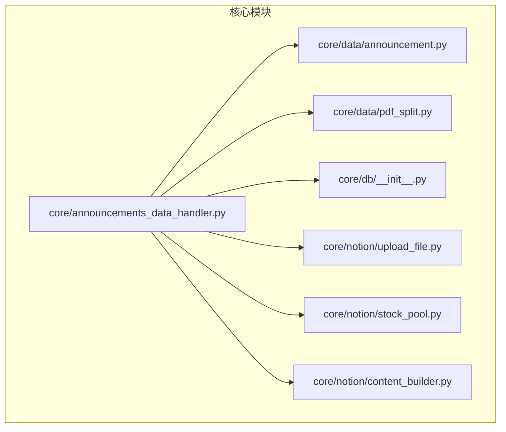
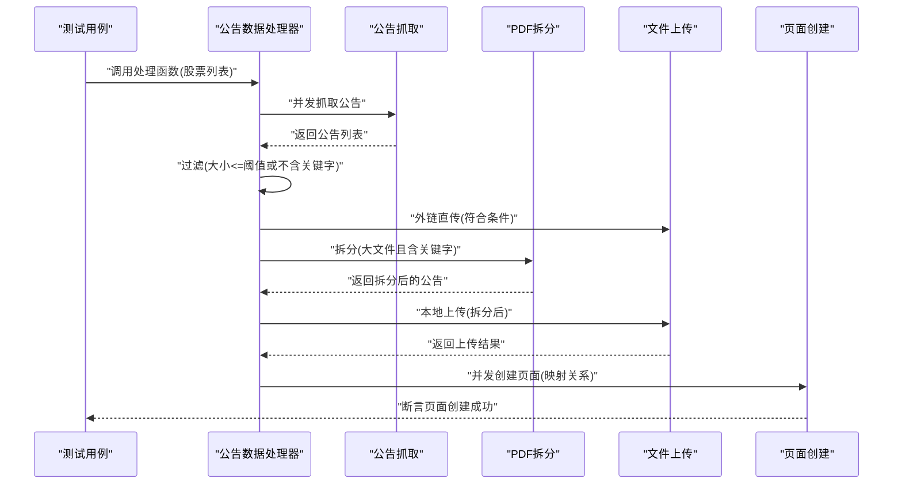
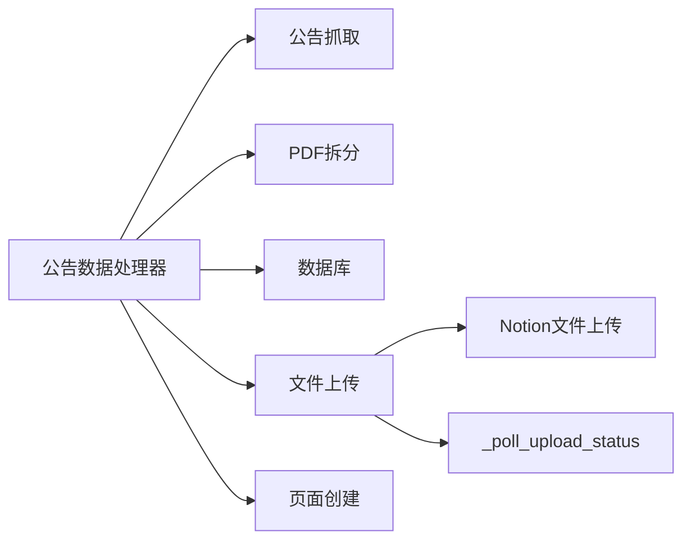

# 单元测试

<cite>
**本文引用的文件**
- [core/announcements_data_handler.py](file://core/announcements_data_handler.py)
- [core/data/announcement.py](file://core/data/announcement.py)
- [core/data/pdf_split.py](file://core/data/pdf_split.py)
- [core/db/__init__.py](file://core/db/__init__.py)
- [core/notion/upload_file.py](file://core/notion/upload_file.py)
- [core/notion/stock_pool.py](file://core/notion/stock_pool.py)
- [core/notion/content_builder.py](file://core/notion/content_builder.py)
</cite>

## 目录
1. [引言](#引言)
2. [项目结构](#项目结构)
3. [核心组件](#核心组件)
4. [架构总览](#架构总览)
5. [详细组件分析](#详细组件分析)
6. [依赖分析](#依赖分析)
7. [性能考量](#性能考量)
8. [故障排查指南](#故障排查指南)
9. [结论](#结论)
10. [附录](#附录)

## 引言
本文件面向股票公告自动化系统，聚焦“单元测试”的设计原则、测试用例编写规范与断言策略，围绕公告数据处理器的异步函数测试、模拟对象使用与参数验证展开；并结合测试夹具配置与测试数据准备（如 sample_stock_pool），给出公告过滤逻辑、文件上传策略与页面创建功能的具体测试思路与示例路径。同时提供测试覆盖率目标、命名约定与组织结构建议，帮助团队建立高质量、可维护的测试体系。

## 项目结构
测试相关模块主要分布在 tests 目录下，本次分析重点覆盖以下核心模块与其实现文件：
- 公告数据处理器：负责拉取公告、按条件过滤、拆分大文件、上传并创建 Notion 页面
- 公告数据模型与 PDF 拆分：定义公告结构与 PDF 分片策略
- 数据库与更新时间：提供更新时间查询与持久化能力
- Notion 文件上传与股票池：提供外链直传、本地上传、轮询状态、股票池查询等能力
- 内容构建器：提供页面内容块构建能力（便于页面创建测试）

图表来源
- [core/announcements_data_handler.py](file://core/announcements_data_handler.py#L1-L116)
- [core/data/announcement.py](file://core/data/announcement.py#L1-L141)
- [core/data/pdf_split.py](file://core/data/pdf_split.py#L1-L128)
- [core/db/__init__.py](file://core/db/__init__.py#L1-L218)
- [core/notion/upload_file.py](file://core/notion/upload_file.py#L1-L180)
- [core/notion/stock_pool.py](file://core/notion/stock_pool.py#L1-L52)
- [core/notion/content_builder.py](file://core/notion/content_builder.py#L1-L103)

章节来源
- [core/announcements_data_handler.py](file://core/announcements_data_handler.py#L1-L116)
- [core/data/announcement.py](file://core/data/announcement.py#L1-L141)
- [core/data/pdf_split.py](file://core/data/pdf_split.py#L1-L128)
- [core/db/__init__.py](file://core/db/__init__.py#L1-L218)
- [core/notion/upload_file.py](file://core/notion/upload_file.py#L1-L180)
- [core/notion/stock_pool.py](file://core/notion/stock_pool.py#L1-L52)
- [core/notion/content_builder.py](file://core/notion/content_builder.py#L1-L103)

## 核心组件
- 公告数据处理器：实现公告抓取、分组并发、过滤与拆分、上传策略选择、页面创建等全流程异步编排
- 公告模型与 PDF 拆分：定义公告结构、过滤规则（标题关键词）、拆分策略（页数阈值与重叠）
- 数据库与更新时间：提供按股票与键查询/设置更新时间的能力，支撑增量更新
- Notion 文件上传：支持外链直传与本地上传，内置轮询与错误处理
- 股池查询：异步查询股票池，返回股票标识与代码
- 内容构建器：构建页面 blocks，便于页面创建测试

章节来源
- [core/announcements_data_handler.py](file://core/announcements_data_handler.py#L1-L116)
- [core/data/announcement.py](file://core/data/announcement.py#L1-L141)
- [core/data/pdf_split.py](file://core/data/pdf_split.py#L1-L128)
- [core/db/__init__.py](file://core/db/__init__.py#L153-L185)
- [core/notion/upload_file.py](file://core/notion/upload_file.py#L28-L61)
- [core/notion/stock_pool.py](file://core/notion/stock_pool.py#L23-L51)
- [core/notion/content_builder.py](file://core/notion/content_builder.py#L1-L103)

## 架构总览
公告自动化流程的单元测试应覆盖以下关键路径：
- 输入参数校验与边界条件（空列表、非法类型、日期范围）
- 异步并发与任务编排（gather、create_task）
- 条件过滤（文件大小阈值、标题关键字）
- PDF 拆分与上传策略选择（本地 vs 外链）
- 页面创建与关系映射（基于股票代码与 ID）

图表来源
- [core/announcements_data_handler.py](file://core/announcements_data_handler.py#L21-L116)
- [core/data/announcement.py](file://core/data/announcement.py#L36-L112)
- [core/data/pdf_split.py](file://core/data/pdf_split.py#L15-L73)
- [core/notion/upload_file.py](file://core/notion/upload_file.py#L28-L61)

## 详细组件分析

### 公告数据处理器单元测试
- 设计原则
  - 面向异步：使用 asyncio.gather 并发执行，需通过模拟网络请求与数据库访问控制真实 IO
  - 参数驱动：输入为股票池列表，需覆盖空列表、单支、多支、重复代码等
  - 过滤优先：先按大小与标题关键字过滤，再决定上传策略
  - 上传策略：小文件走外链直传，大文件走本地拆分上传
  - 页面创建：并发创建，断言数量与关系映射正确性
- 测试用例编写规范
  - 命名：test_process_announcements_data_for_stock_list_*，区分场景（空输入、正常、异常）
  - 夹具：构造 sample_stock_pool（NamedTuple 列表），注入 get_stock_pool 与 get_update_time 的模拟
  - 断言：断言并发任务数量、过滤后数量、上传结果数量、页面创建数量与关系映射
- 异步函数测试
  - 使用 pytest-asyncio 标记异步测试
  - 使用 asyncio.gather 替代顺序等待，保证并发行为一致性
- 模拟对象使用
  - httpx.AsyncClient：模拟公告抓取接口响应
  - 数据库 get_update_time：返回不同更新时间以触发分组策略
  - PDF 拆分：mock split_pdf 返回拆分后的公告列表
  - 文件上传：mock upload_files_with_url 与 upload_files_with_local 返回固定结构
  - 页面创建：mock create_dataflow_page，统计调用次数与参数
- 参数验证
  - 股票列表非空性、日期范围合法性、标题关键字匹配、文件大小阈值
- 示例路径
  - 处理函数入口：[process_announcements_data_for_stock_list](file://core/announcements_data_handler.py#L21-L116)
  - 公告抓取接口：[get_announcements](file://core/data/announcement.py#L36-L112)
  - PDF 拆分策略：[split_pdf](file://core/data/pdf_split.py#L15-L73)
  - 文件上传策略：[upload_files_with_url](file://core/notion/upload_file.py#L40-L61)、[upload_files_with_local](file://core/notion/upload_file.py#L28-L37)
  - 页面创建：[create_dataflow_page](file://core/announcements_data_handler.py#L102-L112)

章节来源
- [core/announcements_data_handler.py](file://core/announcements_data_handler.py#L21-L116)
- [core/data/announcement.py](file://core/data/announcement.py#L36-L112)
- [core/data/pdf_split.py](file://core/data/pdf_split.py#L15-L73)
- [core/notion/upload_file.py](file://core/notion/upload_file.py#L28-L61)

### 公告过滤逻辑测试
- 设计原则
  - 关键词匹配：SPLIT_KEYWORDS 控制是否对大文件进行拆分
  - 大小阈值：超过阈值才拆分，否则外链直传
- 测试要点
  - 标题包含关键字且文件较大：应进入拆分流程
  - 标题不包含关键字或文件较小：应走外链直传
  - 边界值：大小等于阈值、空标题、空关键字列表
- 示例路径
  - 过滤条件：[SPLIT_KEYWORDS 与过滤逻辑](file://core/announcements_data_handler.py#L18-L71)

章节来源
- [core/announcements_data_handler.py](file://core/announcements_data_handler.py#L18-L71)

### 文件上传策略测试
- 设计原则
  - 外链直传：upload_files_with_url，适合小文件与可外链文件
  - 本地上传：upload_files_with_local，适合大文件与需拆分的文件
  - 轮询机制：_poll_upload_status 指数退避，超时处理
- 测试要点
  - 成功与失败场景：断言 successed 标志与错误信息
  - 并发上传：断言 gather 并发执行与结果聚合
  - 轮询超时：断言最终失败与错误消息
- 示例路径
  - 外链上传：[upload_files_with_url](file://core/notion/upload_file.py#L40-L61)
  - 本地上传：[upload_files_with_local](file://core/notion/upload_file.py#L28-L37)
  - 轮询状态：[_poll_upload_status](file://core/notion/upload_file.py#L153-L176)

章节来源
- [core/notion/upload_file.py](file://core/notion/upload_file.py#L28-L61)
- [core/notion/upload_file.py](file://core/notion/upload_file.py#L153-L176)

### 页面创建功能测试
- 设计原则
  - 并发创建：create_dataflow_page 并发执行，断言数量与参数
  - 关系映射：根据股票代码映射到 Notion 页面 ID
- 测试要点
  - 参数完整性：标题、发布时间、数据类型、关联关系、附件 ID、来源 URL
  - 并发一致性：断言 create_tasks 数量与 gather 结果
- 示例路径
  - 页面创建入口：[create_dataflow_page 调用](file://core/announcements_data_handler.py#L99-L113)

章节来源
- [core/announcements_data_handler.py](file://core/announcements_data_handler.py#L99-L113)

### 测试夹具与数据准备
- 股池夹具
  - 构造 sample_stock_pool：使用 NamedTuple 提供 id 与 code
  - 注入 get_stock_pool：在测试中替换为返回固定列表
- 更新时间夹具
  - 构造 get_update_time：返回不同更新时间，验证分组与增量逻辑
- 公告数据夹具
  - 构造多种 Announcement：包含不同大小、标题、URL、时间
- 示例路径
  - 股池模型：[StockPool](file://core/notion/stock_pool.py#L10-L21)
  - 股池查询：[get_stock_pool](file://core/notion/stock_pool.py#L23-L51)
  - 更新时间查询：[get_update_time](file://core/db/__init__.py#L153-L185)

章节来源
- [core/notion/stock_pool.py](file://core/notion/stock_pool.py#L10-L51)
- [core/db/__init__.py](file://core/db/__init__.py#L153-L185)

### 内容构建器单元测试（页面内容）
- 设计原则
  - 构建器链式调用：add_heading/add_paragraph/add_table_from_dataframe/add_divider/add_callout
  - 输出结构：build 返回 blocks 列表
- 测试要点
  - 标题层级：断言 heading_1/2/3 映射
  - 表格渲染：断言表宽、行列数、缺失值占位
  - 分隔线与 Callout：断言类型与图标
- 示例路径
  - 内容构建器：[NotionContentBuilder](file://core/notion/content_builder.py#L1-L103)

章节来源
- [core/notion/content_builder.py](file://core/notion/content_builder.py#L1-L103)

## 依赖分析
- 组件耦合
  - 公告数据处理器依赖公告抓取、PDF 拆分、数据库、文件上传与页面创建
  - 文件上传内部依赖 Notion 文件上传接口与轮询状态
- 外部依赖
  - httpx：异步 HTTP 客户端
  - pymupdf：PDF 解析与拆分
  - aiosqlite：异步 SQLite 访问
- 循环依赖
  - 未发现循环导入；各模块职责清晰

图表来源
- [core/announcements_data_handler.py](file://core/announcements_data_handler.py#L1-L16)
- [core/notion/upload_file.py](file://core/notion/upload_file.py#L153-L176)

章节来源
- [core/announcements_data_handler.py](file://core/announcements_data_handler.py#L1-L16)
- [core/notion/upload_file.py](file://core/notion/upload_file.py#L153-L176)

## 性能考量
- 并发策略
  - 使用 asyncio.gather 并发抓取与上传，减少总耗时
  - 上传轮询采用指数退避，避免频繁请求
- I/O 优化
  - PDF 拆分在内存中进行，避免磁盘 IO
  - 批量插入哈希与更新记录，减少数据库往返
- 测试性能
  - 使用 mock 替代真实网络与数据库，提升测试速度
  - 合理划分测试用例，避免长串等待

## 故障排查指南
- 常见问题
  - 上传失败：检查轮询超时与错误信息，确认 Notion 文件上传接口可用性
  - PDF 拆分异常：检查网络下载与页数解析，必要时降级保留原公告
  - 页面创建失败：核对关系映射与附件 ID，确保 create_dataflow_page 参数完整
- 排查步骤
  - 启用日志：查看上传与拆分过程的日志输出
  - 断言细化：分别断言外链与本地上传的成功率
  - 回归测试：针对失败用例补充最小可复现数据集

## 结论
通过将公告数据处理器的异步流程、过滤逻辑、上传策略与页面创建进行模块化测试，结合模拟对象与夹具配置，能够有效验证系统在不同输入与边界条件下的正确性与鲁棒性。建议持续完善测试覆盖率，强化异常路径与并发场景的覆盖，确保系统稳定运行。

## 附录
- 测试覆盖率要求
  - 语句覆盖率：≥80%
  - 分支覆盖率：≥70%
  - 行为覆盖率：重点覆盖并发与异常路径
- 测试命名约定
  - test_*：标准测试
  - test_async_*：异步测试
  - test_process_announcements_data_for_stock_list_*：处理器场景化命名
- 测试组织结构
  - tests/test_announcements_data_handler.py：处理器主流程
  - tests/test_announcements_data_handler_filter.py：过滤逻辑
  - tests/test_announcements_data_handler_upload.py：上传策略
  - tests/test_announcements_data_handler_page.py：页面创建
  - tests/conftest.py：通用夹具与模拟配置
  - tests/test_content_builder.py：页面内容构建器
  - tests/test_stock_pool.py：股票池查询
  - tests/test_db.py：数据库更新时间与哈希
  - tests/test_pdf_split.py：PDF 拆分
  - tests/test_upload_file.py：文件上传
  - tests/test_announcement.py：公告抓取
  - tests/test_datetime_helper.py：日期工具（如有）
  - tests/test_models.py：数据模型（如有）
  - tests/test_business.py：业务数据处理器（如有）
  - tests/test_business_data_handler.py：业务处理器（如有）
  - tests/test_flow_database.py：数据流数据库（如有）
  - tests/test_integration.py：集成测试（如有）