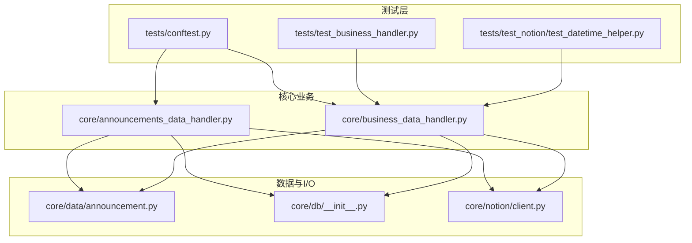
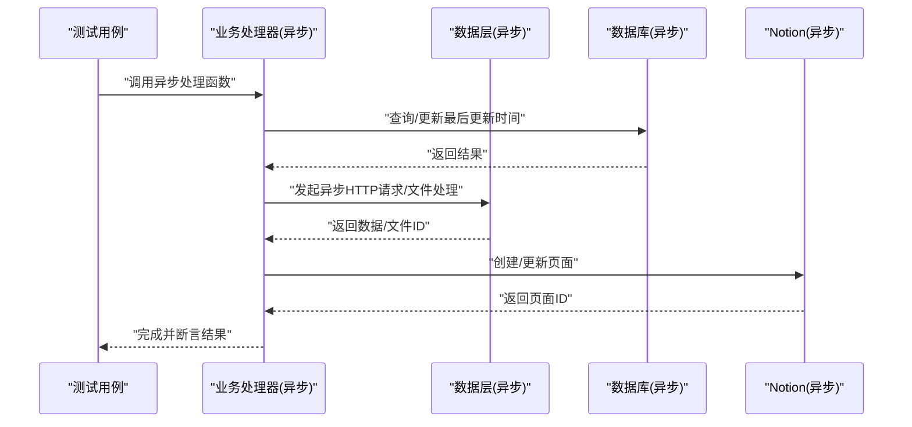
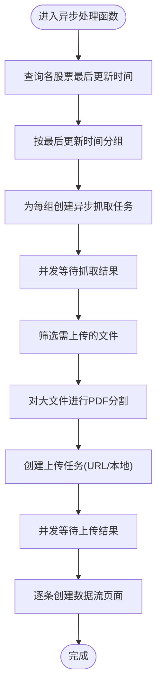
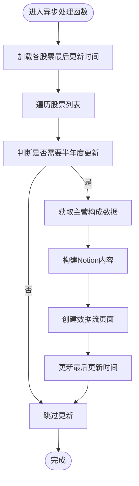
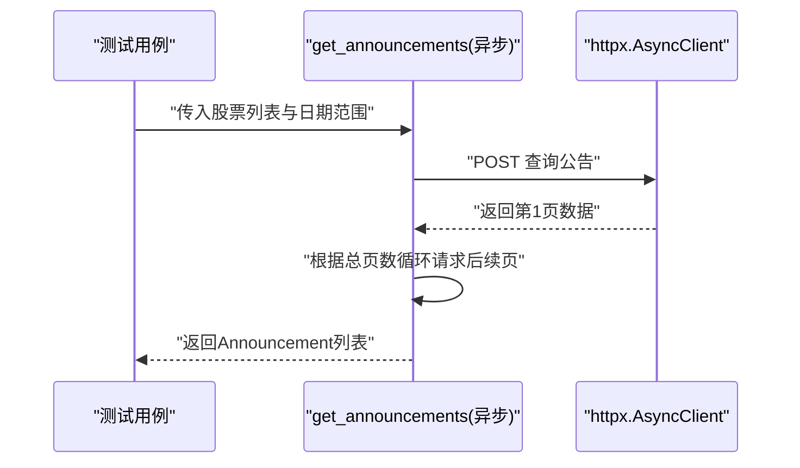
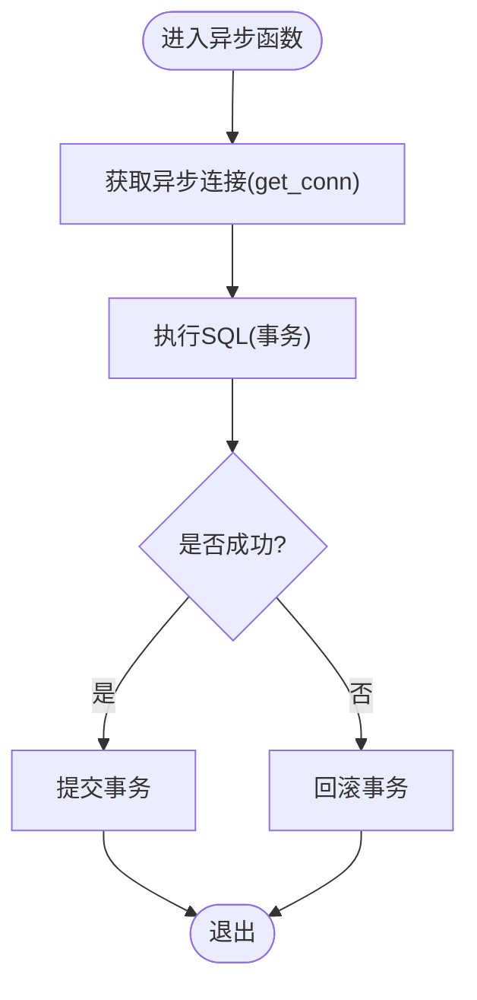
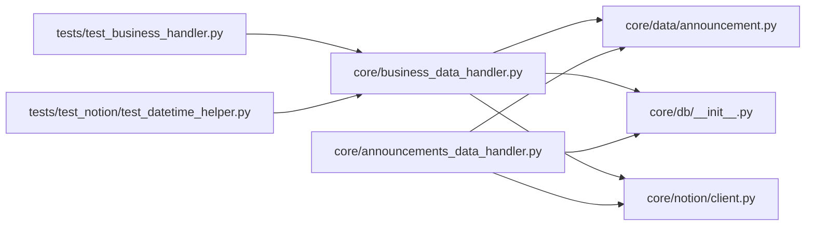

# 异步测试

<cite>
**本文引用的文件**
- [tests/conftest.py](file://tests/conftest.py)
- [tests/test_business_handler.py](file://tests/test_business_handler.py)
- [tests/test_notion/test_datetime_helper.py](file://tests/test_notion/test_datetime_helper.py)
- [core/announcements_data_handler.py](file://core/announcements_data_handler.py)
- [core/business_data_handler.py](file://core/business_data_handler.py)
- [core/data/announcement.py](file://core/data/announcement.py)
- [core/db/__init__.py](file://core/db/__init__.py)
- [core/notion/client.py](file://core/notion/client.py)
</cite>

## 目录
1. [引言](#引言)
2. [项目结构](#项目结构)
3. [核心组件](#核心组件)
4. [架构总览](#架构总览)
5. [详细组件分析](#详细组件分析)
6. [依赖分析](#依赖分析)
7. [性能考量](#性能考量)
8. [故障排查指南](#故障排查指南)
9. [结论](#结论)
10. [附录](#附录)

## 引言
本文件面向“股票公告自动化系统”的异步测试实践，聚焦以下目标：
- pytest 异步测试的配置与使用，包括装饰器与事件循环策略
- AsyncMock 的使用方法与异步测试最佳实践
- 异步函数测试示例：异步数据库操作、异步 HTTP 请求、异步文件处理
- 调试技巧、性能测试方法与并发测试策略
- 测试运行器配置与异步测试的执行顺序控制

本仓库中存在大量异步函数与异步 I/O（如 HTTP 客户端、SQLite 异步驱动），因此围绕这些模块设计异步测试尤为关键。

## 项目结构
项目采用功能域划分的组织方式，核心异步逻辑集中在以下模块：
- 数据层：公告抓取、PDF 分割、数据模型
- 数据库层：基于 aiosqlite 的异步数据库封装
- Notion 集成：异步客户端与页面创建
- 业务处理器：公告与主营构成的异步处理流程

图表来源
- [tests/conftest.py](file://tests/conftest.py#L1-L6)
- [tests/test_business_handler.py](file://tests/test_business_handler.py#L1-L83)
- [tests/test_notion/test_datetime_helper.py](file://tests/test_notion/test_datetime_helper.py#L1-L89)
- [core/announcements_data_handler.py](file://core/announcements_data_handler.py#L1-L116)
- [core/business_data_handler.py](file://core/business_data_handler.py#L1-L108)
- [core/data/announcement.py](file://core/data/announcement.py#L1-L141)
- [core/db/__init__.py](file://core/db/__init__.py#L1-L218)
- [core/notion/client.py](file://core/notion/client.py#L1-L6)

章节来源
- [tests/conftest.py](file://tests/conftest.py#L1-L6)
- [tests/test_business_handler.py](file://tests/test_business_handler.py#L1-L83)
- [tests/test_notion/test_datetime_helper.py](file://tests/test_notion/test_datetime_helper.py#L1-L89)
- [core/announcements_data_handler.py](file://core/announcements_data_handler.py#L1-L116)
- [core/business_data_handler.py](file://core/business_data_handler.py#L1-L108)
- [core/data/announcement.py](file://core/data/announcement.py#L1-L141)
- [core/db/__init__.py](file://core/db/__init__.py#L1-L218)
- [core/notion/client.py](file://core/notion/client.py#L1-L6)

## 核心组件
- 异步公告处理流程：从获取公告、文件上传（本地/URL）、创建 Notion 页面，到更新数据库时间戳
- 异步主营构成处理流程：按半年周期判断是否需要更新，构建内容并创建页面，更新数据库
- 异步 HTTP 客户端：使用 httpx.AsyncClient 发起请求
- 异步数据库：使用 aiosqlite 提供的异步上下文与连接管理
- 异步 Notion 客户端：使用 notion_client.AsyncClient

章节来源
- [core/announcements_data_handler.py](file://core/announcements_data_handler.py#L21-L116)
- [core/business_data_handler.py](file://core/business_data_handler.py#L17-L108)
- [core/data/announcement.py](file://core/data/announcement.py#L36-L141)
- [core/db/__init__.py](file://core/db/__init__.py#L28-L218)
- [core/notion/client.py](file://core/notion/client.py#L1-L6)

## 架构总览
异步测试关注点主要落在“数据层”“数据库层”“Notion 集成层”，以及“业务处理器”。测试策略应覆盖：
- 异步函数的协程行为验证
- 异步 I/O 的隔离与模拟
- 并发任务的调度与聚合
- 数据库事务与一致性
- 环境变量与外部服务（Notion）的隔离

图表来源
- [core/announcements_data_handler.py](file://core/announcements_data_handler.py#L21-L116)
- [core/business_data_handler.py](file://core/business_data_handler.py#L17-L108)
- [core/data/announcement.py](file://core/data/announcement.py#L36-L141)
- [core/db/__init__.py](file://core/db/__init__.py#L153-L218)
- [core/notion/client.py](file://core/notion/client.py#L1-L6)

## 详细组件分析

### 异步公告处理流程测试
- 目标：验证异步并发抓取公告、文件上传（本地/URL）、创建页面的完整链路
- 关键点：
  - 使用异步上下文管理器与并发聚合（gather）
  - 对外部 HTTP 与文件处理进行隔离与模拟
  - 断言最终页面创建数量与附件 ID

图表来源
- [core/announcements_data_handler.py](file://core/announcements_data_handler.py#L21-L116)

章节来源
- [core/announcements_data_handler.py](file://core/announcements_data_handler.py#L1-L116)

### 异步主营构成处理流程测试
- 目标：验证按半年周期判断与页面创建逻辑
- 关键点：
  - 使用时间模拟（patch）控制边界条件
  - 断言不同季度末日期下的更新决策
  - 验证数据库更新时间写入

图表来源
- [core/business_data_handler.py](file://core/business_data_handler.py#L17-L108)

章节来源
- [core/business_data_handler.py](file://core/business_data_handler.py#L1-L108)
- [tests/test_business_handler.py](file://tests/test_business_handler.py#L1-L83)

### 异步 HTTP 请求测试
- 目标：验证公告抓取函数的异步 HTTP 行为
- 关键点：
  - 使用 httpx.AsyncClient 发起请求
  - 对分页逻辑进行断言
  - 对返回数据进行清洗与映射

图表来源
- [core/data/announcement.py](file://core/data/announcement.py#L36-L112)

章节来源
- [core/data/announcement.py](file://core/data/announcement.py#L1-L141)

### 异步数据库操作测试
- 目标：验证异步数据库的连接、事务、查询与写入
- 关键点：
  - 使用异步上下文管理器管理连接与事务
  - 断言查询缺失键时的插入行为
  - 断言更新不存在记录时的异常

图表来源
- [core/db/__init__.py](file://core/db/__init__.py#L28-L52)
- [core/db/__init__.py](file://core/db/__init__.py#L153-L218)

章节来源
- [core/db/__init__.py](file://core/db/__init__.py#L1-L218)

### 异步 Notion 客户端测试
- 目标：验证异步 Notion 客户端初始化与环境变量配置
- 关键点：
  - 通过环境变量注入认证令牌
  - 保证客户端实例可用性

章节来源
- [core/notion/client.py](file://core/notion/client.py#L1-L6)

## 依赖分析
- 测试与被测模块的耦合关系
  - 测试通过 patch 或隔离外部依赖，避免真实网络与数据库影响
  - 业务处理器依赖数据层与数据库层，测试应覆盖这些依赖的模拟
- 并发与顺序
  - 使用 asyncio.gather 并发执行多个任务，测试需验证聚合结果与顺序无关性

图表来源
- [tests/test_business_handler.py](file://tests/test_business_handler.py#L1-L83)
- [tests/test_notion/test_datetime_helper.py](file://tests/test_notion/test_datetime_helper.py#L1-L89)
- [core/business_data_handler.py](file://core/business_data_handler.py#L1-L108)
- [core/announcements_data_handler.py](file://core/announcements_data_handler.py#L1-L116)
- [core/data/announcement.py](file://core/data/announcement.py#L1-L141)
- [core/db/__init__.py](file://core/db/__init__.py#L1-L218)
- [core/notion/client.py](file://core/notion/client.py#L1-L6)

章节来源
- [tests/test_business_handler.py](file://tests/test_business_handler.py#L1-L83)
- [tests/test_notion/test_datetime_helper.py](file://tests/test_notion/test_datetime_helper.py#L1-L89)
- [core/business_data_handler.py](file://core/business_data_handler.py#L1-L108)
- [core/announcements_data_handler.py](file://core/announcements_data_handler.py#L1-L116)
- [core/data/announcement.py](file://core/data/announcement.py#L1-L141)
- [core/db/__init__.py](file://core/db/__init__.py#L1-L218)
- [core/notion/client.py](file://core/notion/client.py#L1-L6)

## 性能考量
- 并发聚合
  - 使用 asyncio.gather 并发执行多个任务，减少总耗时
  - 对于 I/O 密集型场景（HTTP、数据库），并发收益显著
- 任务拆分
  - 将长链路拆分为独立任务，便于并发与重试
- 数据库批处理
  - 使用 executemany 批量写入，减少往返次数
- 缓存与去重
  - 对外部接口响应进行缓存（如 LRU 缓存），减少重复请求
- 超时与重试
  - 为 HTTP 请求设置合理超时与指数退避重试策略

## 故障排查指南
- 异步测试无法启动或事件循环报错
  - 确认测试运行器支持异步（pytest 默认支持），并在测试函数签名中使用正确的事件循环策略
- 异步 Mock 不生效
  - 使用 unittest.mock.AsyncMock 或在 patch 中明确指定 async/await 行为
  - 对于第三方异步库（如 httpx.AsyncClient），优先使用 patch 替换其实例或方法
- 并发测试不稳定
  - 固定随机种子或使用可控输入，避免竞态条件
  - 使用 asyncio.wait_for 设置超时，定位卡死环节
- 数据库事务问题
  - 确保 get_conn 的上下文管理器正确提交/回滚
  - 在测试中清理数据库状态，避免跨用例污染
- 环境变量缺失
  - Notion 客户端依赖环境变量，测试前确保环境变量已设置

## 结论
本项目中的异步测试应围绕“并发聚合、I/O 隔离、数据库事务、外部服务模拟”四大支柱展开。通过合理的 patch 与 AsyncMock，结合 gather 并发与严格的断言，可以在不依赖真实外部服务的情况下稳定验证异步流程的正确性与性能表现。

## 附录

### pytest 异步测试配置与最佳实践
- 运行器配置
  - 使用 pytest 命令行运行测试；默认支持异步协程
  - 如需自定义事件循环策略，可在测试入口或 conftest 中配置
- 装饰器与标记
  - 对于需要显式声明的异步测试，可使用装饰器标记（如 @pytest.mark.asyncio），并确保事件循环可用
- 事件循环策略
  - 在测试入口处设置合适的策略，避免在子线程中运行事件循环
- 测试组织
  - 将异步测试集中在一个目录下，便于统一配置与隔离

章节来源
- [tests/conftest.py](file://tests/conftest.py#L1-L6)

### AsyncMock 使用方法
- 替换异步方法
  - 使用 unittest.mock.patch 替换异步方法或类实例方法
  - 对于第三方库的异步客户端，优先替换其方法或实例
- 断言调用
  - 使用 assert_called、assert_called_once 等断言调用次数
  - 对于异步方法，使用 await 调用并断言返回值
- 与 patch 协同
  - 在测试类或函数中使用 patch 装饰器或 with 上下文，确保作用域内异步行为被替换

### 异步函数测试示例（路径指引）
- 异步数据库操作测试
  - 路径：[core/db/__init__.py](file://core/db/__init__.py#L28-L52)，[core/db/__init__.py](file://core/db/__init__.py#L153-L218)
  - 关键点：使用 get_conn 上下文管理器，断言查询缺失键时的插入与更新异常
- 异步 HTTP 请求测试
  - 路径：[core/data/announcement.py](file://core/data/announcement.py#L36-L112)
  - 关键点：对分页循环与数据清洗进行断言
- 异步文件处理测试
  - 路径：[core/announcements_data_handler.py](file://core/announcements_data_handler.py#L76-L87)
  - 关键点：对大文件分割与上传任务的并发行为进行断言

### 调试技巧
- 使用 pytest 的 -s 与 --tb=long 查看详细堆栈
- 对关键异步函数增加日志输出，定位执行阶段
- 使用 asyncio.run() 或在测试中手动创建事件循环，快速验证单个协程

### 并发测试策略
- 并发聚合
  - 使用 asyncio.gather 并发执行多个任务，断言聚合结果
- 任务拆分
  - 将长链路拆分为独立任务，分别断言
- 竞态控制
  - 使用固定输入与可控时序，避免竞态

### 执行顺序控制
- 顺序无关
  - 并发任务应尽量无序，断言结果集合而非顺序
- 有序依赖
  - 对于必须顺序执行的步骤，拆分为多个独立测试，确保依赖关系清晰