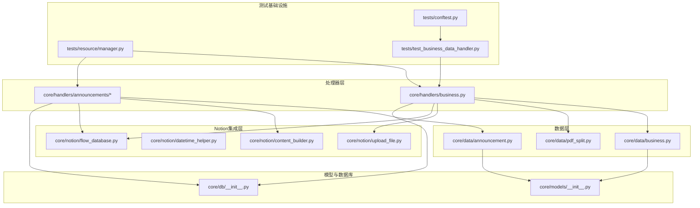
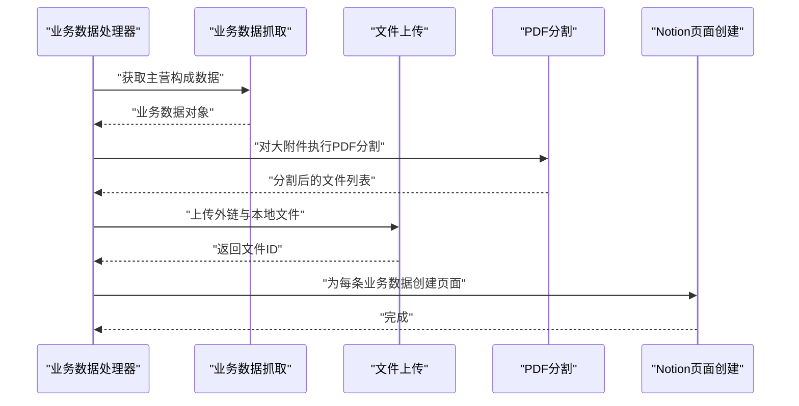
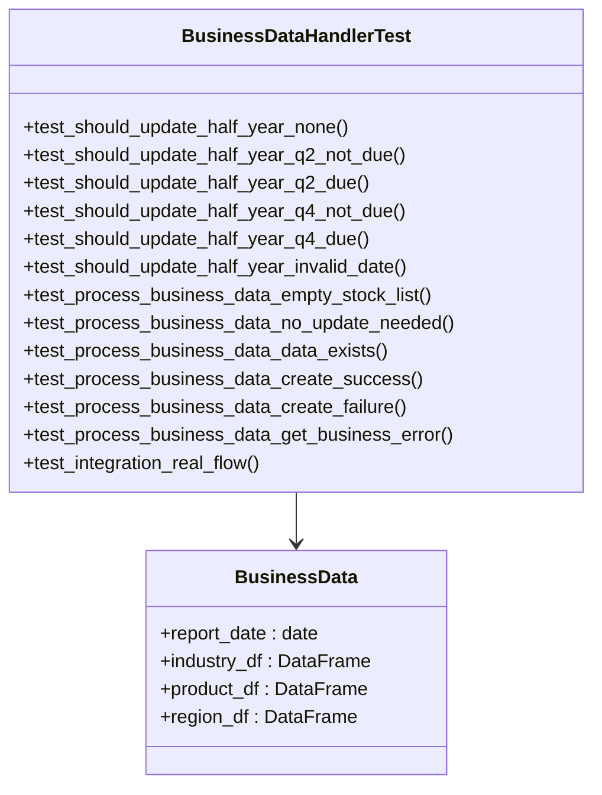
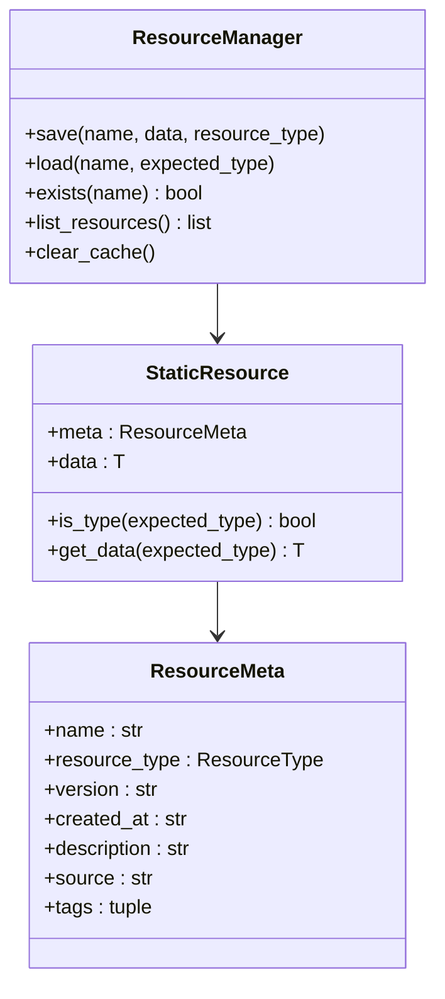
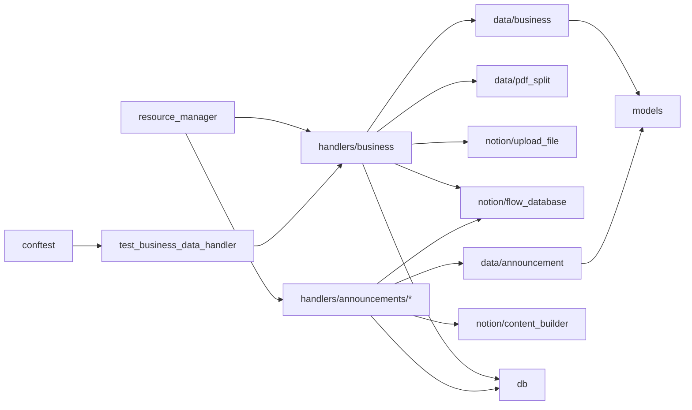

# 测试策略

<cite>
**本文引用的文件**
- [core/handlers/business.py](file://core/handlers/business.py)
- [tests/test_business_data_handler.py](file://tests/test_business_data_handler.py)
- [tests/conftest.py](file://tests/conftest.py)
- [tests/resource/manager.py](file://tests/resource/manager.py)
- [pytest.ini](file://pytest.ini)
</cite>

## 更新摘要
**变更内容**
- 测试基础设施现代化：从复杂的unittest.mock.patch设置转向使用freezegun进行时间操作
- 测试套件更新：反映新的处理器结构和改进的模拟策略
- 时间操作简化：使用freezegun.freeze_time替代复杂的mock设置
- 测试策略优化：提高测试可读性和维护性

## 目录
1. [引言](#引言)
2. [项目结构](#项目结构)
3. [核心组件](#核心组件)
4. [架构总览](#架构总览)
5. [详细组件分析](#详细组件分析)
6. [依赖分析](#依赖分析)
7. [性能考量](#性能考量)
8. [故障排查指南](#故障排查指南)
9. [结论](#结论)
10. [附录](#附录)

## 引言
本测试策略文档面向"股票公告自动化系统"，目标是建立覆盖单元测试、集成测试、异步测试和真实网络测试的完整测试体系。文档围绕 pytest 框架使用、测试夹具配置、模拟对象创建、测试用例设计原则、覆盖率要求、测试数据管理、异步测试最佳实践、错误处理测试、性能测试方法、测试运行与调试、持续集成配置以及测试环境与数据准备等方面展开，帮助开发者与测试工程师高效、稳定地验证系统功能与质量。

**更新** 本次更新反映了测试基础设施的重大现代化，从复杂的unittest.mock.patch设置转向使用freezegun进行时间操作，提高了测试的可读性和维护性。

## 项目结构
该项目采用按功能域划分的模块化组织方式，核心逻辑集中在 core 子包中，测试位于 tests 目录。系统主要由以下模块组成：
- 数据层：公告与业务数据抓取、PDF 分页处理
- Notion 集成层：内容构建、数据库与页面创建、文件上传
- 处理器层：公告与业务数据处理器，负责调度与异步并发
- 工具与模型：日期工具、数据模型、数据库接口
- 测试基础设施：静态资源管理、测试夹具、模拟对象、真实网络测试



**图表来源**
- [core/handlers/business.py](file://core/handlers/business.py)
- [core/data/business.py](file://core/data/business.py)
- [tests/test_business_data_handler.py](file://tests/test_business_data_handler.py)
- [tests/resource/manager.py](file://tests/resource/manager.py)
- [tests/conftest.py](file://tests/conftest.py)

**章节来源**
- [core/handlers/business.py](file://core/handlers/business.py)
- [core/data/business.py](file://core/data/business.py)
- [tests/test_business_data_handler.py](file://tests/test_business_data_handler.py)
- [tests/resource/manager.py](file://tests/resource/manager.py)
- [tests/conftest.py](file://tests/conftest.py)

## 核心组件
- 业务数据处理器：负责按半年周期判断是否需要更新，抓取主营构成数据，构建 Notion 内容并创建页面。
- 公告数据处理器：负责根据股票池与更新时间，批量拉取公告、按条件上传附件（外链与本地分割）、创建 Notion 页面。
- 数据抓取模块：公告与业务数据的异步抓取实现，包含网络请求与缓存逻辑。
- Notion 集成模块：内容构建器、页面创建、文件上传与数据库接口。
- PDF 分割模块：对大附件进行 PDF 分割，便于后续上传。
- **新增** 静态资源管理系统：提供统一的测试数据管理机制，支持多种资源类型的存储与加载，包含真实网络数据的缓存能力。
- **新增** freezegun 时间模拟：提供简洁的时间冻结机制，替代复杂的mock设置。

**更新** 测试套件现已扩展为全面的业务数据处理测试体系，包括业务数据处理器的完整测试覆盖，支持单元测试、集成测试、异步测试和真实网络测试。测试基础设施现代化，使用freezegun简化时间操作。

**章节来源**
- [core/handlers/business.py](file://core/handlers/business.py)
- [core/data/business.py](file://core/data/business.py)
- [tests/test_business_data_handler.py](file://tests/test_business_data_handler.py)
- [tests/resource/manager.py](file://tests/resource/manager.py)

## 架构总览
系统采用异步并发模式，通过处理器协调数据抓取、文件上传与页面创建，确保高吞吐与低延迟。整体流程如下：



**图表来源**
- [core/handlers/business.py](file://core/handlers/business.py)
- [core/data/business.py](file://core/data/business.py)
- [core/data/pdf_split.py](file://core/data/pdf_split.py)
- [core/notion/upload_file.py](file://core/notion/upload_file.py)
- [core/notion/flow_database.py](file://core/notion/flow_database.py)

## 详细组件分析

### 组件A：业务数据处理器测试
**新增** 业务数据处理器的完整测试覆盖，包括单元测试、集成测试和真实网络测试：

- **单元测试**：测试_should_update_half_year辅助函数的各种情况，包括None值、季度末日期、非季度末日期等边界条件
- **集成测试**：测试process_business_data_for_stock_list主函数的完整流程，包括数据获取、去重检查、页面创建等
- **异步测试**：验证异步并发处理能力和错误处理机制
- **真实网络测试**：使用.dev.env配置进行端到端验证，支持真实AkShare API和Notion API调用

**更新** 测试现在使用freezegun进行时间操作，简化了测试代码：

```python
# 新的测试模式 - 使用freezegun
with freeze_time("2025-01-01"):
    result = _should_update_half_year(NotionDate("2024-06-30"))
    assert result is True

# 旧的测试模式 - 复杂的mock设置
with (
    patch("core.handlers.business.datetime") as mock_datetime,
    patch("core.handlers.business.logger") as mock_logger,
):
    mock_datetime.now.return_value = datetime(2025, 1, 1)
    mock_datetime.strptime.side_effect = lambda x, y: datetime.strptime(x, y)
    result = _should_update_half_year(NotionDate("2024-06-30"))
```



**图表来源**
- [tests/test_business_data_handler.py](file://tests/test_business_data_handler.py)
- [core/handlers/business.py](file://core/handlers/business.py)

**章节来源**
- [tests/test_business_data_handler.py](file://tests/test_business_data_handler.py)
- [core/handlers/business.py](file://core/handlers/business.py)

### 组件B：静态资源管理系统
**保留** 静态资源管理系统的完整测试覆盖：

- **资源类型测试**：验证多种资源类型的正确识别与处理
- **元数据管理测试**：验证资源元数据的存储、加载与序列化
- **缓存机制测试**：验证内存缓存的正确工作
- **文件结构测试**：验证pickle和JSON文件的正确格式



**图表来源**
- [tests/resource/manager.py](file://tests/resource/manager.py)

**章节来源**
- [tests/resource/manager.py](file://tests/resource/manager.py)

### 组件C：测试基础设施
**新增** 增强的测试基础设施，支持真实网络测试和现代化时间操作：

- **内存数据库**：提供独立的测试数据库，支持事务性和隔离性
- **环境变量管理**：支持.test.env和.dev.env配置文件
- **事件循环管理**：为异步测试提供稳定的事件循环
- **freezegun时间模拟**：提供简洁的时间冻结机制，替代复杂的mock设置
- **真实数据获取**：提供fetch_business.py脚本获取真实业务数据

**更新** 测试基础设施现代化，使用freezegun简化时间操作：

```python
# 测试夹具中使用freezegun进行时间冻结
@pytest.mark.unit
@pytest.mark.fast
async def test_should_update_half_year_q2_due(self):
    """测试Q2结束且已到更新时间的情况."""
    from core.handlers.business import _should_update_half_year
    from core.models import NotionDate
    from freezegun import freeze_time

    with freeze_time("2025-01-01"):
        result = _should_update_half_year(NotionDate("2024-06-30"))
        assert result is True
```

**章节来源**
- [tests/conftest.py](file://tests/conftest.py)
- [tests/test_business_data_handler.py](file://tests/test_business_data_handler.py)

## 依赖分析
- 处理器依赖数据抓取与 Notion 集成模块，形成清晰的分层耦合
- 数据抓取模块依赖外部服务与第三方库（如 httpx、AkShare），需通过模拟与缓存控制外部依赖
- PDF 分割模块与文件上传模块共同支撑大附件处理
- 数据模型与数据库接口为跨模块共享
- **新增** 测试基础设施依赖静态资源管理系统，提供受控的测试数据环境
- **新增** 真实网络测试依赖环境变量配置，支持生产级测试验证
- **新增** freezegun依赖用于时间操作的简化测试



**图表来源**
- [core/handlers/business.py](file://core/handlers/business.py)
- [core/data/business.py](file://core/data/business.py)
- [tests/test_business_data_handler.py](file://tests/test_business_data_handler.py)
- [tests/resource/manager.py](file://tests/resource/manager.py)
- [tests/conftest.py](file://tests/conftest.py)

**章节来源**
- [core/handlers/business.py](file://core/handlers/business.py)
- [core/data/business.py](file://core/data/business.py)
- [tests/test_business_data_handler.py](file://tests/test_business_data_handler.py)
- [tests/resource/manager.py](file://tests/resource/manager.py)
- [tests/conftest.py](file://tests/conftest.py)

## 性能考量
- 异步并发：使用 asyncio.gather 并发抓取、上传与创建页面，显著提升吞吐量
- 批量请求：对存在更新时间的股票按日期分组，减少接口调用次数
- 缓存优化：对股票映射 JSON 使用 LRU 缓存，避免重复网络请求
- I/O 密集型：网络请求与文件上传为主要瓶颈，建议在测试中使用限速与超时控制
- **新增** 内存数据库：测试数据库使用内存存储，避免磁盘I/O开销
- **新增** 资源缓存：静态资源管理器内置内存缓存，提升测试执行效率
- **新增** 真实网络测试：支持端到端性能验证，包括API响应时间和页面创建时间
- **新增** freezegun性能：时间冻结操作开销极小，相比复杂mock设置更高效

**更新** 新增了内存数据库、资源缓存、真实网络测试和freezegun性能的考量，全面支持不同层次的性能测试需求。

**章节来源**
- [core/handlers/business.py](file://core/handlers/business.py)
- [core/data/business.py](file://core/data/business.py)
- [tests/conftest.py](file://tests/conftest.py)
- [tests/resource/manager.py](file://tests/resource/manager.py)

## 故障排查指南
- 日志定位：各模块均包含日志记录，优先查看 INFO/ERROR 级别日志以定位问题
- 网络异常：公告抓取与股票数据抓取依赖外部接口，需关注超时与状态码
- 权限与配额：Notion 页面创建与文件上传需检查 API 密钥与空间配额
- 数据格式：确保输入的股票代码与日期格式正确，避免解析错误
- 单元测试辅助：通过模拟外部依赖与缓存，隔离问题范围
- **新增** 真实网络测试：使用.dev.env配置进行端到端验证，支持生产级故障排查
- **新增** 资源加载故障：静态资源文件损坏或元数据不匹配会导致测试失败，需检查资源文件完整性
- **新增** 环境变量配置：检查.test.env和.dev.env文件的正确性
- **新增** freezegun时间问题：确保freeze_time上下文正确使用，避免时间冻结范围错误

**更新** 新增了真实网络测试、环境变量配置、资源加载和freezegun时间操作相关的故障排查指导。

**章节来源**
- [core/data/business.py](file://core/data/business.py)
- [core/handlers/business.py](file://core/handlers/business.py)
- [tests/test_business_data_handler.py](file://tests/test_business_data_handler.py)
- [tests/resource/manager.py](file://tests/resource/manager.py)
- [tests/conftest.py](file://tests/conftest.py)

## 结论
本测试策略以 pytest 为核心，结合单元测试、集成测试、异步测试和真实网络测试，覆盖数据抓取、文件上传、页面创建与业务规则校验。通过模拟外部依赖、缓存控制与并发测试，既能保证测试稳定性，又能评估系统性能。**更新** 当前测试套件已扩展为全面的业务数据处理测试体系，包括业务数据处理器的完整测试覆盖，支持真实网络测试能力。测试基础设施现代化，使用freezegun简化时间操作，提高测试可读性和维护性。建议在 CI 中引入覆盖率统计与性能回归基线，持续保障系统质量。

## 附录

### A. 测试策略与实施要点
- **单元测试**
  - 目标：验证函数内部逻辑、边界条件与异常路径
  - 方法：使用 pytest + pytest-asyncio；对网络与 I/O 使用 pytest-mock 或 unittest.mock
  - 示例：对_should_update_half_year函数进行参数校验、季度判断与异常处理测试
  - **更新** 使用freezegun简化时间操作，提高测试可读性
- **集成测试**
  - 目标：验证模块间协作与端到端流程
  - 方法：使用真实但受控的外部服务（如测试用 Notion 数据库）与最小化数据集
  - 示例：从抓取到页面创建的完整链路测试，包括数据去重和页面创建验证
- **异步测试**
  - 目标：验证并发行为与资源竞争
  - 方法：使用 pytest-asyncio 的标记与事件循环；对并发任务进行顺序与结果断言
  - 示例：并发上传与页面创建的时序与一致性测试
- **真实网络测试**
  - 目标：验证与外部服务的真实交互
  - 方法：使用.dev.env配置进行端到端验证，支持AkShare API和Notion API
  - 示例：完整的业务数据处理流程，从真实数据获取到页面创建
- **测试夹具与模拟**
  - 使用 pytest fixture 提供测试数据与模拟对象（HTTP 客户端、数据库连接、文件上传接口）
  - 对 LRU 缓存进行控制，确保测试可重复性
  - **新增** 使用内存数据库替代真实数据库，提升测试速度和可重复性
  - **新增** 环境变量夹具，支持.test.env和.dev.env配置
  - **新增** freezegun时间夹具，提供简洁的时间冻结机制
- **测试用例设计原则**
  - 覆盖正常路径、边界条件、异常路径与错误恢复
  - 对日期、金额、百分比等数值字段进行精度与格式校验
  - 对并发场景进行压力与竞态测试
  - **新增** 真实网络测试用例，验证生产环境兼容性
  - **新增** 资源完整性验证，确保测试数据的一致性
  - **新增** freezegun时间测试，验证时间敏感逻辑的正确性
- **覆盖率要求**
  - 建议函数级语句覆盖率≥80%，分支覆盖率≥60%
  - 对关键路径（抓取、上传、页面创建）达到更高覆盖率
  - **新增** 业务数据处理器覆盖率≥90%，确保核心功能完整验证
  - **新增** 测试基础设施覆盖率≥70%，确保测试代码质量
- **测试数据管理**
  - 使用固定种子与预置数据，避免外部依赖波动
  - 对 PDF 分割与文件上传使用小体积样本文件
  - **新增** 静态资源管理器提供统一的测试数据管理机制
  - **新增** 支持真实网络数据的缓存和重用
- **异步测试最佳实践**
  - 明确事件循环与任务调度，避免死锁
  - 对超时与重试进行显式断言
  - **新增** 使用freezegun进行时间冻结，确保测试稳定性
  - **新增** 简化时间操作，提高测试代码可读性
- **错误处理测试**
  - 模拟网络失败、空响应、异常状态码与 Notion API 错误
  - 验证日志记录与降级策略
  - **新增** 真实网络错误处理，验证生产环境容错能力
- **性能测试方法**
  - 使用 pytest-benchmark 或自定义计时器测量关键路径耗时
  - 对并发规模进行基准测试，记录吞吐与延迟
  - **新增** 内存数据库性能测试，验证数据库操作效率
  - **新增** 真实网络性能监控，包括API响应时间和页面创建时间
  - **新增** freezegun性能测试，验证时间冻结对性能的影响
- **测试运行指南**
  - 使用命令行参数控制并发与超时
  - 在 CI 中分阶段运行：单元→集成→性能回归→真实网络测试
  - **新增** 支持测试资源的自动加载与缓存管理
  - **新增** 环境变量配置支持，区分测试和开发环境
  - **新增** freezegun时间配置，支持时间敏感测试
- **调试技巧**
  - 启用详细日志与断点调试
  - 使用最小复现样例快速定位问题
  - **新增** 利用静态资源管理器的调试功能，快速定位数据问题
  - **新增** 真实网络调试，支持生产环境问题复现
  - **新增** freezegun时间调试，验证时间相关逻辑
- **持续集成配置**
  - 在 CI 中安装依赖与测试套件
  - 配置覆盖率上报与性能基线对比
  - **新增** 自动化测试资源准备与清理
  - **新增** 环境变量管理和安全配置
  - **新增** freezegun依赖管理
- **测试环境搭建**
  - 准备测试数据库与 Notion 测试页面
  - 配置测试专用 API 密钥与限流策略
  - **新增** 配置静态资源目录与缓存机制
  - **新增** 支持.test.env和.dev.env双环境配置
  - **新增** freezegun时间配置
- **测试结果分析**
  - 汇总失败用例与错误分布，识别热点模块
  - 对性能回归进行趋势分析与阈值报警
  - **新增** 分析真实网络测试结果，验证生产环境兼容性
  - **新增** 测试资源加载性能与缓存命中率分析
  - **新增** freezegun时间测试性能分析

### B. 测试基础设施配置
- **pytest 配置**
  - 异步模式自动配置
  - 测试路径指向 tests 目录
  - 支持 async/await 语法
  - **新增** 自定义标记：unit、integration、fast、slow、real_network
  - **新增** freezegun依赖配置
- **测试夹具**
  - 内存数据库夹具，提供独立的测试数据库
  - 环境变量夹具，支持.test.env和.dev.env配置
  - 事件循环夹具，确保异步测试稳定性
  - **新增** 静态资源管理器，提供统一的测试数据访问
  - **新增** freezegun时间夹具，支持日期和时间的精确控制
- **测试数据管理**
  - 支持多种数据格式：Pickle、JSON、DataFrame
  - 自动化的元数据管理与版本控制
  - 内存缓存机制提升测试执行效率
  - **新增** 真实网络数据缓存，支持重复使用
- **测试运行策略**
  - 支持并行测试执行
  - 模块级别的独立测试运行
  - 集成测试的端到端验证
  - **新增** 真实网络测试的分阶段执行
  - **新增** 环境隔离和配置管理
  - **新增** freezegun时间测试支持

**章节来源**
- [pytest.ini](file://pytest.ini)
- [tests/conftest.py](file://tests/conftest.py)
- [tests/resource/manager.py](file://tests/resource/manager.py)
- [tests/test_business_data_handler.py](file://tests/test_business_data_handler.py)