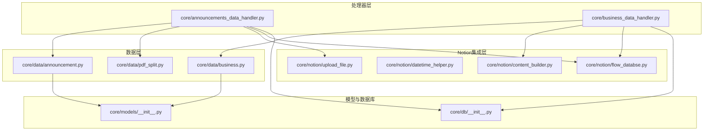
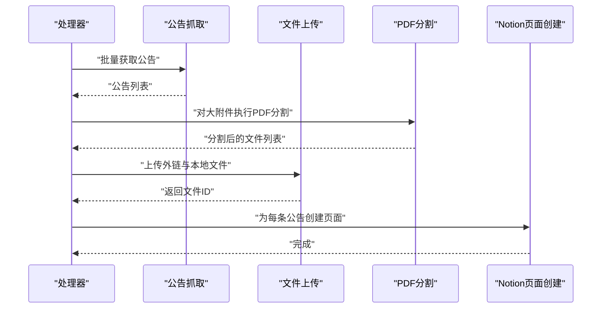
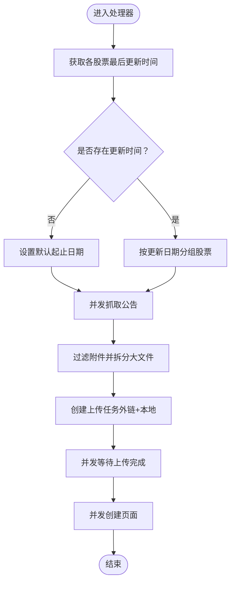
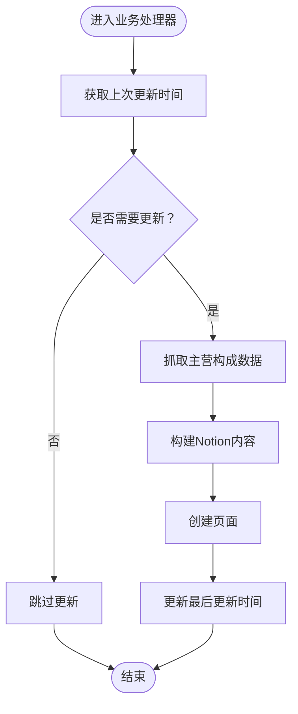
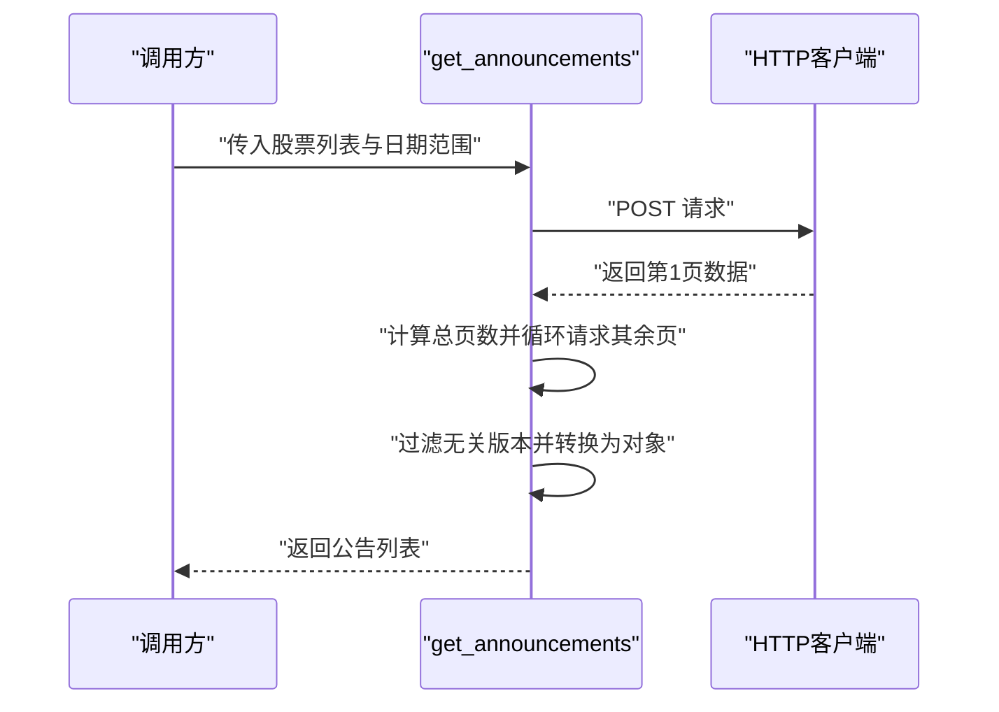
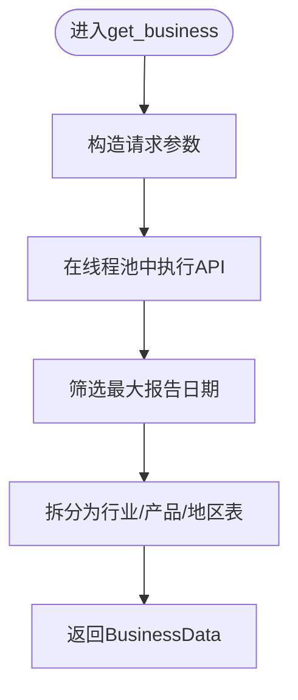
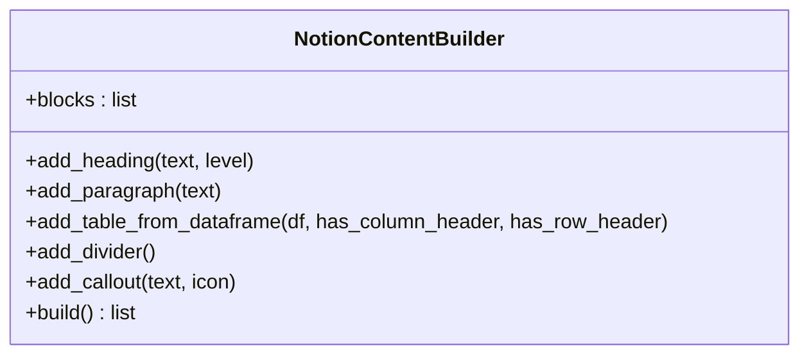
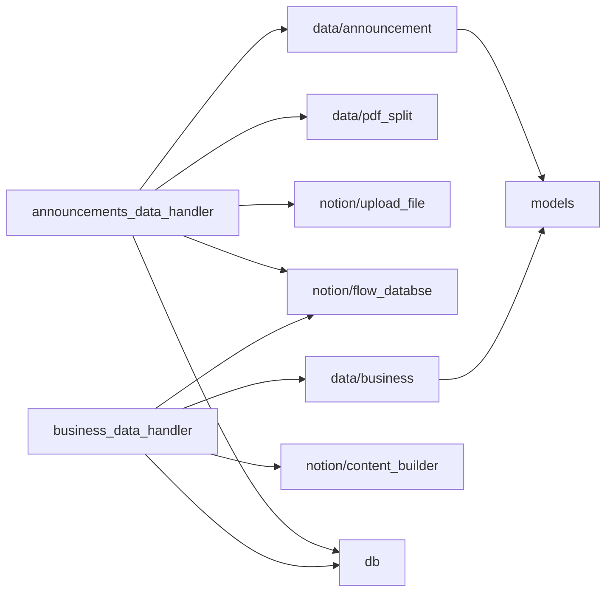

# 测试策略

<cite>
**本文引用的文件**
- [core/announcements_data_handler.py](file://core/announcements_data_handler.py)
- [core/business_data_handler.py](file://core/business_data_handler.py)
- [core/data/announcement.py](file://core/data/announcement.py)
- [core/data/business.py](file://core/data/business.py)
- [core/data/pdf_split.py](file://core/data/pdf_split.py)
- [core/notion/content_builder.py](file://core/notion/content_builder.py)
- [core/notion/datetime_helper.py](file://core/notion/datetime_helper.py)
- [core/notion/flow_databse.py](file://core/notion/flow_databse.py)
- [core/notion/upload_file.py](file://core/notion/upload_file.py)
- [core/models/__init__.py](file://core/models/__init__.py)
- [core/db/__init__.py](file://core/db/__init__.py)
- [module_test.py](file://module_test.py)
</cite>

## 目录
1. [引言](#引言)
2. [项目结构](#项目结构)
3. [核心组件](#核心组件)
4. [架构总览](#架构总览)
5. [详细组件分析](#详细组件分析)
6. [依赖分析](#依赖分析)
7. [性能考量](#性能考量)
8. [故障排查指南](#故障排查指南)
9. [结论](#结论)
10. [附录](#附录)

## 引言
本测试策略文档面向“股票公告自动化系统”，目标是建立覆盖单元测试、集成测试与异步测试的完整测试体系。文档围绕 pytest 框架使用、测试夹具配置、模拟对象创建、测试用例设计原则、覆盖率要求、测试数据管理、异步测试最佳实践、错误处理测试、性能测试方法、测试运行与调试、持续集成配置以及测试环境与数据准备等方面展开，帮助开发者与测试工程师高效、稳定地验证系统功能与质量。

## 项目结构
该项目采用按功能域划分的模块化组织方式，核心逻辑集中在 core 子包中，测试位于 tests 目录（尽管当前仓库未包含该目录）。系统主要由以下模块组成：
- 数据层：公告与业务数据抓取、PDF 分页处理
- Notion 集成层：内容构建、数据库与页面创建、文件上传
- 处理器层：公告与业务数据处理器，负责调度与异步并发
- 工具与模型：日期工具、数据模型、数据库接口

图表来源
- [core/announcements_data_handler.py](file://core/announcements_data_handler.py#L1-L116)
- [core/business_data_handler.py](file://core/business_data_handler.py#L1-L108)
- [core/data/announcement.py](file://core/data/announcement.py#L1-L141)
- [core/data/business.py](file://core/data/business.py#L1-L96)
- [core/data/pdf_split.py](file://core/data/pdf_split.py)
- [core/notion/content_builder.py](file://core/notion/content_builder.py#L1-L103)
- [core/notion/datetime_helper.py](file://core/notion/datetime_helper.py)
- [core/notion/flow_databse.py](file://core/notion/flow_databse.py)
- [core/notion/upload_file.py](file://core/notion/upload_file.py)
- [core/models/__init__.py](file://core/models/__init__.py)
- [core/db/__init__.py](file://core/db/__init__.py)

章节来源
- [core/announcements_data_handler.py](file://core/announcements_data_handler.py#L1-L116)
- [core/business_data_handler.py](file://core/business_data_handler.py#L1-L108)
- [core/data/announcement.py](file://core/data/announcement.py#L1-L141)
- [core/data/business.py](file://core/data/business.py#L1-L96)
- [core/data/pdf_split.py](file://core/data/pdf_split.py)
- [core/notion/content_builder.py](file://core/notion/content_builder.py#L1-L103)
- [core/notion/datetime_helper.py](file://core/notion/datetime_helper.py)
- [core/notion/flow_databse.py](file://core/notion/flow_databse.py)
- [core/notion/upload_file.py](file://core/notion/upload_file.py)
- [core/models/__init__.py](file://core/models/__init__.py)
- [core/db/__init__.py](file://core/db/__init__.py)

## 核心组件
- 公告数据处理器：负责根据股票池与更新时间，批量拉取公告、按条件上传附件（外链与本地分割）、创建 Notion 页面。
- 业务数据处理器：负责按半年周期判断是否需要更新，抓取主营构成数据，构建 Notion 内容并创建页面。
- 数据抓取模块：公告与业务数据的异步抓取实现，包含网络请求与缓存逻辑。
- Notion 集成模块：内容构建器、页面创建、文件上传与数据库接口。
- PDF 分割模块：对大附件进行 PDF 分割，便于后续上传。

章节来源
- [core/announcements_data_handler.py](file://core/announcements_data_handler.py#L21-L116)
- [core/business_data_handler.py](file://core/business_data_handler.py#L17-L108)
- [core/data/announcement.py](file://core/data/announcement.py#L36-L141)
- [core/data/business.py](file://core/data/business.py#L33-L96)
- [core/data/pdf_split.py](file://core/data/pdf_split.py)
- [core/notion/content_builder.py](file://core/notion/content_builder.py#L1-L103)
- [core/notion/flow_databse.py](file://core/notion/flow_databse.py)
- [core/notion/upload_file.py](file://core/notion/upload_file.py)

## 架构总览
系统采用异步并发模式，通过处理器协调数据抓取、文件上传与页面创建，确保高吞吐与低延迟。整体流程如下：

图表来源
- [core/announcements_data_handler.py](file://core/announcements_data_handler.py#L40-L116)
- [core/data/announcement.py](file://core/data/announcement.py#L36-L112)
- [core/data/pdf_split.py](file://core/data/pdf_split.py)
- [core/notion/upload_file.py](file://core/notion/upload_file.py)
- [core/notion/flow_databse.py](file://core/notion/flow_databse.py)

## 详细组件分析

### 组件A：公告数据处理器
- 职责：按股票池与更新时间分组，批量获取公告；根据大小与标题关键词决定外链上传或本地分割上传；创建 Notion 页面。
- 关键流程：
  - 计算各股票的最后更新时间，生成起止日期
  - 并发调用公告抓取接口
  - 过滤附件并拆分大文件
  - 并发上传并收集文件ID
  - 并发创建页面
- 异步并发：使用 asyncio.gather 并发执行多个任务，提升吞吐量
- 错误处理：对无更新时间的股票默认回溯一年；对外链与本地上传分别创建任务并聚合等待

图表来源
- [core/announcements_data_handler.py](file://core/announcements_data_handler.py#L21-L116)

章节来源
- [core/announcements_data_handler.py](file://core/announcements_data_handler.py#L21-L116)

### 组件B：业务数据处理器
- 职责：判断半年度更新周期，抓取主营构成数据，构建 Notion 内容并创建页面，更新最后更新时间。
- 关键流程：
  - 获取上次更新时间并判断是否需要更新
  - 构建内容（按行业/产品/地区三张表）
  - 创建页面并更新数据库时间
- 错误处理：对非季度末日期记录错误日志并跳过更新

图表来源
- [core/business_data_handler.py](file://core/business_data_handler.py#L17-L108)

章节来源
- [core/business_data_handler.py](file://core/business_data_handler.py#L17-L108)

### 组件C：数据抓取模块（公告）
- 职责：异步调用巨潮资讯网接口获取公告列表，支持分页与过滤，返回结构化数据。
- 关键流程：
  - 组装请求参数（股票组合、日期范围）
  - 发送请求并解析响应
  - 遍历所有页并合并结果
  - 过滤摘要/英文版/图文版等无关版本
  - 转换为命名元组对象
- 缓存：对股票映射 JSON 使用 LRU 缓存，减少重复请求

图表来源
- [core/data/announcement.py](file://core/data/announcement.py#L36-L112)

章节来源
- [core/data/announcement.py](file://core/data/announcement.py#L36-L112)

### 组件D：数据抓取模块（业务）
- 职责：异步抓取 AkShare 的主营构成数据，按报告日期筛选最新数据，拆分为行业/产品/地区三张表。
- 关键流程：
  - 根据股票代码构造请求参数
  - 在线程池中执行阻塞式 API 调用
  - 选择最大报告日期的数据并重命名列
  - 返回包含报告日期与三张表的命名元组

图表来源
- [core/data/business.py](file://core/data/business.py#L33-L96)

章节来源
- [core/data/business.py](file://core/data/business.py#L33-L96)

### 组件E：Notion 内容构建器
- 职责：将表格数据转换为 Notion 页面 blocks，支持标题、段落、表格、分隔线与 Callout。
- 关键流程：逐个添加块并最终输出 blocks 数组。

图表来源
- [core/notion/content_builder.py](file://core/notion/content_builder.py#L1-L103)

章节来源
- [core/notion/content_builder.py](file://core/notion/content_builder.py#L1-L103)

## 依赖分析
- 处理器依赖数据抓取与 Notion 集成模块，形成清晰的分层耦合
- 数据抓取模块依赖外部服务与第三方库（如 httpx、AkShare），需通过模拟与缓存控制外部依赖
- PDF 分割模块与文件上传模块共同支撑大附件处理
- 数据模型与数据库接口为跨模块共享

图表来源
- [core/announcements_data_handler.py](file://core/announcements_data_handler.py#L7-L16)
- [core/business_data_handler.py](file://core/business_data_handler.py#L4-L12)
- [core/data/announcement.py](file://core/data/announcement.py#L1-L10)
- [core/data/business.py](file://core/data/business.py#L1-L11)
- [core/models/__init__.py](file://core/models/__init__.py)
- [core/db/__init__.py](file://core/db/__init__.py)

章节来源
- [core/announcements_data_handler.py](file://core/announcements_data_handler.py#L7-L16)
- [core/business_data_handler.py](file://core/business_data_handler.py#L4-L12)
- [core/data/announcement.py](file://core/data/announcement.py#L1-L10)
- [core/data/business.py](file://core/data/business.py#L1-L11)
- [core/models/__init__.py](file://core/models/__init__.py)
- [core/db/__init__.py](file://core/db/__init__.py)

## 性能考量
- 异步并发：使用 asyncio.gather 并发抓取、上传与创建页面，显著提升吞吐量
- 批量请求：对存在更新时间的股票按日期分组，减少接口调用次数
- 缓存优化：对股票映射 JSON 使用 LRU 缓存，避免重复网络请求
- I/O 密集型：网络请求与文件上传为主要瓶颈，建议在测试中使用限速与超时控制

章节来源
- [core/announcements_data_handler.py](file://core/announcements_data_handler.py#L40-L116)
- [core/data/announcement.py](file://core/data/announcement.py#L115-L141)

## 故障排查指南
- 日志定位：各模块均包含日志记录，优先查看 INFO/ERROR 级别日志以定位问题
- 网络异常：公告抓取与股票数据抓取依赖外部接口，需关注超时与状态码
- 权限与配额：Notion 页面创建与文件上传需检查 API 密钥与空间配额
- 数据格式：确保输入的股票代码与日期格式正确，避免解析错误
- 单元测试辅助：通过模拟外部依赖与缓存，隔离问题范围

章节来源
- [core/data/announcement.py](file://core/data/announcement.py#L9-L10)
- [core/data/business.py](file://core/data/business.py#L13-L13)
- [core/business_data_handler.py](file://core/business_data_handler.py#L14-L14)

## 结论
本测试策略以 pytest 为核心，结合单元测试、集成测试与异步测试，覆盖数据抓取、文件上传、页面创建与业务规则校验。通过模拟外部依赖、缓存控制与并发测试，既能保证测试稳定性，又能评估系统性能。建议在 CI 中引入覆盖率统计与性能回归基线，持续保障系统质量。

## 附录

### A. 测试策略与实施要点
- 单元测试
  - 目标：验证函数内部逻辑、边界条件与异常路径
  - 方法：使用 pytest + pytest-asyncio；对网络与 I/O 使用 pytest-mock 或 unittest.mock
  - 示例：对公告抓取函数进行参数校验、分页逻辑与过滤逻辑测试
- 集成测试
  - 目标：验证模块间协作与端到端流程
  - 方法：使用真实但受控的外部服务（如测试用 Notion 数据库）与最小化数据集
  - 示例：从抓取到页面创建的完整链路测试
- 异步测试
  - 目标：验证并发行为与资源竞争
  - 方法：使用 pytest-asyncio 的标记与事件循环；对并发任务进行顺序与结果断言
  - 示例：并发上传与页面创建的时序与一致性测试
- 测试夹具与模拟
  - 使用 pytest fixture 提供测试数据与模拟对象（HTTP 客户端、数据库连接、文件上传接口）
  - 对 LRU 缓存进行控制，确保测试可重复性
- 测试用例设计原则
  - 覆盖正常路径、边界条件、异常路径与错误恢复
  - 对日期、金额、百分比等数值字段进行精度与格式校验
  - 对并发场景进行压力与竞态测试
- 覆盖率要求
  - 建议函数级语句覆盖率≥80%，分支覆盖率≥60%
  - 对关键路径（抓取、上传、页面创建）达到更高覆盖率
- 测试数据管理
  - 使用固定种子与预置数据，避免外部依赖波动
  - 对 PDF 分割与文件上传使用小体积样本文件
- 异步测试最佳实践
  - 明确事件循环与任务调度，避免死锁
  - 对超时与重试进行显式断言
- 错误处理测试
  - 模拟网络失败、空响应、异常状态码与 Notion API 错误
  - 验证日志记录与降级策略
- 性能测试方法
  - 使用 pytest-benchmark 或自定义计时器测量关键路径耗时
  - 对并发规模进行基准测试，记录吞吐与延迟
- 测试运行指南
  - 使用命令行参数控制并发与超时
  - 在 CI 中分阶段运行：单元→集成→性能回归
- 调试技巧
  - 启用详细日志与断点调试
  - 使用最小复现样例快速定位问题
- 持续集成配置
  - 在 CI 中安装依赖与测试套件
  - 配置覆盖率上报与性能基线对比
- 测试环境搭建
  - 准备测试数据库与 Notion 测试页面
  - 配置测试专用 API 密钥与限流策略
- 测试结果分析
  - 汇总失败用例与错误分布，识别热点模块
  - 对性能回归进行趋势分析与阈值报警

### B. 参考运行入口（模块级测试）
- 模块级测试入口可用于快速验证单个模块功能，例如文件上传模块的端到端验证。

章节来源
- [module_test.py](file://module_test.py#L1-L7)