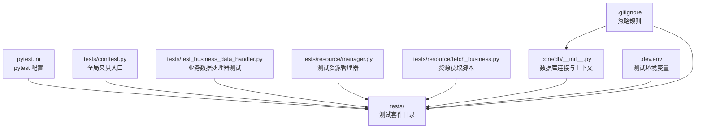
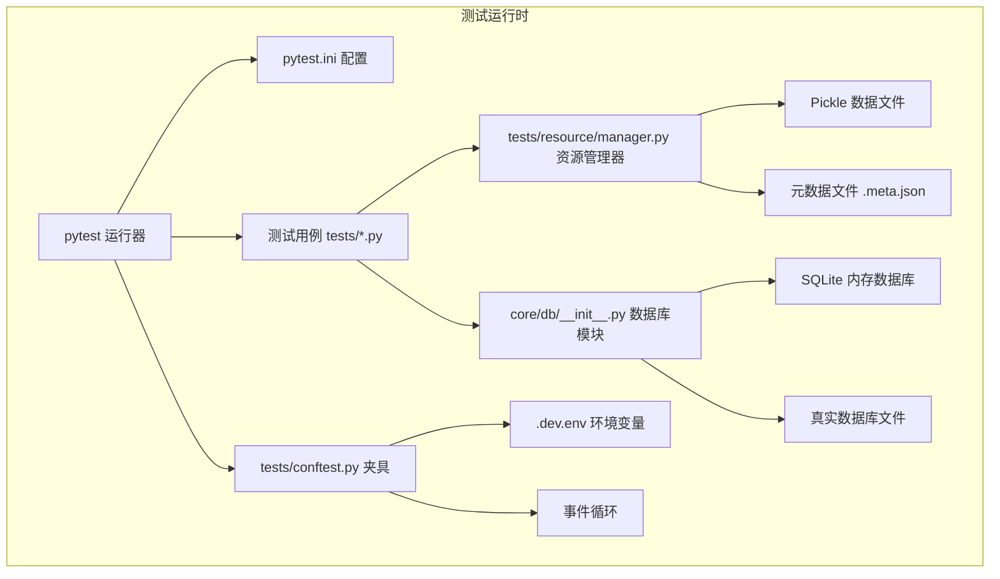
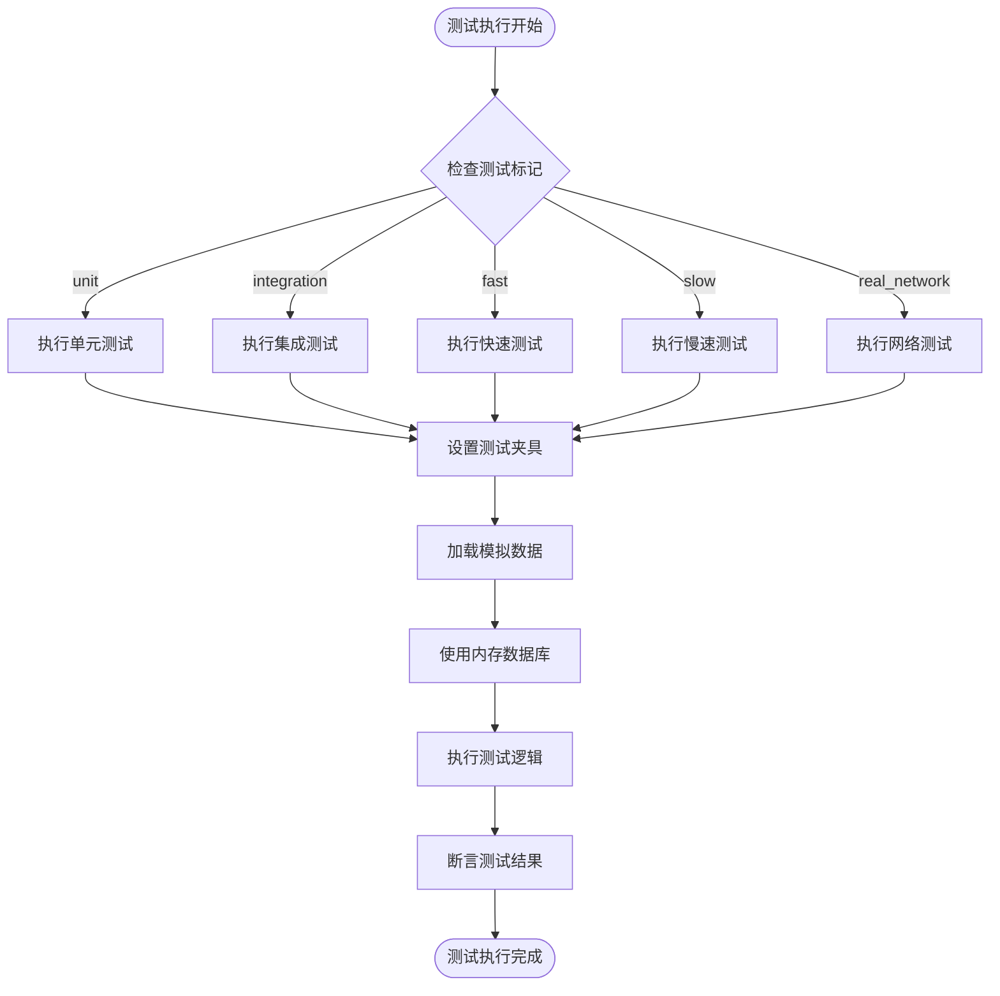
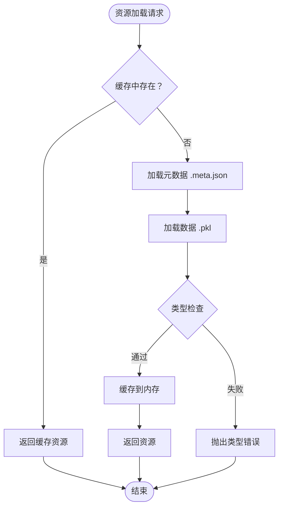
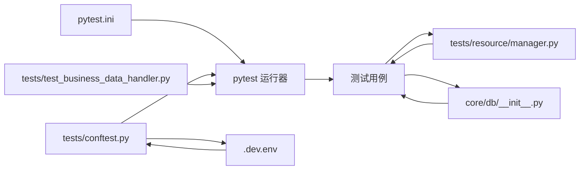

# 测试配置

<cite>
**本文档引用的文件**
- [pytest.ini](file://pytest.ini)
- [tests/conftest.py](file://tests/conftest.py)
- [tests/test_business_data_handler.py](file://tests/test_business_data_handler.py)
- [tests/resource/manager.py](file://tests/resource/manager.py)
- [tests/resource/fetch_business.py](file://tests/resource/fetch_business.py)
- [tests/resource/ygdq_300274_business.meta.json](file://tests/resource/ygdq_300274_business.meta.json)
- [.dev.env](file://.dev.env)
- [core/db/__init__.py](file://core/db/__init__.py)
- [.gitignore](file://.gitignore)
</cite>

## 更新摘要
**变更内容**
- 新增pytest配置增强，包括自定义测试标记系统
- 新增测试夹具配置，提供完整的测试环境支持
- 新增业务数据处理器测试，涵盖单元测试和集成测试
- 新增测试资源管理器，提供统一的静态资源管理机制
- 新增内存数据库夹具，支持快速测试执行

## 目录
1. [简介](#简介)
2. [项目结构](#项目结构)
3. [核心组件](#核心组件)
4. [架构总览](#架构总览)
5. [详细组件分析](#详细组件分析)
6. [依赖分析](#依赖分析)
7. [性能考虑](#性能考虑)
8. [故障排查指南](#故障排查指南)
9. [结论](#结论)
10. [附录](#附录)

## 简介
本文件面向股票公告自动化系统，提供完整的测试配置与运行指南。重点覆盖 pytest 配置、测试夹具与全局设置、数据库连接与模拟对象配置、测试运行命令与参数、并行执行与覆盖率统计建议、测试环境搭建（依赖、虚拟环境、CI/CD）、测试报告与日志、以及调试工具使用方法。内容基于仓库中现有的 pytest 配置与测试夹具入口进行整理与扩展说明。

**更新** 本次更新反映了测试配置的重大增强：新增了自定义测试标记系统（unit、integration、fast、slow、real_network），引入了完整的测试夹具配置，包括事件循环管理、环境变量加载和内存数据库支持，以及新增的业务数据处理器测试提供了全面的测试环境支持。

## 项目结构
测试相关的关键文件与位置如下：
- pytest 配置：pytest.ini（新增自定义测试标记）
- 全局测试夹具入口：tests/conftest.py（新增事件循环、环境变量、内存数据库夹具）
- 业务数据处理器测试：tests/test_business_data_handler.py（完整的测试套件）
- 测试资源管理器：tests/resource/manager.py（统一的静态资源管理）
- 资源获取脚本：tests/resource/fetch_business.py（真实数据获取工具）
- 测试资源配置：.dev.env（测试环境变量）
- 数据库模块：core/db/__init__.py（提供异步数据库连接与上下文管理）
- 版本控制忽略规则：.gitignore（包含数据库文件与虚拟环境等）

**图表来源**
- [pytest.ini](file://pytest.ini#L1-L10)
- [tests/conftest.py](file://tests/conftest.py#L1-L60)
- [tests/test_business_data_handler.py](file://tests/test_business_data_handler.py#L1-L636)
- [tests/resource/manager.py](file://tests/resource/manager.py#L1-L330)
- [tests/resource/fetch_business.py](file://tests/resource/fetch_business.py#L1-L49)
- [core/db/__init__.py](file://core/db/__init__.py#L1-L228)
- [.dev.env](file://.dev.env#L1-L6)
- [.gitignore](file://.gitignore#L1-L44)

## 核心组件
- pytest 配置（pytest.ini）
  - asyncio_mode 设置为自动模式，适配异步测试用例。
  - testpaths 指向 tests 目录，pytest 默认扫描该目录下的测试文件。
  - **新增** markers 配置，提供完整的测试标记系统：
    - unit：标记为单元测试
    - integration：标记为集成测试
    - fast：执行时间少于1秒的快速测试
    - slow：执行时间超过1秒的慢速测试
    - real_network：需要真实网络连接的测试
- 全局测试夹具入口（tests/conftest.py）
  - 将项目根目录加入 sys.path，便于在测试中导入核心模块。
  - **新增** event_loop fixture：创建session级别的事件循环，支持异步测试。
  - **新增** test_env fixture：加载测试环境变量（.dev.env），提供Notion API配置。
  - **新增** in_memory_db fixture：提供内存数据库连接，替代真实数据库，支持快速测试。
- 业务数据处理器测试（tests/test_business_data_handler.py）
  - 提供完整的业务数据处理器测试套件，涵盖单元测试和集成测试。
  - 使用pytestmark = pytest.mark.asyncio标记所有测试为异步。
  - 包含多个fixture：sample_stock_list、sample_stock_list_300274、mock_akshare_response。
  - 支持完整的测试标记系统，包括@pytest.mark.unit、@pytest.mark.integration等。
- 测试资源管理器（tests/resource/manager.py）
  - 提供统一的静态资源管理机制，支持资源元数据管理、类型自动判断、资源加载和保存。
  - 包含 ResourceMeta 和 ResourceManager 类，支持多种资源类型（DataFrame、JSON、Pickle、Response、Text、Binary）。
  - 增强了 ResourceMeta.from_dict 方法的资源类型转换健壮性。
- 数据库连接（core/db/__init__.py）
  - 提供异步上下文管理器 get_conn()，封装数据库连接生命周期与事务提交/回滚。
  - 统一数据库路径与表结构（如 hash 表），支持批量保存与查询。
- 版本控制忽略规则（.gitignore）
  - 忽略虚拟环境、IDE 缓存、数据库文件与环境变量文件，避免误提交。

**章节来源**
- [pytest.ini](file://pytest.ini#L1-L10)
- [tests/conftest.py](file://tests/conftest.py#L1-L60)
- [tests/test_business_data_handler.py](file://tests/test_business_data_handler.py#L1-L636)
- [tests/resource/manager.py](file://tests/resource/manager.py#L1-L330)
- [core/db/__init__.py](file://core/db/__init__.py#L1-L228)
- [.gitignore](file://.gitignore#L1-L44)

## 架构总览
下图展示测试运行时的核心交互：pytest 读取配置与夹具，加载测试模块，调用测试资源管理器和数据库模块，完成测试执行与结果输出。

**图表来源**
- [pytest.ini](file://pytest.ini#L1-L10)
- [tests/conftest.py](file://tests/conftest.py#L1-L60)
- [tests/resource/manager.py](file://tests/resource/manager.py#L1-L330)
- [core/db/__init__.py](file://core/db/__init__.py#L1-L228)

## 详细组件分析

### pytest 配置（pytest.ini）
- asyncio_mode
  - 自动模式，允许在协程中编写测试，减少同步包装开销。
- testpaths
  - 指定默认测试目录为 tests，pytest 会在启动时自动扫描该目录。
- **新增** markers
  - **unit**：标记为单元测试，通常用于独立函数和小模块的测试。
  - **integration**：标记为集成测试，测试多个组件协同工作的功能。
  - **fast**：执行时间少于1秒的快速测试，适合频繁运行的测试。
  - **slow**：执行时间超过1秒的慢速测试，通常包含网络请求或复杂计算。
  - **real_network**：需要真实网络连接的测试，如API调用或外部服务访问。

建议补充项（基于现有配置的扩展说明）：
- 增加 filterwarnings 或 log_cli/log_cli_level 控制日志输出。
- 增加 addopts 以默认启用并行执行（nq）与覆盖率统计（cov）。

**章节来源**
- [pytest.ini](file://pytest.ini#L1-L10)

### 全局测试夹具（tests/conftest.py）
- sys.path 插入项目根目录，确保测试可直接导入 core 下模块。
- **新增** event_loop fixture（scope="session"）：
  - 创建session级别的事件循环，支持异步测试用例。
  - 自动管理事件循环的生命周期，确保测试结束后正确关闭。
- **新增** test_env fixture（scope="session"）：
  - 加载测试环境变量（.dev.env），提供Notion API配置。
  - 返回包含NOTION_TOKEN、FLOW_DATABASE、STOCK_POOL的字典。
  - 支持测试环境的灵活配置和管理。
- **新增** in_memory_db fixture：
  - 提供内存数据库连接，替代真实数据库，支持快速测试。
  - 使用aiosqlite连接内存数据库（:memory:）。
  - 初始化测试数据库表结构，包括update_records和hash表。
  - 通过patch替换core.db._get_db，确保测试中使用内存数据库。
  - 支持事务管理和数据隔离，避免测试间的相互影响。

建议新增：
- 数据库连接 fixture：使用 core/db/__init__.py 的 get_conn 上下文，提供测试专用连接。
- Notion 客户端 fixture：注入测试替身（mock），避免真实 API 调用。
- 环境变量 fixture：统一设置测试所需的环境变量（如数据库路径、API 密钥占位符）。
- 资源管理器 fixture：提供测试专用的 ResourceManager 实例。

**章节来源**
- [tests/conftest.py](file://tests/conftest.py#L1-L60)

### 业务数据处理器测试（tests/test_business_data_handler.py）
- **新增** 完整的业务数据处理器测试套件，涵盖单元测试和集成测试。
- **新增** pytestmark = pytest.mark.asyncio，标记所有测试为异步。
- **新增** 多个fixture：
  - sample_stock_list：提供测试用的股票列表。
  - sample_stock_list_300274：提供特定股票代码的测试数据。
  - mock_akshare_response：从静态资源加载akshare接口的mock响应数据。
- **新增** 测试标记系统：
  - @pytest.mark.unit：标记为单元测试。
  - @pytest.mark.integration：标记为集成测试。
  - @pytest.mark.fast：标记为快速测试。
  - @pytest.mark.slow：标记为慢速测试。
  - @pytest.mark.real_network：标记为需要真实网络连接的测试。
- **新增** 测试分类：
  - TestShouldUpdateHalfYear：测试_should_update_half_year辅助函数。
  - TestProcessBusinessDataForStockList：测试process_business_data_for_stock_list主函数。
- **新增** 内存数据库支持：
  - in_memory_db fixture确保测试使用内存数据库，提高执行速度。
  - 支持数据库事务和数据隔离，避免测试间的相互影响。

**图表来源**
- [tests/test_business_data_handler.py](file://tests/test_business_data_handler.py#L1-L636)

**章节来源**
- [tests/test_business_data_handler.py](file://tests/test_business_data_handler.py#L1-L636)

### 测试资源管理器（tests/resource/manager.py）
- 资源类型管理
  - ResourceType 枚举定义了支持的资源类型：DATAFRAME、JSON、PICKLE、RESPONSE、TEXT、BINARY。
  - ResourceMeta.from_dict 方法增强了资源类型转换的健壮性，改进了标签处理和资源类型解析。
- 资源容器
  - StaticResource 泛型类提供类型安全的资源存储，支持类型检查和数据访问。
  - 增加了 JSON 加载数据的类型注解，提高了类型安全性。
- 资源管理
  - ResourceManager 提供统一的资源管理接口，支持保存、加载、缓存和元数据管理。
  - 支持内存缓存机制，提高重复访问性能。
  - 提供便捷函数 save_resource 和 load_resource，简化资源操作。
- **新增** 资源文件结构：
  - 资源文件采用.pkl和.meta.json配对存储。
  - 支持资源元数据的完整管理，包括版本、创建时间、描述、来源和标签。

**图表来源**
- [tests/resource/manager.py](file://tests/resource/manager.py#L213-L268)

**章节来源**
- [tests/resource/manager.py](file://tests/resource/manager.py#L1-L330)

### 数据库连接与上下文（core/db/__init__.py）
- 异步上下文管理器 get_conn()
  - 自动管理连接生命周期，确保事务提交或回滚，以及连接关闭。
  - 适合在测试中注入真实数据库连接，或在 mock 中模拟其行为。
- 批量写入与查询
  - 提供 save_hash 与 get_update_time 等接口，便于测试数据准备与断言。
- 数据库路径
  - 统一在 core/db/notion.db，测试中可通过 fixture 覆盖路径或使用临时文件。
- **新增** 内存数据库支持：
  - 通过in_memory_db fixture使用内存数据库（:memory:）。
  - 支持测试数据库表结构的初始化和管理。
  - 提供事务管理和数据隔离，确保测试的独立性。

**图表来源**
- [core/db/__init__.py](file://core/db/__init__.py#L32-L56)
- [core/db/__init__.py](file://core/db/__init__.py#L66-L101)
- [core/db/__init__.py](file://core/db/__init__.py#L141-L161)

**章节来源**
- [core/db/__init__.py](file://core/db/__init__.py#L1-L228)

### 测试环境变量（.dev.env）
- **新增** 测试环境配置文件，包含Notion API配置：
  - NOTION_TOKEN：Notion API访问令牌
  - FLOW_DATABASE：数据流数据库ID
  - STOCK_POOL：股票池数据库ID
- **新增** 环境变量加载机制：
  - 通过test_env fixture加载和管理测试环境变量。
  - 支持测试环境的灵活配置和管理。
  - 确保测试与生产环境的完全隔离。

**章节来源**
- [.dev.env](file://.dev.env#L1-L6)

### 版本控制忽略规则（.gitignore）
- 忽略虚拟环境目录（venv/env/ENV），避免污染仓库。
- 忽略 IDE 缓存与临时文件（如 .vscode/.idea）。
- 忽略数据库文件（*.db/*.sqlite*）与环境变量文件（.env），防止敏感信息泄露。
- **新增** 忽略测试资源文件（*.pkl、*.meta.json），避免误提交测试数据。

**章节来源**
- [.gitignore](file://.gitignore#L1-L44)

## 依赖分析
- pytest 运行器依赖 pytest.ini 的配置项（asyncio_mode、testpaths、markers）。
- 测试用例依赖 tests/conftest.py 提供的夹具与导入路径。
- 业务数据处理器测试依赖内存数据库夹具和资源管理器。
- 测试资源管理依赖 tests/resource/manager.py 提供的资源管理功能。
- 数据库相关测试依赖 core/db/__init__.py 的异步连接与上下文管理。
- .gitignore 影响测试产物（数据库文件、资源文件）的版本控制行为。
- **新增** 环境变量依赖 .dev.env 提供的测试配置。

**图表来源**
- [pytest.ini](file://pytest.ini#L1-L10)
- [tests/conftest.py](file://tests/conftest.py#L1-L60)
- [tests/test_business_data_handler.py](file://tests/test_business_data_handler.py#L1-L636)
- [tests/resource/manager.py](file://tests/resource/manager.py#L1-L330)
- [core/db/__init__.py](file://core/db/__init__.py#L1-L228)
- [.dev.env](file://.dev.env#L1-L6)

**章节来源**
- [pytest.ini](file://pytest.ini#L1-L10)
- [tests/conftest.py](file://tests/conftest.py#L1-L60)
- [tests/test_business_data_handler.py](file://tests/test_business_data_handler.py#L1-L636)
- [tests/resource/manager.py](file://tests/resource/manager.py#L1-L330)
- [core/db/__init__.py](file://core/db/__init__.py#L1-L228)
- [.dev.env](file://.dev.env#L1-L6)

## 性能考虑
- 异步测试
  - 使用 asyncio_mode = "auto"，减少同步包装带来的额外开销。
- **新增** 内存数据库性能优化：
  - 使用内存数据库（:memory:）替代磁盘数据库，显著提升测试执行速度。
  - 支持事务管理和数据隔离，确保测试的独立性和一致性。
- **新增** 测试标记系统优化：
  - 通过unit、fast标记快速运行核心测试。
  - 通过slow、integration标记运行完整测试套件。
  - 支持选择性测试执行，提高开发效率。
- 并行执行
  - 建议在 pytest.ini 中增加并行选项（如 nq），但需确保测试间无共享状态冲突。
- 覆盖率统计
  - 建议在 pytest.ini 中增加覆盖率统计选项（如 cov），以便评估测试完整性。
- 资源管理性能
  - 测试资源管理器内置内存缓存机制，提高重复访问性能。
  - 增强的 ResourceMeta.from_dict 方法减少了类型转换错误，提高资源加载效率。
- 数据库性能
  - 在测试中优先使用内存数据库或临时文件，避免磁盘 I/O；必要时使用事务包裹以提升写入效率。

## 故障排查指南
- 测试无法导入模块
  - 检查 tests/conftest.py 是否正确将项目根目录加入 sys.path。
- 资源文件加载失败
  - 确认资源文件（.pkl 和 .meta.json）完整且格式正确。
  - 检查 ResourceMeta.from_dict 方法的类型转换逻辑。
- 数据库文件未被忽略
  - 确认 .gitignore 中已包含数据库文件与虚拟环境目录。
- 协程测试报错
  - 确认 pytest.ini 的 asyncio_mode 已设置为自动模式。
- **新增** 内存数据库问题
  - 确认 in_memory_db fixture 正确初始化数据库表结构。
  - 检查数据库连接是否正确替换（patch）。
  - 验证事务管理是否正常工作。
- **新增** 环境变量问题
  - 确认 .dev.env 文件存在且格式正确。
  - 检查 test_env fixture 是否正确加载环境变量。
  - 验证Notion API凭据的有效性。
- **新增** 测试标记问题
  - 确认 pytest.ini 中的markers配置正确。
  - 检查测试用例是否正确使用测试标记。
  - 验证测试过滤命令的正确性。
- 测试运行缓慢
  - 检查是否存在阻塞操作；考虑使用并行执行与覆盖率统计优化。
  - 利用测试资源管理器的缓存机制提高资源访问速度。
  - **新增** 使用内存数据库替代磁盘数据库。

**章节来源**
- [tests/conftest.py](file://tests/conftest.py#L1-L60)
- [tests/resource/manager.py](file://tests/resource/manager.py#L68-L82)
- [.gitignore](file://.gitignore#L1-L44)
- [pytest.ini](file://pytest.ini#L1-L10)
- [.dev.env](file://.dev.env#L1-L6)

## 结论
本测试配置以增强的设置实现高效、可维护的测试运行：通过 pytest.ini 的自定义测试标记系统与 tests/conftest.py 的完整夹具入口，结合新增的内存数据库支持、测试资源管理器和业务数据处理器测试，形成清晰的测试执行链路。最新的配置增强显著提升了测试的灵活性和执行效率：自定义测试标记系统支持精确的测试分类和选择性执行，内存数据库夹具提供快速的测试环境，测试资源管理器确保测试数据的一致性和可维护性。建议后续按需扩展并行执行、覆盖率统计和CI/CD集成配置，以满足更复杂的测试需求。

## 附录

### 测试运行命令与参数配置（建议）
- 基本运行
  - pytest：使用默认配置扫描 tests 目录。
- **新增** 测试标记过滤
  - 按标记过滤：pytest -m "unit"
  - 多标记组合：pytest -m "unit and fast"
  - 排除标记：pytest -m "not slow"
- **新增** 测试分类运行
  - 运行单元测试：pytest -m "unit"
  - 运行集成测试：pytest -m "integration"
  - 运行快速测试：pytest -m "fast"
  - 运行慢速测试：pytest -m "slow"
  - 运行网络测试：pytest -m "real_network"
- 并行执行
  - 建议：pytest -n auto（或 nq）+ --dist loadfile
- 覆盖率统计
  - 建议：pytest --cov=core --cov-report=html --cov-report=term
- **新增** 资源管理测试
  - 建议：pytest tests/resource/ -v --tb=short
- **新增** 业务数据处理器测试
  - 建议：pytest tests/test_business_data_handler.py -v --tb=short

### 测试环境搭建指南（建议）
- 依赖安装
  - 使用 pip 安装 pytest、pytest-asyncio、pytest-xdist、pytest-cov、freezegun、aiosqlite 等插件。
- 虚拟环境
  - 创建 venv 并激活，安装依赖，确保 .gitignore 忽略 venv。
- **新增** 环境变量配置
  - 复制 .dev.env.example 为 .dev.env（如有示例文件）。
  - 配置Notion API凭据和数据库连接信息。
- CI/CD 集成
  - 在流水线中执行 pytest 命令，结合覆盖率阈值与报告上传。
- **新增** 测试资源管理
  - 确保测试资源文件（.pkl 和 .meta.json）正确放置在 tests/resource/ 目录中。
  - 使用 fetch_business.py 脚本获取真实数据并保存为测试资源。
- **新增** 内存数据库测试
  - 确保 in_memory_db fixture 正常工作。
  - 验证数据库表结构初始化正确。

### 测试标记系统说明
- **unit**：单元测试，测试独立的功能模块，通常快速且无外部依赖。
- **integration**：集成测试，测试多个模块协同工作的功能。
- **fast**：快速测试，执行时间少于1秒，适合频繁运行。
- **slow**：慢速测试，执行时间超过1秒，通常包含网络请求或复杂计算。
- **real_network**：真实网络测试，需要访问外部API或服务。

### 内存数据库夹具使用说明
- **in_memory_db fixture** 自动：
  - 创建内存数据库连接（:memory:）
  - 初始化update_records和hash表结构
  - 替换core.db._get_db函数
  - 确保测试使用内存数据库而非真实数据库
- 使用方法：
  - 在测试函数参数中添加in_memory_db
  - 测试结束后自动清理内存数据库
  - 支持事务管理和数据隔离

### 测试资源管理器使用说明
- **ResourceManager** 类：
  - 提供save和load方法管理测试资源
  - 支持多种资源类型（DataFrame、JSON、Pickle等）
  - 自动处理元数据和数据文件的配对存储
- **静态资源文件结构**：
  - {name}.pkl：资源数据文件
  - {name}.meta.json：资源元数据文件
  - 支持版本管理和标签系统
- **使用示例**：
  - 使用load_resource函数加载测试数据
  - 使用save_resource函数保存测试数据
  - 支持类型检查和缓存机制

### 删除的测试模块说明
根据更新原因，以下测试模块已被删除：
- tests/test_announcements_handler.py
- tests/test_business_handler.py  
- tests/test_notion/test_content_builder.py
- tests/test_notion/test_datetime_helper.py

这些删除不影响当前测试配置，因为：
1. 测试资源管理功能已迁移到 tests/resource/manager.py
2. 数据库相关测试仍可通过 core/db/__init__.py 访问
3. 项目结构已调整为更清晰的模块组织
4. 新增的业务数据处理器测试提供了更完整的测试覆盖