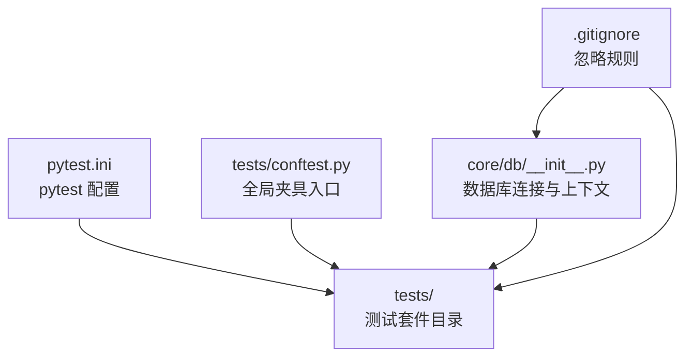
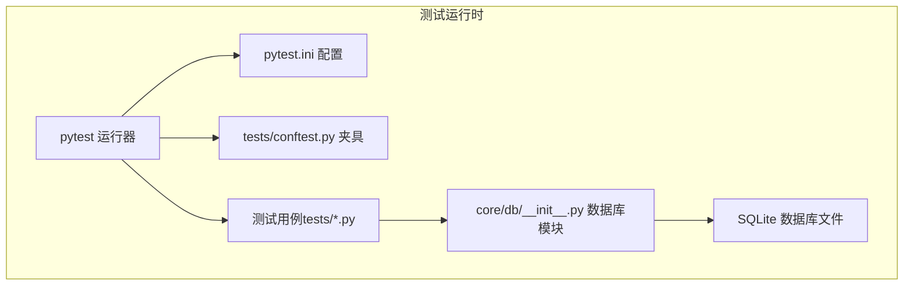
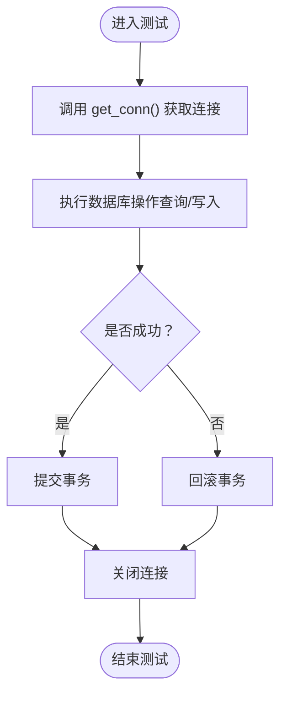
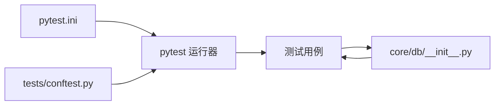

# 测试配置

<cite>
**本文引用的文件**
- [pytest.ini](file://pytest.ini)
- [tests/conftest.py](file://tests/conftest.py)
- [.gitignore](file://.gitignore)
- [core/db/__init__.py](file://core/db/__init__.py)
</cite>

## 目录
1. [简介](#简介)
2. [项目结构](#项目结构)
3. [核心组件](#核心组件)
4. [架构总览](#架构总览)
5. [详细组件分析](#详细组件分析)
6. [依赖分析](#依赖分析)
7. [性能考虑](#性能考虑)
8. [故障排查指南](#故障排查指南)
9. [结论](#结论)
10. [附录](#附录)

## 简介
本文件面向股票公告自动化系统，提供完整的测试配置与运行指南。重点覆盖 pytest 配置、测试夹具与全局设置、数据库连接与模拟对象配置、测试运行命令与参数、并行执行与覆盖率统计建议、测试环境搭建（依赖、虚拟环境、CI/CD）、测试报告与日志、以及调试工具使用方法。内容基于仓库中现有的 pytest 配置与测试夹具入口进行整理与扩展说明。

## 项目结构
测试相关的关键文件与位置如下：
- pytest 配置：pytest.ini
- 全局测试夹具入口：tests/conftest.py
- 数据库模块：core/db/__init__.py（提供异步数据库连接与上下文管理）
- 版本控制忽略规则：.gitignore（包含数据库文件与虚拟环境等）

**图表来源**
- [pytest.ini](file://pytest.ini#L1-L4)
- [tests/conftest.py](file://tests/conftest.py#L1-L6)
- [core/db/__init__.py](file://core/db/__init__.py#L1-L163)
- [.gitignore](file://.gitignore#L1-L44)

**章节来源**
- [pytest.ini](file://pytest.ini#L1-L4)
- [tests/conftest.py](file://tests/conftest.py#L1-L6)
- [.gitignore](file://.gitignore#L1-L44)

## 核心组件
- pytest 配置（pytest.ini）
  - asyncio_mode 设置为自动模式，适配异步测试用例。
  - testpaths 指向 tests 目录，pytest 默认扫描该目录下的测试文件。
- 全局测试夹具入口（tests/conftest.py）
  - 将项目根目录加入 sys.path，便于在测试中导入核心模块。
- 数据库连接（core/db/__init__.py）
  - 提供异步上下文管理器 get_conn()，封装数据库连接生命周期与事务提交/回滚。
  - 统一数据库路径与表结构（如 hash 表），支持批量保存与查询。
- 版本控制忽略规则（.gitignore）
  - 忽略虚拟环境、IDE 缓存、数据库文件与环境变量文件，避免误提交。

**章节来源**
- [pytest.ini](file://pytest.ini#L1-L4)
- [tests/conftest.py](file://tests/conftest.py#L1-L6)
- [core/db/__init__.py](file://core/db/__init__.py#L1-L163)
- [.gitignore](file://.gitignore#L1-L44)

## 架构总览
下图展示测试运行时的核心交互：pytest 读取配置与夹具，加载测试模块，调用数据库模块提供的异步连接，完成测试执行与结果输出。

**图表来源**
- [pytest.ini](file://pytest.ini#L1-L4)
- [tests/conftest.py](file://tests/conftest.py#L1-L6)
- [core/db/__init__.py](file://core/db/__init__.py#L1-L163)

## 详细组件分析

### pytest 配置（pytest.ini）
- asyncio_mode
  - 自动模式，允许在协程中编写测试，减少同步包装开销。
- testpaths
  - 指定默认测试目录为 tests，pytest 会在启动时自动扫描该目录。

建议补充项（基于现有配置的扩展说明）：
- 增加 markers（标记）以区分测试类型（如单元、集成、性能）。
- 增加 filterwarnings 或 log_cli/log_cli_level 控制日志输出。
- 增加 addopts 以默认启用并行执行（nq）与覆盖率统计（cov）。

**章节来源**
- [pytest.ini](file://pytest.ini#L1-L4)

### 全局测试夹具（tests/conftest.py）
- sys.path 插入项目根目录，确保测试可直接导入 core 下模块。
- 可在此文件中定义共享的 fixture（如数据库连接、Notion 客户端、临时目录等），供多模块测试复用。

建议新增：
- 数据库连接 fixture：使用 core/db/__init__.py 的 get_conn 上下文，提供测试专用连接。
- Notion 客户端 fixture：注入测试替身（mock），避免真实 API 调用。
- 环境变量 fixture：统一设置测试所需的环境变量（如数据库路径、API 密钥占位符）。

**章节来源**
- [tests/conftest.py](file://tests/conftest.py#L1-L6)

### 数据库连接与上下文（core/db/__init__.py）
- 异步上下文管理器 get_conn()
  - 自动管理连接生命周期，确保事务提交或回滚，以及连接关闭。
  - 适合在测试中注入真实数据库连接，或在 mock 中模拟其行为。
- 批量写入与查询
  - 提供 save_hash 与 get_update_time 等接口，便于测试数据准备与断言。
- 数据库路径
  - 统一在 core/db/notion.db，测试中可通过 fixture 覆盖路径或使用临时文件。

**图表来源**
- [core/db/__init__.py](file://core/db/__init__.py#L28-L48)
- [core/db/__init__.py](file://core/db/__init__.py#L131-L151)
- [core/db/__init__.py](file://core/db/__init__.py#L153-L163)

**章节来源**
- [core/db/__init__.py](file://core/db/__init__.py#L1-L163)

### 版本控制忽略规则（.gitignore）
- 忽略虚拟环境目录（venv/env/ENV），避免污染仓库。
- 忽略 IDE 缓存与临时文件（如 .vscode/.idea）。
- 忽略数据库文件（*.db/*.sqlite*）与环境变量文件（.env），防止敏感信息泄露。

**章节来源**
- [.gitignore](file://.gitignore#L1-L44)

## 依赖分析
- pytest 运行器依赖 pytest.ini 的配置项（asyncio_mode、testpaths）。
- 测试用例依赖 tests/conftest.py 提供的夹具与导入路径。
- 数据库相关测试依赖 core/db/__init__.py 的异步连接与上下文管理。
- .gitignore 影响测试产物（数据库文件）的版本控制行为。

**图表来源**
- [pytest.ini](file://pytest.ini#L1-L4)
- [tests/conftest.py](file://tests/conftest.py#L1-L6)
- [core/db/__init__.py](file://core/db/__init__.py#L1-L163)

**章节来源**
- [pytest.ini](file://pytest.ini#L1-L4)
- [tests/conftest.py](file://tests/conftest.py#L1-L6)
- [core/db/__init__.py](file://core/db/__init__.py#L1-L163)

## 性能考虑
- 异步测试
  - 使用 asyncio_mode = "auto"，减少同步包装带来的额外开销。
- 并行执行
  - 建议在 pytest.ini 中增加并行选项（如 nq），但需确保测试间无共享状态冲突。
- 覆盖率统计
  - 建议在 pytest.ini 中增加覆盖率统计选项（如 cov），以便评估测试完整性。
- 数据库性能
  - 在测试中优先使用内存数据库或临时文件，避免磁盘 I/O；必要时使用事务包裹以提升写入效率。

[本节为通用指导，不直接分析具体文件]

## 故障排查指南
- 测试无法导入模块
  - 检查 tests/conftest.py 是否正确将项目根目录加入 sys.path。
- 数据库文件未被忽略
  - 确认 .gitignore 中已包含数据库文件与虚拟环境目录。
- 协程测试报错
  - 确认 pytest.ini 的 asyncio_mode 已设置为自动模式。
- 测试运行缓慢
  - 检查是否存在阻塞操作；考虑使用并行执行与覆盖率统计优化。

**章节来源**
- [tests/conftest.py](file://tests/conftest.py#L1-L6)
- [.gitignore](file://.gitignore#L1-L44)
- [pytest.ini](file://pytest.ini#L1-L4)

## 结论
本测试配置以最小化设置实现高效、可维护的测试运行：通过 pytest.ini 的基础配置与 tests/conftest.py 的全局夹具入口，结合 core/db/__init__.py 的异步数据库上下文，形成清晰的测试执行链路。建议后续按需扩展标记、日志、并行与覆盖率配置，以满足更复杂的测试需求。

[本节为总结性内容，不直接分析具体文件]

## 附录

### 测试运行命令与参数配置（建议）
- 基本运行
  - pytest：使用默认配置扫描 tests 目录。
- 测试过滤
  - 按标记过滤：pytest -m "标记名"
  - 按关键字过滤：pytest -k "关键字"
- 并行执行
  - 建议：pytest -n auto（或 nq）+ --dist loadfile
- 覆盖率统计
  - 建议：pytest --cov=core --cov-report=html --cov-report=term
- 日志与报告
  - 建议：pytest --log-cli-level=INFO --junitxml=report.xml

[本节为通用指导，不直接分析具体文件]

### 测试环境搭建指南（建议）
- 依赖安装
  - 使用 pip 安装 pytest、pytest-asyncio、pytest-xdist、pytest-cov 等插件。
- 虚拟环境
  - 创建 venv 并激活，安装依赖，确保 .gitignore 忽略 venv。
- CI/CD 集成
  - 在流水线中执行 pytest 命令，结合覆盖率阈值与报告上传。

[本节为通用指导，不直接分析具体文件]