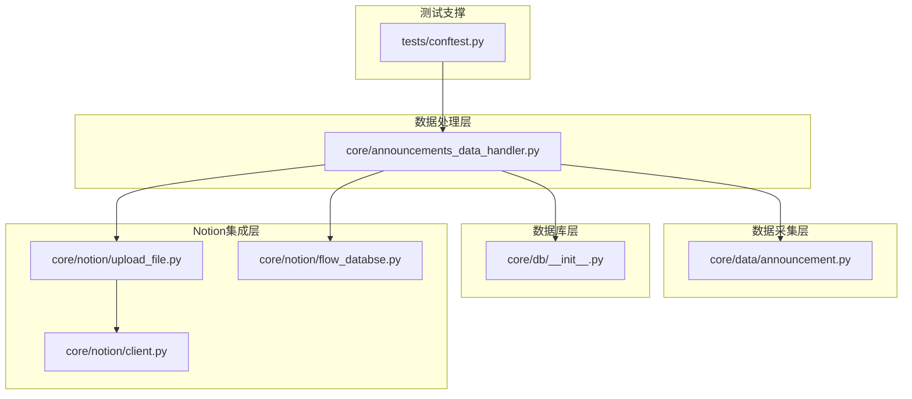
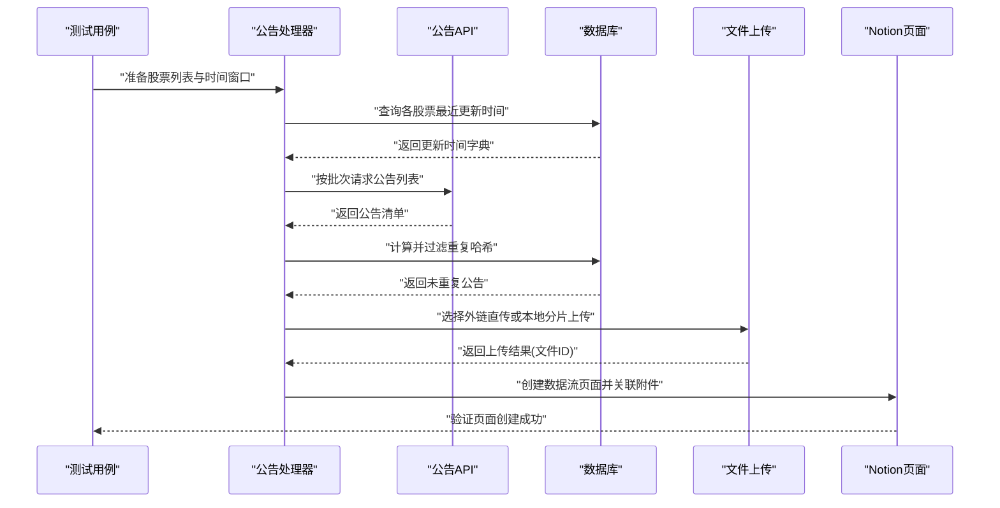
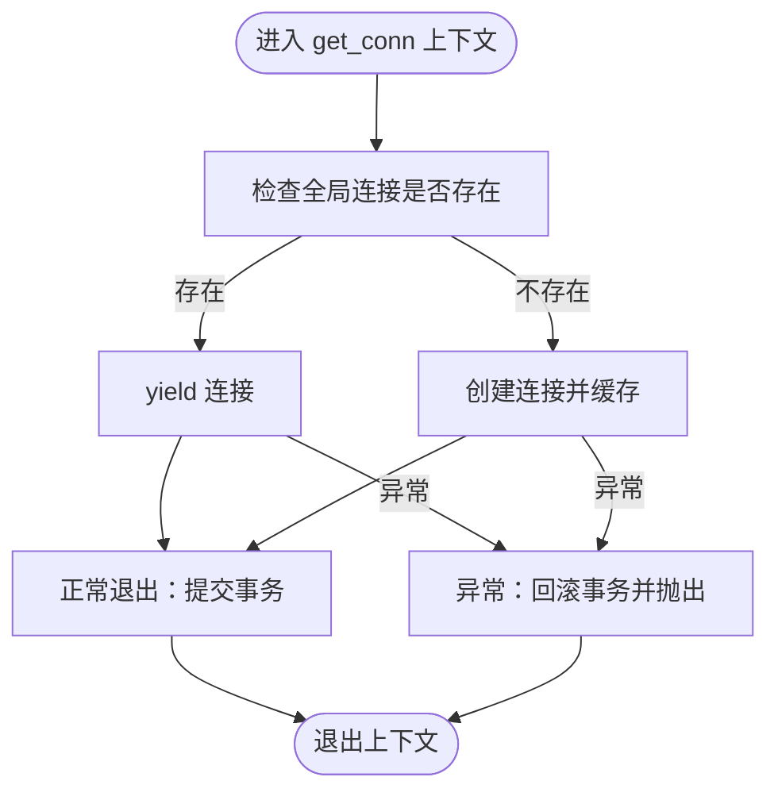
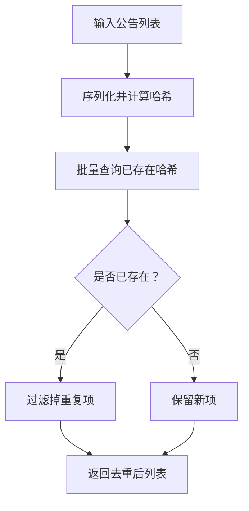
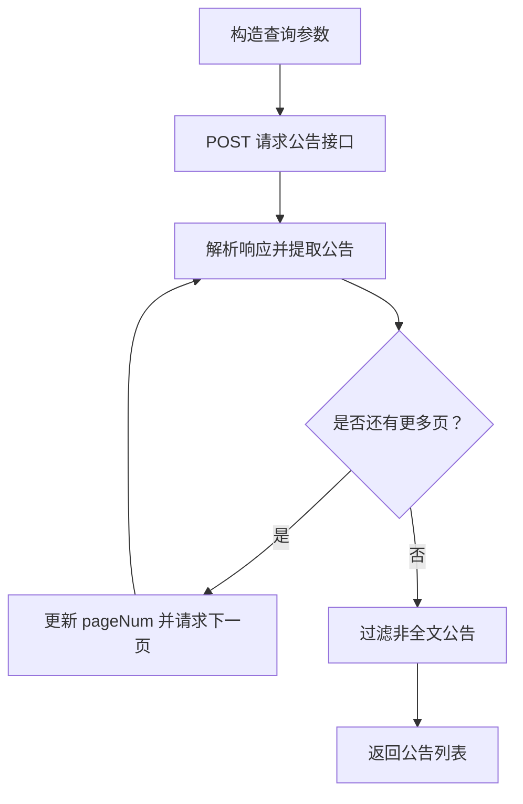
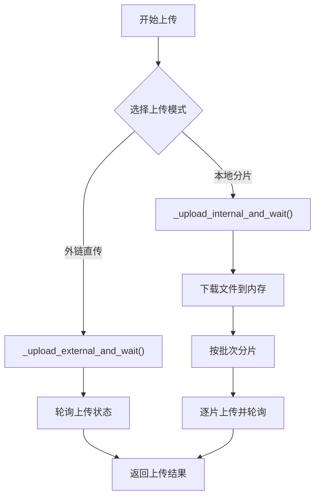
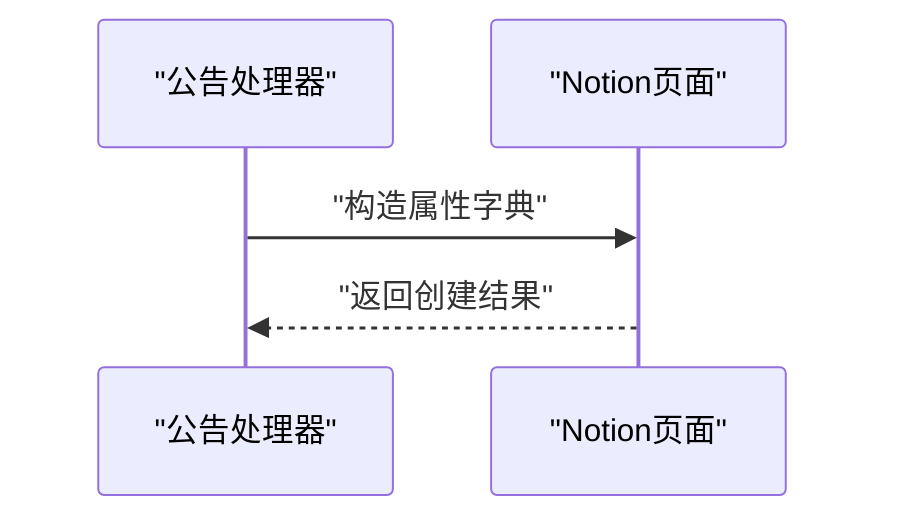
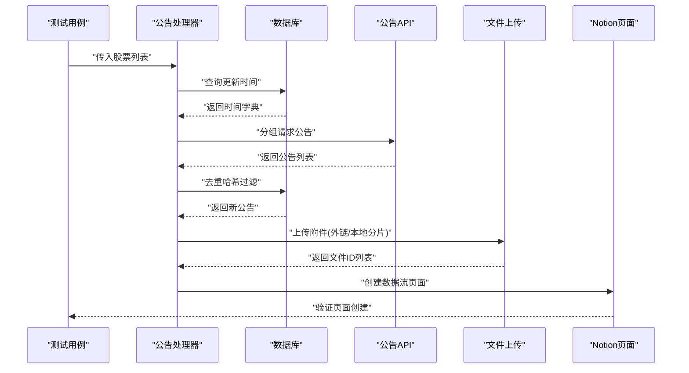
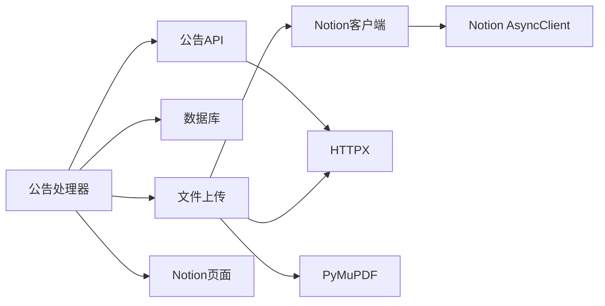

# 集成测试

<cite>
**本文引用的文件**
- [tests/conftest.py](file://tests/conftest.py)
- [core/db/__init__.py](file://core/db/__init__.py)
- [core/data/announcement.py](file://core/data/announcement.py)
- [core/notion/client.py](file://core/notion/client.py)
- [core/notion/upload_file.py](file://core/notion/upload_file.py)
- [core/notion/flow_databse.py](file://core/notion/flow_databse.py)
- [core/announcements_data_handler.py](file://core/announcements_data_handler.py)
</cite>

## 目录
1. [引言](#引言)
2. [项目结构](#项目结构)
3. [核心组件](#核心组件)
4. [架构总览](#架构总览)
5. [详细组件分析](#详细组件分析)
6. [依赖关系分析](#依赖关系分析)
7. [性能考量](#性能考量)
8. [故障排查指南](#故障排查指南)
9. [结论](#结论)
10. [附录](#附录)

## 引言
本文件面向“股票公告自动化系统”的集成测试，聚焦多模块协作的端到端验证，包括数据库连接、外部API（巨潮资讯网）数据抓取、PDF文件分片与上传、以及Notion页面创建等完整流程。文档提供测试设计目标、测试场景与策略、测试环境配置要点、测试数据管理与结果验证方法，并通过图示化方式呈现关键流程与依赖关系，帮助测试人员快速构建稳定可靠的集成测试体系。

## 项目结构
系统采用按功能域划分的模块组织方式，核心路径如下：
- 数据采集层：core/data/announcement.py 提供公告抓取能力
- 数据处理层：core/announcements_data_handler.py 组织抓取、分片、上传与页面创建
- 数据库层：core/db/__init__.py 提供异步SQLite连接、去重哈希与更新时间管理
- Notion集成层：core/notion/client.py、core/notion/upload_file.py、core/notion/flow_databse.py 实现Notion客户端、文件上传与页面创建
- 测试支撑：tests/conftest.py 用于测试运行时路径注入

图表来源
- [tests/conftest.py](file://tests/conftest.py#L1-L6)
- [core/data/announcement.py](file://core/data/announcement.py#L36-L112)
- [core/announcements_data_handler.py](file://core/announcements_data_handler.py#L21-L115)
- [core/db/__init__.py](file://core/db/__init__.py#L28-L94)
- [core/notion/client.py](file://core/notion/client.py#L1-L6)
- [core/notion/upload_file.py](file://core/notion/upload_file.py#L28-L61)
- [core/notion/flow_databse.py](file://core/notion/flow_databse.py#L25-L66)

章节来源
- [tests/conftest.py](file://tests/conftest.py#L1-L6)
- [core/data/announcement.py](file://core/data/announcement.py#L36-L112)
- [core/announcements_data_handler.py](file://core/announcements_data_handler.py#L21-L115)
- [core/db/__init__.py](file://core/db/__init__.py#L28-L94)
- [core/notion/client.py](file://core/notion/client.py#L1-L6)
- [core/notion/upload_file.py](file://core/notion/upload_file.py#L28-L61)
- [core/notion/flow_databse.py](file://core/notion/flow_databse.py#L25-L66)

## 核心组件
- 数据采集与去重
  - 公告抓取：基于HTTP接口批量查询公告，支持分页与过滤
  - 哈希去重：对公告内容计算哈希，避免重复入库与重复上传
- 数据库连接与事务
  - 异步上下文管理器封装连接生命周期，自动提交或回滚
  - 初始化表结构：更新记录表与哈希表
- 文件上传与分片
  - 支持本地下载后上传与外链直传两种模式
  - PDF分片：按批次切分大文件，提升上传成功率与Notion渲染性能
  - 上传状态轮询：指数退避策略保障稳定性
- Notion页面创建
  - 将公告信息映射为页面属性，建立与股票的关系
  - 支持附件与原文链接字段

章节来源
- [core/data/announcement.py](file://core/data/announcement.py#L36-L112)
- [core/db/__init__.py](file://core/db/__init__.py#L28-L94)
- [core/db/__init__.py](file://core/db/__init__.py#L97-L151)
- [core/notion/upload_file.py](file://core/notion/upload_file.py#L28-L61)
- [core/notion/upload_file.py](file://core/notion/upload_file.py#L110-L121)
- [core/notion/upload_file.py](file://core/notion/upload_file.py#L153-L176)
- [core/notion/flow_databse.py](file://core/notion/flow_databse.py#L25-L66)

## 架构总览
下图展示了从公告抓取到Notion页面创建的完整集成流程，包含数据去重、数据库写入、文件上传与页面创建的关键节点。

图表来源
- [core/announcements_data_handler.py](file://core/announcements_data_handler.py#L21-L115)
- [core/data/announcement.py](file://core/data/announcement.py#L36-L112)
- [core/db/__init__.py](file://core/db/__init__.py#L97-L151)
- [core/notion/upload_file.py](file://core/notion/upload_file.py#L28-L61)
- [core/notion/flow_databse.py](file://core/notion/flow_databse.py#L25-L66)

## 详细组件分析

### 数据库连接与事务管理
- 设计目标
  - 提供稳定的异步数据库连接，确保并发场景下的事务一致性
  - 通过上下文管理器简化资源生命周期管理，避免连接泄漏
- 关键点
  - 连接池与全局实例：首次调用时建立连接，后续复用
  - 自动提交与回滚：异常时自动回滚，保证数据一致性
  - 表结构初始化：创建“更新记录”和“哈希”表，支撑去重与增量更新
- 测试策略
  - 单元测试覆盖连接获取、事务提交/回滚、表初始化
  - 集成测试验证多协程并发下的连接复用与一致性
- 性能与可靠性
  - 异常分支明确，便于快速定位问题
  - 适合在测试环境中使用内存数据库或临时文件数据库进行隔离

图表来源
- [core/db/__init__.py](file://core/db/__init__.py#L28-L52)

章节来源
- [core/db/__init__.py](file://core/db/__init__.py#L28-L52)
- [core/db/__init__.py](file://core/db/__init__.py#L62-L94)

### 哈希去重与更新时间管理
- 设计目标
  - 基于公告内容生成稳定哈希，避免重复处理
  - 记录各股票的公告更新时间，支持增量抓取
- 关键点
  - 内容序列化与哈希计算：统一编码与排序规则
  - 批量查询与过滤：减少数据库往返
  - 缺失记录补插：保证查询与更新的一致性
- 测试策略
  - 单元测试：构造重复/新增内容，验证过滤结果
  - 集成测试：结合公告抓取与数据库，验证去重与更新时间写入

图表来源
- [core/db/__init__.py](file://core/db/__init__.py#L97-L128)

章节来源
- [core/db/__init__.py](file://core/db/__init__.py#L97-L151)

### 公告抓取与分页
- 设计目标
  - 支持多股票、跨日期范围的批量查询
  - 自动识别并翻页，过滤非全文公告
- 关键点
  - 请求参数构造：股票组合、日期区间、分页参数
  - 结果清洗：剔除摘要/英文版/图文版等非全文类型
  - 缓存：股票映射数据使用LRU缓存减少重复请求
- 测试策略
  - 单元测试：构造不同日期范围与股票组合，验证分页与过滤
  - 集成测试：结合数据库去重，验证最终公告集合

图表来源
- [core/data/announcement.py](file://core/data/announcement.py#L36-L112)

章节来源
- [core/data/announcement.py](file://core/data/announcement.py#L36-L112)

### 文件上传与分片
- 设计目标
  - 支持外链直传与本地下载后上传两种模式
  - 对超大PDF进行分片上传，提升成功率与渲染性能
  - 上传状态轮询与指数退避，增强鲁棒性
- 关键点
  - 上传模式选择：根据文件大小与标题关键词决定直传或分片
  - 分片策略：固定批次大小与封面页覆盖
  - 轮询机制：指数退避等待上传完成
- 测试策略
  - 单元测试：模拟上传与轮询，验证成功/失败路径
  - 集成测试：结合公告处理器，验证真实文件的上传与结果汇总

图表来源
- [core/notion/upload_file.py](file://core/notion/upload_file.py#L28-L61)
- [core/notion/upload_file.py](file://core/notion/upload_file.py#L64-L96)
- [core/notion/upload_file.py](file://core/notion/upload_file.py#L110-L121)
- [core/notion/upload_file.py](file://core/notion/upload_file.py#L153-L176)

章节来源
- [core/notion/upload_file.py](file://core/notion/upload_file.py#L28-L61)
- [core/notion/upload_file.py](file://core/notion/upload_file.py#L64-L96)
- [core/notion/upload_file.py](file://core/notion/upload_file.py#L110-L121)
- [core/notion/upload_file.py](file://core/notion/upload_file.py#L153-L176)

### Notion页面创建
- 设计目标
  - 将公告信息映射为页面属性，建立与股票的关系
  - 可选附件与原文链接，支持正文内容扩展
- 关键点
  - 属性映射：标题、发布时间、来源接口、数据类型、关联股票
  - 错误处理：捕获异常并记录日志，不影响整体流程
- 测试策略
  - 单元测试：构造属性字典，验证页面创建调用
  - 集成测试：结合上传结果，验证页面创建与附件关联

图表来源
- [core/notion/flow_databse.py](file://core/notion/flow_databse.py#L25-L66)

章节来源
- [core/notion/flow_databse.py](file://core/notion/flow_databse.py#L25-L66)

### 公告处理器：完整流程编排
- 设计目标
  - 将上述模块串联，形成从抓取到页面创建的完整流水线
  - 支持增量更新与分组请求，优化网络与数据库开销
- 关键点
  - 时间分组：按最近更新时间聚合股票，减少重复请求
  - 并发控制：异步任务分批执行，提高吞吐
  - 结果汇总：收集上传结果并创建对应页面
- 测试策略
  - 集成测试：覆盖抓取、去重、上传、页面创建全流程
  - 场景覆盖：正常路径、部分失败、超大文件分片、外链直传

图表来源
- [core/announcements_data_handler.py](file://core/announcements_data_handler.py#L21-L115)

章节来源
- [core/announcements_data_handler.py](file://core/announcements_data_handler.py#L21-L115)

## 依赖关系分析
- 模块耦合
  - 公告处理器依赖数据库（去重与更新时间）、数据采集（抓取）、Notion上传与页面创建
  - 数据采集与数据库之间为弱耦合，通过处理器协调
  - Notion上传与页面创建依赖Notion客户端，上传模块进一步依赖HTTP客户端与PDF处理库
- 外部依赖
  - 巨潮资讯网公告接口（HTTP）
  - Notion API（AsyncClient）
  - PDF处理库（用于分片）

图表来源
- [core/announcements_data_handler.py](file://core/announcements_data_handler.py#L7-L16)
- [core/data/announcement.py](file://core/data/announcement.py#L79-L81)
- [core/notion/upload_file.py](file://core/notion/upload_file.py#L6-L7)
- [core/notion/client.py](file://core/notion/client.py#L3-L5)

章节来源
- [core/announcements_data_handler.py](file://core/announcements_data_handler.py#L7-L16)
- [core/data/announcement.py](file://core/data/announcement.py#L79-L81)
- [core/notion/upload_file.py](file://core/notion/upload_file.py#L6-L7)
- [core/notion/client.py](file://core/notion/client.py#L3-L5)

## 性能考量
- 并发与批处理
  - 公告抓取与文件上传均采用异步并发，显著提升吞吐
  - 上传轮询采用指数退避，平衡成功率与资源占用
- 数据库访问
  - 批量查询与插入减少往返次数；事务自动提交/回滚保障一致性
- I/O与网络
  - PDF分片降低单次上传体积，提升成功率
  - 缓存股票映射数据减少重复请求

## 故障排查指南
- 数据库相关
  - 症状：事务未提交或异常未回滚
  - 排查：确认上下文管理器使用方式，检查异常分支
  - 参考：[core/db/__init__.py](file://core/db/__init__.py#L28-L52)
- 文件上传相关
  - 症状：上传超时或失败
  - 排查：检查轮询间隔与最大尝试次数，确认Notion令牌与数据库配置
  - 参考：[core/notion/upload_file.py](file://core/notion/upload_file.py#L153-L176)
- Notion页面创建相关
  - 症状：页面创建失败或属性映射错误
  - 排查：核对数据类型映射与数据库环境变量，查看日志输出
  - 参考：[core/notion/flow_databse.py](file://core/notion/flow_databse.py#L25-L66)
- 外部API相关
  - 症状：公告抓取失败或返回空
  - 排查：检查网络连通性与接口参数，确认日期范围与股票组合
  - 参考：[core/data/announcement.py](file://core/data/announcement.py#L36-L112)

章节来源
- [core/db/__init__.py](file://core/db/__init__.py#L28-L52)
- [core/notion/upload_file.py](file://core/notion/upload_file.py#L153-L176)
- [core/notion/flow_databse.py](file://core/notion/flow_databse.py#L25-L66)
- [core/data/announcement.py](file://core/data/announcement.py#L36-L112)

## 结论
本文档围绕股票公告自动化系统的多模块协作，给出了集成测试的设计目标、场景与策略，并通过图示化方式梳理了从公告抓取到Notion页面创建的完整流程。建议在测试中优先覆盖以下关键路径：数据库去重与更新时间、公告抓取与分页、文件上传与分片、Notion页面创建。通过合理的测试环境配置与数据管理，能够有效保障系统在真实生产场景下的稳定性与可靠性。

## 附录
- 测试环境配置要点
  - 数据库：确保数据库文件可读写，初始化表结构
  - Notion：设置必要的环境变量（如数据库ID、令牌），确保网络可达
  - 外部API：确保网络连通性，必要时配置代理
- 测试数据管理
  - 使用小规模股票列表与短时间窗口进行回归测试
  - 对于上传测试，准备少量真实PDF文件与外链URL
- 测试结果验证
  - 数据库：校验去重后数量与哈希表记录
  - Notion：校验页面属性、附件关联与页面创建日志