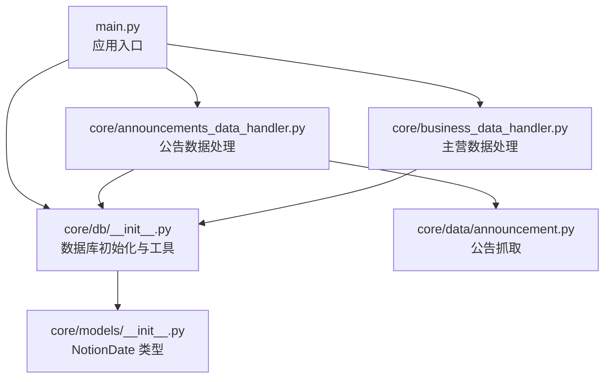
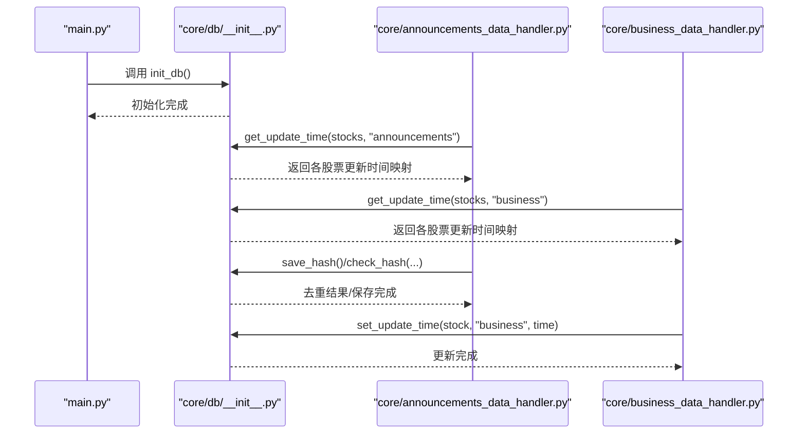
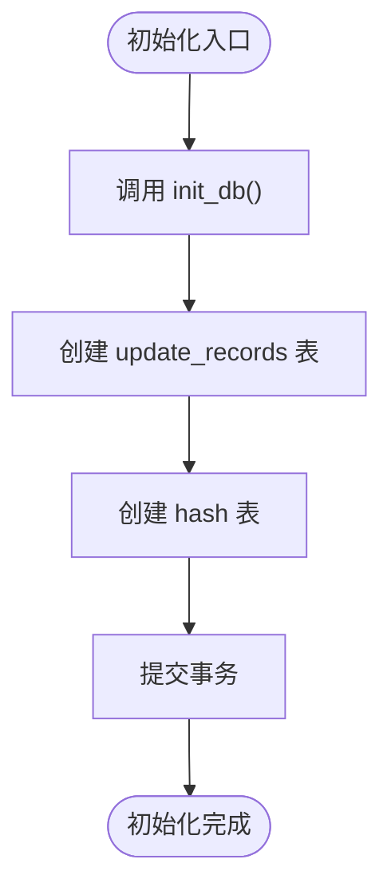
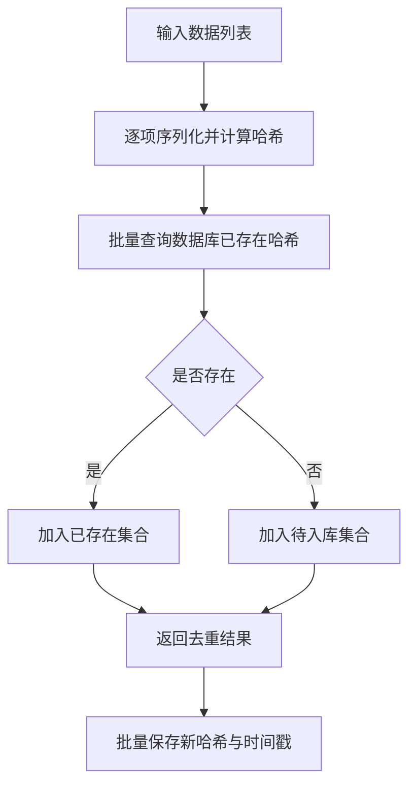
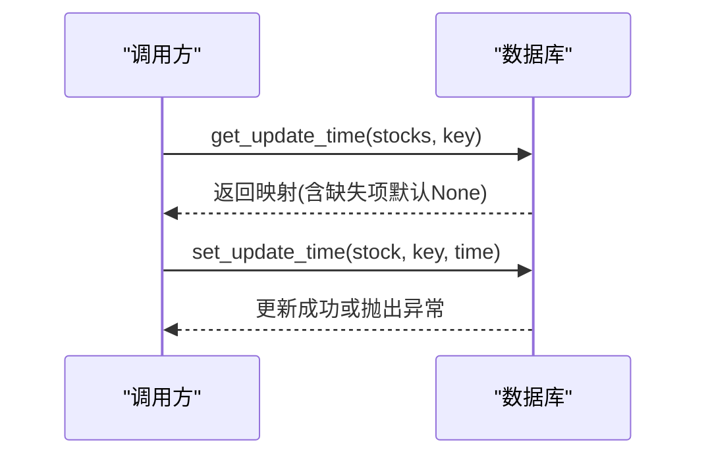
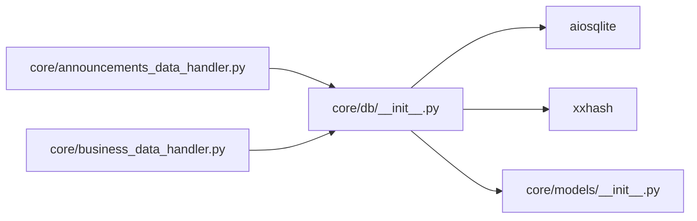
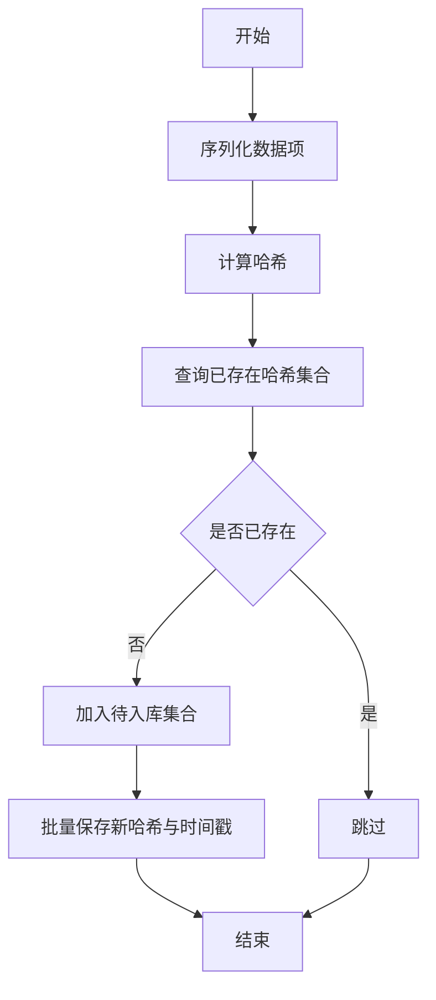

# 数据库配置

<cite>
**本文引用的文件**
- [core/db/__init__.py](file://core/db/__init__.py)
- [core/models/__init__.py](file://core/models/__init__.py)
- [main.py](file://main.py)
- [core/announcements_data_handler.py](file://core/announcements_data_handler.py)
- [core/business_data_handler.py](file://core/business_data_handler.py)
- [core/data/announcement.py](file://core/data/announcement.py)
</cite>

## 目录
1. [简介](#简介)
2. [项目结构](#项目结构)
3. [核心组件](#核心组件)
4. [架构总览](#架构总览)
5. [详细组件分析](#详细组件分析)
6. [依赖关系分析](#依赖关系分析)
7. [性能考量](#性能考量)
8. [故障排查指南](#故障排查指南)
9. [结论](#结论)
10. [附录](#附录)

## 简介
本文件面向“股票公告自动化系统”的数据库配置与初始化，聚焦以下主题：
- SQLite 数据库配置与存储路径
- 表结构设计与初始化流程
- 数据库连接与事务管理
- 哈希去重机制的数据库实现
- 更新时间戳管理与并发访问控制
- 数据库迁移、备份与维护建议

## 项目结构
数据库相关的核心文件位于 core/db/__init__.py，模型类型定义位于 core/models/__init__.py；应用入口 main.py 中负责调用初始化流程；公告与主营数据处理器分别使用数据库进行时间戳读写与去重。

图表来源
- [main.py](file://main.py#L20-L36)
- [core/db/__init__.py](file://core/db/__init__.py#L62-L94)
- [core/models/__init__.py](file://core/models/__init__.py#L1-L8)
- [core/announcements_data_handler.py](file://core/announcements_data_handler.py#L21-L30)
- [core/business_data_handler.py](file://core/business_data_handler.py#L34-L36)
- [core/data/announcement.py](file://core/data/announcement.py#L36-L52)

章节来源
- [main.py](file://main.py#L1-L40)
- [core/db/__init__.py](file://core/db/__init__.py#L1-L218)

## 核心组件
- 数据库初始化与连接
  - 初始化函数负责创建两张表：update_records 与 hash
  - 提供异步上下文管理器 get_conn，统一事务提交/回滚与连接关闭
- 哈希去重
  - 计算内容哈希，查询已存在哈希并过滤重复
  - 批量保存新哈希与创建时间
- 更新时间戳管理
  - 读取指定股票与键的更新时间
  - 更新对应记录的时间戳，不存在则抛错以保证业务一致性

章节来源
- [core/db/__init__.py](file://core/db/__init__.py#L28-L94)
- [core/db/__init__.py](file://core/db/__init__.py#L97-L150)
- [core/db/__init__.py](file://core/db/__init__.py#L153-L215)

## 架构总览
数据库层采用异步 SQLite 访问，通过 aiosqlite 提供异步能力；应用启动时由入口调用初始化，后续各业务模块通过统一接口读写数据库。

图表来源
- [main.py](file://main.py#L20-L36)
- [core/db/__init__.py](file://core/db/__init__.py#L62-L94)
- [core/announcements_data_handler.py](file://core/announcements_data_handler.py#L27-L29)
- [core/business_data_handler.py](file://core/business_data_handler.py#L34-L36)
- [core/db/__init__.py](file://core/db/__init__.py#L153-L215)

## 详细组件分析

### 数据库初始化与连接
- 存储路径
  - 数据库存放于 core/db 目录下的 notion.db 文件
- 初始化流程
  - 创建 update_records 表：主键为 (stock, key)，包含更新时间字段
  - 创建 hash 表：主键为 hash，包含创建时间字段
- 连接与事务
  - get_conn 为异步上下文管理器，自动提交或回滚，并在退出时关闭连接
  - 内部使用单例连接，避免重复打开

图表来源
- [core/db/__init__.py](file://core/db/__init__.py#L62-L94)

章节来源
- [core/db/__init__.py](file://core/db/__init__.py#L12-L13)
- [core/db/__init__.py](file://core/db/__init__.py#L54-L59)
- [core/db/__init__.py](file://core/db/__init__.py#L62-L94)

### 哈希去重机制
- 哈希计算
  - 对每个数据项进行 JSON 序列化（排序键、非 ASCII 字符保留），使用 xxhash.xxh3_64_hexdigest 生成 64 位十六进制哈希
- 去重流程
  - 批量查询数据库中已存在的哈希集合
  - 过滤出不存在的项，返回去重后的数据列表
- 保存流程
  - 批量插入新哈希与当前时间戳（ISO 字符串）

图表来源
- [core/db/__init__.py](file://core/db/__init__.py#L97-L150)

章节来源
- [core/db/__init__.py](file://core/db/__init__.py#L97-L150)

### 更新时间戳管理
- 读取
  - 支持一次性查询多个股票的指定键的更新时间
  - 若某股票缺失记录，自动插入默认空值记录
- 更新
  - 严格校验记录是否存在，若不存在则抛出异常，防止业务逻辑错误

图表来源
- [core/db/__init__.py](file://core/db/__init__.py#L153-L185)
- [core/db/__init__.py](file://core/db/__init__.py#L188-L215)

章节来源
- [core/db/__init__.py](file://core/db/__init__.py#L153-L215)

### 时间类型与转换
- NotionDate 类型
  - 使用 NewType 包装字符串，确保时间字段在类型层面保持一致
- 日期转换
  - 业务侧使用覆盖函数将 datetime/date 转换为 NotionDate 字符串
  - 读取时再转回 datetime，便于比较与计算

章节来源
- [core/models/__init__.py](file://core/models/__init__.py#L1-L8)
- [core/business_data_handler.py](file://core/business_data_handler.py#L63-L67)

### 数据库使用示例（公告处理）
- 入口初始化
  - main.py 在启动时调用 init_db，确保数据库可用
- 公告处理流程
  - 读取公告更新时间，按需分组请求
  - 上传附件并创建数据流页面

章节来源
- [main.py](file://main.py#L20-L36)
- [core/announcements_data_handler.py](file://core/announcements_data_handler.py#L21-L63)

## 依赖关系分析
- 组件耦合
  - 数据库模块被业务处理器依赖，但对外暴露有限 API，内聚性良好
  - 与 NotionDate 类型强关联，保证时间字段一致性
- 外部依赖
  - aiosqlite 提供异步 SQLite 访问
  - xxhash 提供高性能哈希计算
- 潜在风险
  - 单例连接在多进程或多线程环境中可能引发并发问题
  - 缺少显式的外键约束与索引，查询性能依赖 SQL 查询计划

图表来源
- [core/db/__init__.py](file://core/db/__init__.py#L7-L10)
- [core/announcements_data_handler.py](file://core/announcements_data_handler.py#L8)
- [core/business_data_handler.py](file://core/business_data_handler.py#L5)

章节来源
- [core/db/__init__.py](file://core/db/__init__.py#L1-L23)
- [core/models/__init__.py](file://core/models/__init__.py#L1-L8)
- [core/announcements_data_handler.py](file://core/announcements_data_handler.py#L1-L17)
- [core/business_data_handler.py](file://core/business_data_handler.py#L1-L14)

## 性能考量
- 查询优化
  - 建议为 update_records(key) 和 hash(hash) 建立索引，提升去重与查询效率
- 批量操作
  - 已使用 executemany 与 IN 批量查询，减少往返开销
- 并发控制
  - 当前为单例连接，建议引入连接池或在多进程/多线程场景下为每个协程/线程单独连接
- I/O 与序列化
  - 哈希计算基于 JSON 序列化，建议固定键顺序与编码，避免重复计算

[本节为通用性能建议，无需特定文件引用]

## 故障排查指南
- 初始化失败
  - 确认数据库文件路径存在且具备写权限
  - 检查 init_db 是否在应用启动阶段被调用
- 哈希去重异常
  - 核对输入数据结构是否包含 data_type 与 content 字段
  - 检查 JSON 序列化参数是否一致，避免重复哈希
- 更新时间戳异常
  - set_update_time 抛出异常通常表示记录不存在，确认是否先调用 get_update_time 插入默认记录
- 并发问题
  - 如出现锁等待或冲突，考虑使用连接池或在不同进程中隔离数据库文件

章节来源
- [core/db/__init__.py](file://core/db/__init__.py#L188-L215)
- [core/db/__init__.py](file://core/db/__init__.py#L97-L150)
- [main.py](file://main.py#L20-L22)

## 结论
本系统采用轻量级 SQLite 作为本地持久化方案，通过异步接口实现高效的数据去重与时间戳管理。建议在生产环境中补充索引、连接池与备份策略，以进一步提升稳定性与性能。

[本节为总结性内容，无需特定文件引用]

## 附录

### 数据库表结构与初始化
- 表：update_records
  - 字段：stock（文本）、key（文本）、update_time（文本，可空）
  - 主键：(stock, key)
- 表：hash
  - 字段：hash（文本，主键）、create_at（文本，非空）
- 初始化语句
  - 创建 update_records 表
  - 创建 hash 表

章节来源
- [core/db/__init__.py](file://core/db/__init__.py#L77-L93)

### 哈希去重与时间戳管理流程

图表来源
- [core/db/__init__.py](file://core/db/__init__.py#L97-L150)

### 并发访问控制建议
- 使用连接池或每个协程/线程独立连接
- 对热点表（如 hash）增加索引
- 在高并发场景下考虑 WAL 模式与合适的 PRAGMA 设置

[本节为通用建议，无需特定文件引用]