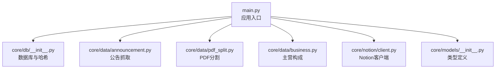
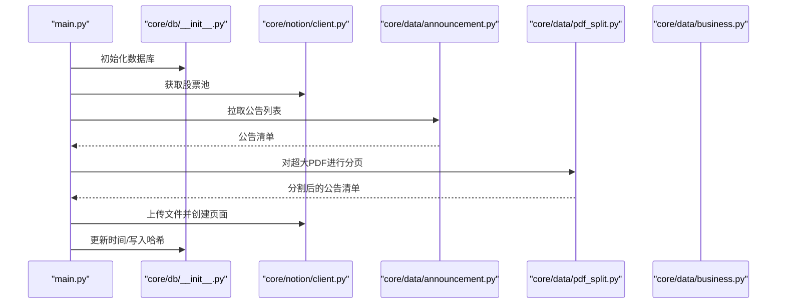
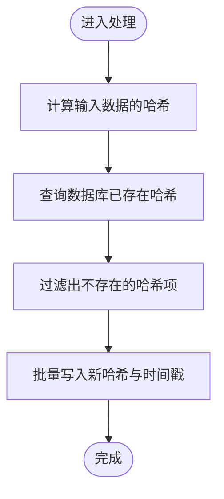
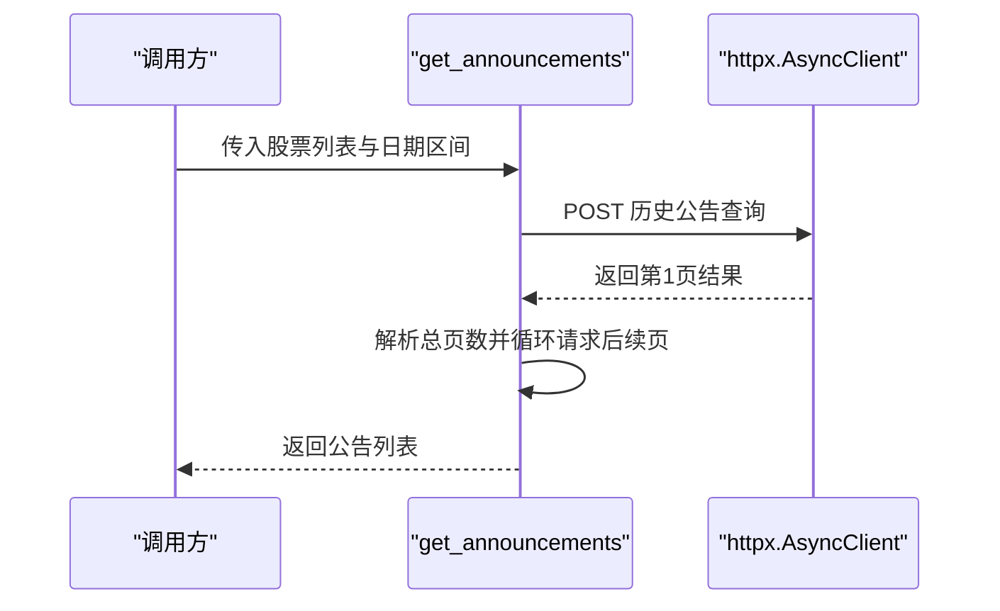
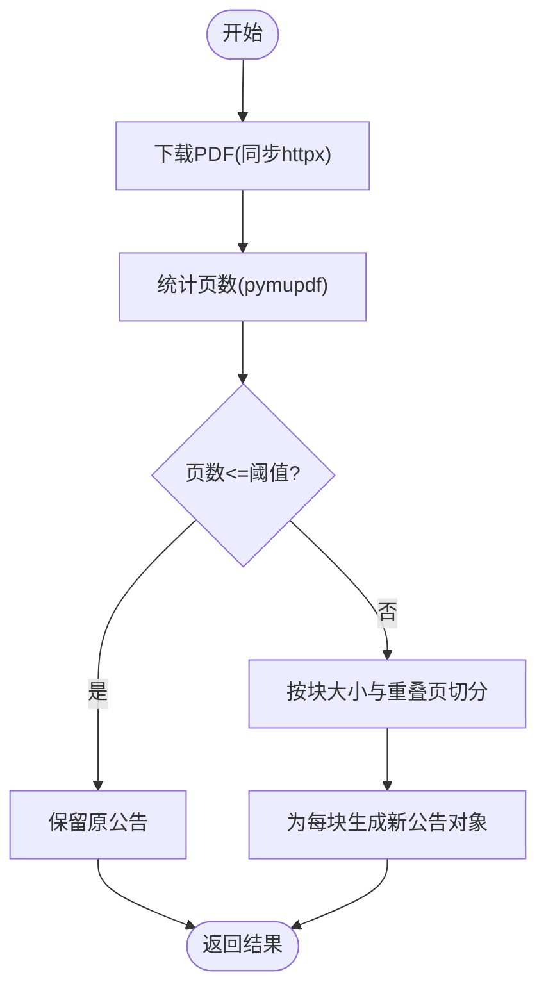
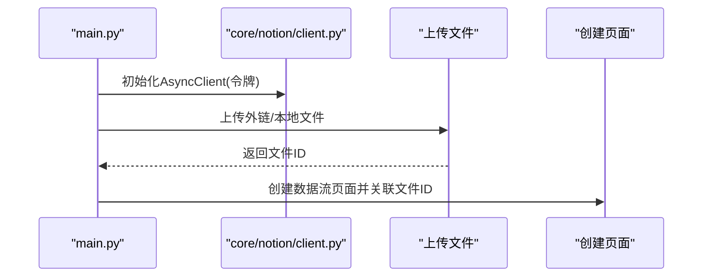
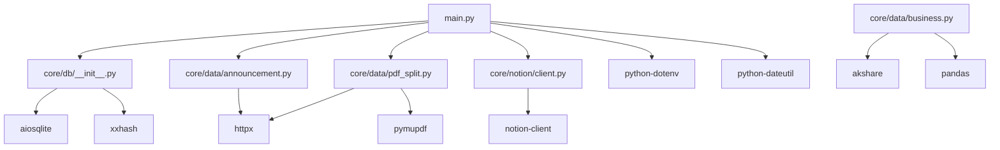

# 环境准备

<cite>
**本文引用的文件**
- [main.py](file://main.py)
- [module_test.py](file://module_test.py)
- [core/db/__init__.py](file://core/db/__init__.py)
- [core/data/announcement.py](file://core/data/announcement.py)
- [core/data/pdf_split.py](file://core/data/pdf_split.py)
- [core/data/business.py](file://core/data/business.py)
- [core/notion/client.py](file://core/notion/client.py)
- [core/models/__init__.py](file://core/models/__init__.py)
</cite>

## 目录
1. [简介](#简介)
2. [项目结构](#项目结构)
3. [核心组件](#核心组件)
4. [架构总览](#架构总览)
5. [详细组件分析](#详细组件分析)
6. [依赖分析](#依赖分析)
7. [性能考虑](#性能考虑)
8. [故障排除指南](#故障排除指南)
9. [结论](#结论)
10. [附录](#附录)

## 简介
本文件面向“股票公告自动化系统”的环境准备与部署，目标是帮助开发者与运维人员在 Windows、Linux、macOS 等主流操作系统上，快速完成 Python 3.8+ 的安装、虚拟环境创建、依赖安装与配置校验，并区分开发与生产环境的差异。本文基于仓库内实际导入与使用情况，梳理项目依赖项（如 httpx、aiosqlite、pymupdf、xxhash 等）的作用与版本建议，提供 pip 安装命令、requirements.txt 说明、依赖冲突解决思路与常见问题解答。

## 项目结构
该项目采用按功能分层的模块化组织方式，核心运行入口位于根目录的主程序文件，数据采集、数据库、Notion 集成与业务处理分别置于 core 子包中；测试与演示脚本位于 tests 与根目录。

图表来源
- [main.py](file://main.py#L1-L40)
- [core/db/__init__.py](file://core/db/__init__.py#L1-L218)
- [core/data/announcement.py](file://core/data/announcement.py#L1-L141)
- [core/data/pdf_split.py](file://core/data/pdf_split.py#L1-L128)
- [core/data/business.py](file://core/data/business.py#L1-L96)
- [core/notion/client.py](file://core/notion/client.py#L1-L6)
- [core/models/__init__.py](file://core/models/__init__.py#L1-L8)

章节来源
- [main.py](file://main.py#L1-L40)

## 核心组件
- 应用入口与调度
  - 通过异步主程序启动数据库初始化、读取股票池、并调用公告与业务数据处理器。
- 数据层
  - 使用异步 SQLite（aiosqlite）持久化更新时间与去重哈希，配合 xxhash 快速计算内容哈希。
- 数据采集层
  - 使用 httpx 异步访问巨潮资讯接口获取公告列表；使用 httpx 同步下载 PDF。
  - 使用 pymupdf 对超大 PDF 进行分页切割，便于后续上传与索引。
- Notion 集成层
  - 使用 notion-client 的异步客户端连接 Notion，上传文件并创建数据流页面。
- 类型与模型
  - 使用 NewType 定义 NotionDate 类型，保证日期字段的类型一致性。

章节来源
- [main.py](file://main.py#L1-L40)
- [core/db/__init__.py](file://core/db/__init__.py#L1-L218)
- [core/data/announcement.py](file://core/data/announcement.py#L1-L141)
- [core/data/pdf_split.py](file://core/data/pdf_split.py#L1-L128)
- [core/notion/client.py](file://core/notion/client.py#L1-L6)
- [core/models/__init__.py](file://core/models/__init__.py#L1-L8)

## 架构总览
下图展示系统从入口到各子系统的调用关系与数据流。

图表来源
- [main.py](file://main.py#L1-L40)
- [core/db/__init__.py](file://core/db/__init__.py#L1-L218)
- [core/data/announcement.py](file://core/data/announcement.py#L1-L141)
- [core/data/pdf_split.py](file://core/data/pdf_split.py#L1-L128)
- [core/notion/client.py](file://core/notion/client.py#L1-L6)

## 详细组件分析

### 组件一：数据库与哈希（aiosqlite + xxhash）
- 作用
  - 异步管理 SQLite 连接，创建 update_records 与 hash 两张表，用于记录各股票的数据更新时间与内容哈希，避免重复处理。
  - 使用 xxhash 快速计算 JSON 序列化后的哈希值，提升去重效率。
- 关键流程
  - 初始化：创建表结构。
  - 去重：对输入数据计算哈希，查询数据库是否存在，过滤后返回未存在的数据。
  - 写入：批量写入新哈希与当前时间戳。
  - 时间维护：按股票与键（业务/公告）维度记录最后更新时间。
- 性能要点
  - 使用异步连接池与上下文管理器，减少连接开销。
  - 哈希计算与数据库查询结合，避免重复入库。

图表来源
- [core/db/__init__.py](file://core/db/__init__.py#L97-L151)

章节来源
- [core/db/__init__.py](file://core/db/__init__.py#L1-L218)

### 组件二：公告抓取（httpx + 巨潮资讯接口）
- 作用
  - 通过异步 httpx 请求巨潮资讯历史公告接口，分页拉取公告列表，并清洗非正文类摘要/英文版/图文版等无关条目。
- 关键流程
  - 组装请求参数（股票组合、日期区间等）。
  - 异步发起请求并解析响应，循环获取剩余页。
  - 结构化为 Announcement 对象列表。
- 性能要点
  - 使用异步客户端，提高并发效率。
  - LRU 缓存股票映射，减少重复请求。

图表来源
- [core/data/announcement.py](file://core/data/announcement.py#L36-L112)

章节来源
- [core/data/announcement.py](file://core/data/announcement.py#L1-L141)

### 组件三：PDF 分割（httpx + pymupdf）
- 作用
  - 对超大 PDF（按阈值判断）进行分页切片，生成多个小体积片段，便于上传与索引。
- 关键流程
  - 下载 PDF（同步 httpx）。
  - 读取页数并按固定块大小与重叠页数切分。
  - 为每个片段生成新的公告对象（保留原公告属性，仅更新标题与估算大小）。
- 性能要点
  - 使用内存缓冲区保存切分后的 PDF，避免磁盘 IO。
  - 合理设置块大小与重叠页，平衡片段数量与检索粒度。

图表来源
- [core/data/pdf_split.py](file://core/data/pdf_split.py#L15-L73)

章节来源
- [core/data/pdf_split.py](file://core/data/pdf_split.py#L1-L128)

### 组件四：Notion 集成（notion-client + 上传与页面创建）
- 作用
  - 通过环境变量提供的令牌初始化异步 Notion 客户端，支持外链与本地文件上传，并创建数据流页面。
- 关键流程
  - 初始化客户端。
  - 上传文件（URL 或本地片段）。
  - 创建数据流页面并建立关联。
- 性能要点
  - 异步上传与页面创建并行执行，提升吞吐。

图表来源
- [core/notion/client.py](file://core/notion/client.py#L1-L6)
- [main.py](file://main.py#L1-L40)

章节来源
- [core/notion/client.py](file://core/notion/client.py#L1-L6)
- [main.py](file://main.py#L1-L40)

### 组件五：主营构成（akshare + pandas）
- 作用
  - 通过 akshare 获取某股票的主营业务构成数据，按行业/产品/地区维度整理为表格。
- 关键流程
  - 根据股票代码构造请求参数。
  - 异步线程池执行第三方接口。
  - 选择最新报告期并筛选三类维度表格。
- 性能要点
  - 使用异步线程池避免阻塞事件循环。

章节来源
- [core/data/business.py](file://core/data/business.py#L1-L96)

## 依赖分析
根据代码导入与使用情况，项目依赖的关键库如下：

- httpx
  - 用途：异步/同步 HTTP 客户端，用于访问巨潮资讯接口与下载 PDF。
  - 版本建议：较新稳定版本，支持异步上下文与并发。
- aiosqlite
  - 用途：异步 SQLite 驱动，提供异步连接与事务管理。
  - 版本建议：与 Python 3.8+ 兼容的稳定版本。
- pymupdf
  - 用途：PDF 解析与切分，支持页级操作与内存保存。
  - 版本建议：兼容当前系统平台的稳定版本。
- xxhash
  - 用途：高性能哈希算法，用于内容去重。
  - 版本建议：稳定版本即可。
- notion-client
  - 用途：Notion API 客户端，支持异步操作。
  - 版本建议：与异步模式兼容的版本。
- python-dotenv
  - 用途：加载 .env 环境变量文件，用于读取令牌等配置。
  - 版本建议：稳定版本。
- akshare、pandas
  - 用途：主营构成数据抓取与表格处理。
  - 版本建议：与项目使用的 API 兼容的版本。
- python-dateutil
  - 用途：日期相对增量计算（如一年前）。
  - 版本建议：稳定版本。

图表来源
- [main.py](file://main.py#L1-L40)
- [core/db/__init__.py](file://core/db/__init__.py#L1-L218)
- [core/data/announcement.py](file://core/data/announcement.py#L1-L141)
- [core/data/pdf_split.py](file://core/data/pdf_split.py#L1-L128)
- [core/notion/client.py](file://core/notion/client.py#L1-L6)
- [core/data/business.py](file://core/data/business.py#L1-L96)

## 性能考虑
- 异步优先：尽量使用异步客户端与异步数据库驱动，减少阻塞。
- 并发控制：对外部 API 与文件上传采用并发策略，但需注意服务端限流与带宽限制。
- 哈希去重：利用 xxhash 快速计算与数据库索引，避免重复处理。
- PDF 切分：合理设置块大小与重叠页，兼顾检索粒度与上传效率。
- 日志级别：生产环境建议调整日志级别，避免过多 I/O。

## 故障排除指南
- 无法导入模块
  - 确认已在虚拟环境中安装全部依赖。
  - 检查 Python 版本是否满足 3.8+。
- 连接 Notion 失败
  - 确认环境变量中存在正确的令牌，且具备相应数据库权限。
- PDF 分割报错
  - 检查网络连通性与 PDF URL 可达性；确认 pymupdf 已正确安装。
- 数据库连接异常
  - 检查数据库文件路径与权限；确认 aiosqlite 可用。
- 依赖冲突
  - 使用隔离的虚拟环境；必要时锁定版本或使用兼容矩阵。
- 环境变量未生效
  - 确保 .env 文件存在且路径正确，入口已调用加载函数。

章节来源
- [main.py](file://main.py#L1-L40)
- [core/notion/client.py](file://core/notion/client.py#L1-L6)
- [core/data/pdf_split.py](file://core/data/pdf_split.py#L1-L128)
- [core/db/__init__.py](file://core/db/__init__.py#L1-L218)

## 结论
本项目围绕“异步 + 轻量数据库 + PDF 处理 + Notion 集成”的技术栈构建，强调高并发与低重复处理。按照本文档的环境准备与依赖说明，可在不同操作系统上快速搭建开发与生产环境，并通过合理的并发与缓存策略保障稳定性与性能。

## 附录

### A. Python 3.8+ 安装与虚拟环境
- Windows/Linux/macOS
  - 官方下载 Python 3.8+ 安装包，勾选“添加到 PATH”。
  - 建议使用 venv 创建虚拟环境：python -m venv .venv
  - 激活虚拟环境：Windows 使用 .venv\Scripts\activate；Linux/macOS 使用 source .venv/bin/activate
  - 升级 pip：python -m pip install --upgrade pip

### B. 依赖安装与 requirements.txt 说明
- 推荐做法
  - 使用 requirements.txt 统一声明依赖，便于复现环境。
  - 开发环境与生产环境可分别维护 requirements-dev.txt 与 requirements-prod.txt。
- 常用 pip 命令
  - 安装依赖：pip install -r requirements.txt
  - 生成锁定文件：pip freeze > requirements.lock
  - 升级依赖：pip install --upgrade -r requirements.txt
- 依赖冲突解决
  - 使用虚拟环境隔离不同项目。
  - 若出现冲突，尝试降级/升级特定包或使用兼容版本范围。
  - 使用 pip-tools 或 Poetry 管理依赖锁定与解析。

### C. 不同操作系统安装要点
- Windows
  - 安装 Microsoft C++ Build Tools（若依赖含 C 扩展）。
  - 安装 PyMuPDF 时可能需要预编译二进制或使用预构建 wheel。
- Linux
  - Ubuntu/Debian：apt install libpymupdf-dev 或对应发行版包。
  - CentOS/RHEL：yum/dnf 安装系统依赖头文件与库。
- macOS
  - 使用 Homebrew 安装系统依赖（如 poppler 等，视 PyMuPDF 需求而定）。
  - 如遇编译问题，优先尝试官方 wheel。

### D. 开发环境与生产环境区别
- 开发环境
  - 可开启更详细的日志级别，便于调试。
  - 可启用热重载或单测脚本（如 module_test.py）验证局部功能。
- 生产环境
  - 固定依赖版本，使用 requirements.lock 或容器镜像。
  - 设置只读数据库文件与最小权限的 Notion 令牌。
  - 配置进程守护与健康检查，监控异常并告警。

章节来源
- [module_test.py](file://module_test.py#L1-L7)