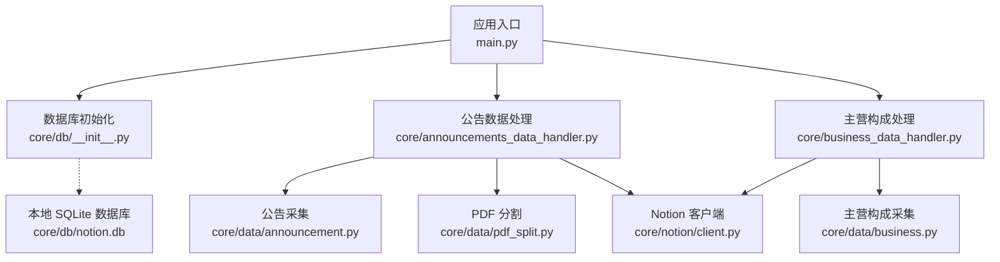
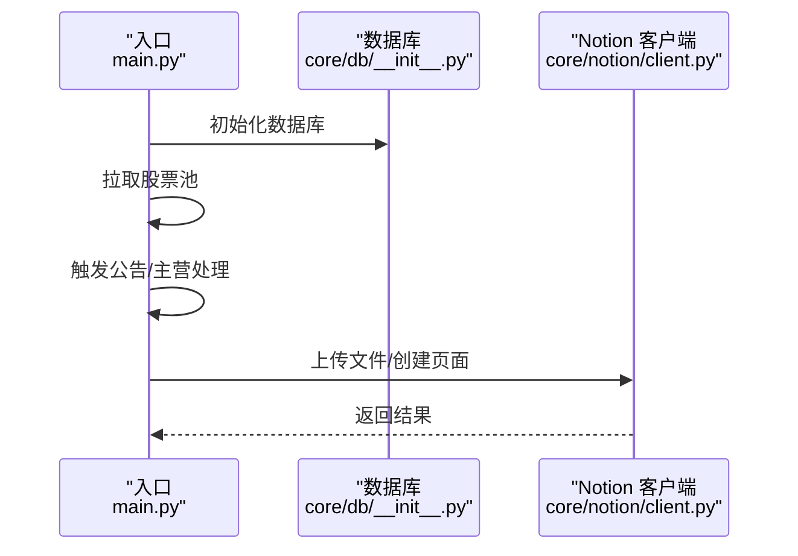
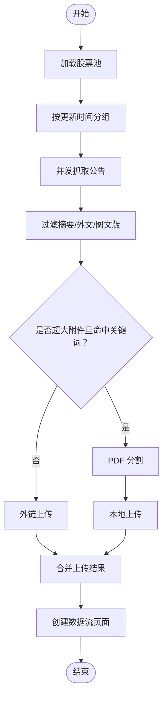
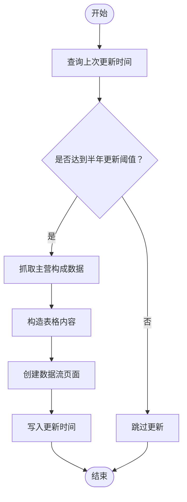
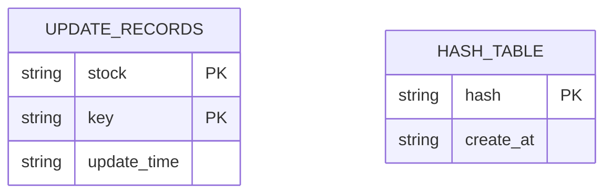
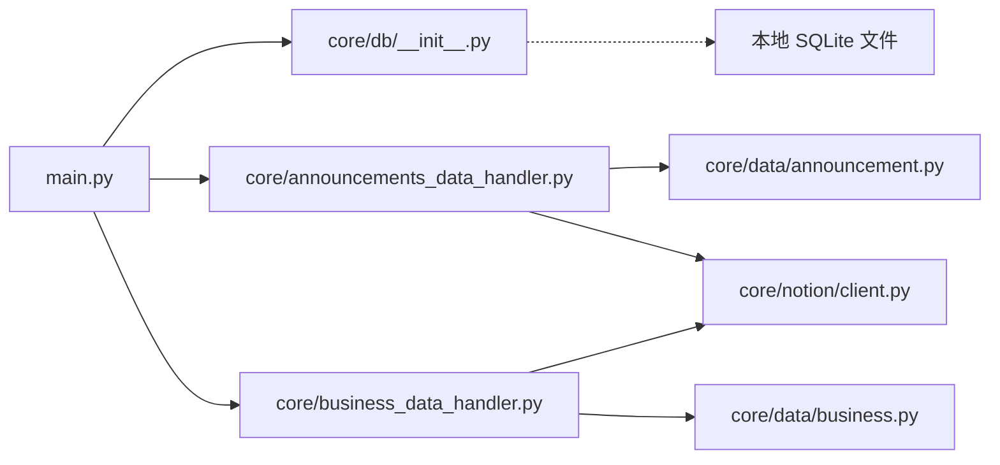

# 生产部署

<cite>
**本文引用的文件**
- [main.py](file://main.py)
- [core/db/__init__.py](file://core/db/__init__.py)
- [core/data/announcement.py](file://core/data/announcement.py)
- [core/data/business.py](file://core/data/business.py)
- [core/announcements_data_handler.py](file://core/announcements_data_handler.py)
- [core/business_data_handler.py](file://core/business_data_handler.py)
- [core/notion/client.py](file://core/notion/client.py)
- [core/models/__init__.py](file://core/models/__init__.py)
</cite>

## 目录
1. [简介](#简介)
2. [项目结构](#项目结构)
3. [核心组件](#核心组件)
4. [架构总览](#架构总览)
5. [详细组件分析](#详细组件分析)
6. [依赖关系分析](#依赖关系分析)
7. [性能考量](#性能考量)
8. [故障排查指南](#故障排查指南)
9. [结论](#结论)
10. [附录](#附录)

## 简介
本文件面向“股票公告自动化系统”的生产环境部署，目标是提供一套可落地的容器化与云平台部署方案，涵盖以下要点：
- Docker 容器化与镜像构建
- 云平台部署指南（AWS/Azure/阿里云）
- 服务器配置要求与资源规划
- 环境变量配置清单
- 进程管理（PM2、systemd）与日志轮转
- 负载均衡、SSL 与安全加固
- 自动化部署脚本模板与回滚策略

本系统以异步为主、SQLite 本地持久化、Notion API 作为数据出口，适合单实例或小规模集群部署。

## 项目结构
项目采用按功能域划分的目录组织，核心模块如下：
- 应用入口与调度：main.py
- 数据层：core/db（SQLite 异步封装）
- 数据采集：core/data（公告、主营构成、PDF 分割）
- 业务处理器：core/announcements_data_handler、core/business_data_handler
- Notion 集成：core/notion（客户端、上传、页面创建）
- 类型定义：core/models（如 NotionDate）

图表来源
- [main.py](file://main.py#L20-L39)
- [core/db/__init__.py](file://core/db/__init__.py#L62-L94)
- [core/announcements_data_handler.py](file://core/announcements_data_handler.py#L21-L115)
- [core/business_data_handler.py](file://core/business_data_handler.py#L17-L67)
- [core/data/announcement.py](file://core/data/announcement.py#L36-L112)
- [core/data/business.py](file://core/data/business.py#L33-L95)
- [core/notion/client.py](file://core/notion/client.py#L1-L6)

章节来源
- [main.py](file://main.py#L1-L40)
- [core/db/__init__.py](file://core/db/__init__.py#L1-L218)

## 核心组件
- 应用入口与调度
  - 通过异步主程序初始化数据库、拉取股票池、调用公告与主营构成处理流程。
- 数据库层
  - 提供异步连接、事务管理、更新时间记录、去重哈希存储等能力；默认在模块所在目录生成本地 SQLite 文件。
- 数据采集层
  - 公告采集对接巨潮资讯网接口；主营构成采集对接 AkShare；PDF 分割用于大附件拆分。
- 业务处理器
  - 公告处理器：按股票与时间窗口聚合请求、并发抓取、分页上传、创建 Notion 页面。
  - 主营构成处理器：按半年周期判断是否更新，生成表格内容并创建页面。
- Notion 集成
  - 通过环境变量读取 Token，使用异步客户端与上传、页面创建接口交互。

章节来源
- [main.py](file://main.py#L20-L39)
- [core/db/__init__.py](file://core/db/__init__.py#L62-L217)
- [core/data/announcement.py](file://core/data/announcement.py#L36-L141)
- [core/data/business.py](file://core/data/business.py#L33-L96)
- [core/announcements_data_handler.py](file://core/announcements_data_handler.py#L21-L115)
- [core/business_data_handler.py](file://core/business_data_handler.py#L17-L108)
- [core/notion/client.py](file://core/notion/client.py#L1-L6)

## 架构总览
系统运行时序概览如下：

图表来源
- [main.py](file://main.py#L20-L39)
- [core/db/__init__.py](file://core/db/__init__.py#L62-L94)
- [core/notion/client.py](file://core/notion/client.py#L1-L6)

## 详细组件分析

### 组件一：公告数据处理流程
- 输入：股票池、时间窗口
- 处理：按需分组请求、并发抓取、过滤与分页、上传、创建页面
- 输出：Notion 页面与附件

图表来源
- [core/announcements_data_handler.py](file://core/announcements_data_handler.py#L21-L115)
- [core/data/announcement.py](file://core/data/announcement.py#L36-L112)

章节来源
- [core/announcements_data_handler.py](file://core/announcements_data_handler.py#L21-L115)
- [core/data/announcement.py](file://core/data/announcement.py#L36-L141)

### 组件二：主营构成处理流程
- 输入：股票池
- 处理：判断半年周期、抓取数据、构造表格、创建页面
- 输出：Notion 页面

图表来源
- [core/business_data_handler.py](file://core/business_data_handler.py#L17-L108)
- [core/data/business.py](file://core/data/business.py#L33-L96)

章节来源
- [core/business_data_handler.py](file://core/business_data_handler.py#L17-L108)
- [core/data/business.py](file://core/data/business.py#L33-L96)

### 组件三：数据库与去重机制
- 初始化：创建两张表（更新记录、哈希）
- 去重：对输入数据计算哈希，查询并过滤重复
- 更新时间：按股票+键维护最后更新时间

图表来源
- [core/db/__init__.py](file://core/db/__init__.py#L77-L93)
- [core/db/__init__.py](file://core/db/__init__.py#L153-L185)
- [core/db/__init__.py](file://core/db/__init__.py#L97-L128)

章节来源
- [core/db/__init__.py](file://core/db/__init__.py#L62-L217)

### 组件四：Notion 客户端与上传
- 通过环境变量读取 Token，初始化异步客户端
- 支持 URL 外链与本地分割后的文件上传
- 页面创建基于数据流模板

章节来源
- [core/notion/client.py](file://core/notion/client.py#L1-L6)

## 依赖关系分析
- 运行时依赖
  - Python 异步运行时（asyncio）
  - 异步 HTTP 客户端（httpx）
  - 异步 SQLite 驱动（aiosqlite）
  - 第三方数据源（AkShare、巨潮资讯网）
  - Notion SDK（异步客户端）
- 内部模块耦合
  - 入口模块依赖数据库初始化与 Notion 客户端
  - 处理器模块依赖数据采集与数据库模块
  - 数据采集模块依赖外部 API 与 PDF 工具

图表来源
- [main.py](file://main.py#L12-L13)
- [core/db/__init__.py](file://core/db/__init__.py#L12-L13)
- [core/announcements_data_handler.py](file://core/announcements_data_handler.py#L7-L16)
- [core/business_data_handler.py](file://core/business_data_handler.py#L4-L12)
- [core/data/announcement.py](file://core/data/announcement.py#L1-L8)
- [core/data/business.py](file://core/data/business.py#L10-L11)
- [core/notion/client.py](file://core/notion/client.py#L3-L5)

## 性能考量
- 并发与批量化
  - 公告采集按时间分组批量请求，减少接口调用次数
  - 使用 asyncio.gather 并发上传与页面创建
- I/O 密集优化
  - 异步 HTTP 客户端与异步 SQLite，避免阻塞
- 存储与去重
  - 通过哈希去重，避免重复上传与页面创建
- 资源规划建议
  - CPU：I/O 密集，建议 2C4G 起步
  - 内存：根据并发量与 PDF 分割内存占用调整
  - 磁盘：SQLite 本地文件，建议 20G+ 可用空间
  - 网络：公网可达巨潮资讯网与 Notion API

[本节为通用指导，无需列出章节来源]

## 故障排查指南
- 数据库初始化失败
  - 检查数据库目录权限与路径
  - 确认 SQLite 文件存在且可读写
- Notion 上传失败
  - 核对环境变量中的 Token 是否有效
  - 检查网络连通性与 API 限流
- 公告采集异常
  - 关注接口返回与分页逻辑
  - 检查股票映射与日期范围
- 主营构成更新异常
  - 核对上次更新时间与半年周期判断逻辑
  - 检查 AkShare 数据可用性

章节来源
- [core/db/__init__.py](file://core/db/__init__.py#L62-L94)
- [core/notion/client.py](file://core/notion/client.py#L1-L6)
- [core/data/announcement.py](file://core/data/announcement.py#L36-L112)
- [core/business_data_handler.py](file://core/business_data_handler.py#L70-L108)

## 结论
本系统以异步与本地 SQLite 为核心，具备良好的可运维性与扩展性。结合容器化与云平台部署，可在保证稳定性的同时实现自动化与弹性伸缩。建议在生产环境中配合监控、日志与备份策略，持续优化并发与资源配额。

[本节为总结性内容，无需列出章节来源]

## 附录

### A. Docker 容器化与镜像构建
- 基础镜像选择
  - 推荐使用官方 Python 3.11 slim 镜像作为基础
- 依赖安装
  - 使用 pip 安装项目依赖（建议使用虚拟环境与 requirements.txt）
- 工作目录与启动命令
  - 设置工作目录为项目根目录
  - 启动命令为运行入口脚本
- 卷挂载
  - 挂载数据库目录以持久化 SQLite 文件
- 健康检查
  - 可添加简单健康检查，验证数据库连接与 Notion Token 可用性

[本节为通用指导，无需列出章节来源]

### B. 云平台部署指南（AWS/Azure/阿里云）
- 实例规格建议
  - 2 vCPU / 4 GiB 内存起步，根据并发与数据量评估
- 安全组/防火墙
  - 开放出站网络访问（巨潮资讯网、Notion API、GitHub Releases 等）
- 存储
  - 使用云盘挂载数据库目录，开启快照与备份
- 容器编排
  - 使用 ECS/EKS/AKS/ACK 部署容器，设置副本数与重启策略
- CI/CD
  - 使用流水线构建镜像并推送至镜像仓库，触发部署

[本节为通用指导，无需列出章节来源]

### C. 环境变量配置清单
- 必填项
  - NOTION_TOKEN：Notion 数据库集成密钥
- 可选项
  - LOG_LEVEL：日志级别（如 DEBUG/INFO/WARNING）
  - DATABASE_PATH：自定义 SQLite 路径（若非默认）
  - HTTP_PROXY/HTTPS_PROXY：代理配置（如需）
- 建议
  - 使用密钥管理服务（KMS/Vault）管理敏感变量
  - 不在镜像中硬编码敏感信息

章节来源
- [core/notion/client.py](file://core/notion/client.py#L1-L6)
- [main.py](file://main.py#L15-L17)

### D. 进程管理与日志轮转
- PM2（推荐）
  - 使用 ecosystem.config.js 管理进程与环境变量
  - 配置日志轮转与自动重启
- systemd（备选）
  - 编写服务单元文件，设置 RestartSec、Restart、StandardOutput 等
  - 使用 journald 或 logrotate 进行日志轮转

[本节为通用指导，无需列出章节来源]

### E. 负载均衡、SSL 与安全加固
- 负载均衡
  - 使用平台 LB（Elastic Load Balancer/Azure Load Balancer/SLB）分发流量
- SSL 证书
  - 通过 ACM/Cert Manager/平台证书服务申请与续期
- 安全加固
  - 最小权限原则（IAM/服务账号）
  - 网络隔离（VPC/子网/安全组）
  - 定期扫描镜像与依赖漏洞

[本节为通用指导，无需列出章节来源]

### F. 自动化部署脚本模板与回滚策略
- 部署脚本模板（伪代码思路）
  - 拉取镜像 → 停止旧容器 → 启动新容器 → 健康检查 → 发送通知
- 回滚策略
  - 保留最近 N 个镜像版本
  - 回滚时停止当前容器并启动上一个版本
  - 使用蓝绿/金丝雀发布降低风险

[本节为通用指导，无需列出章节来源]