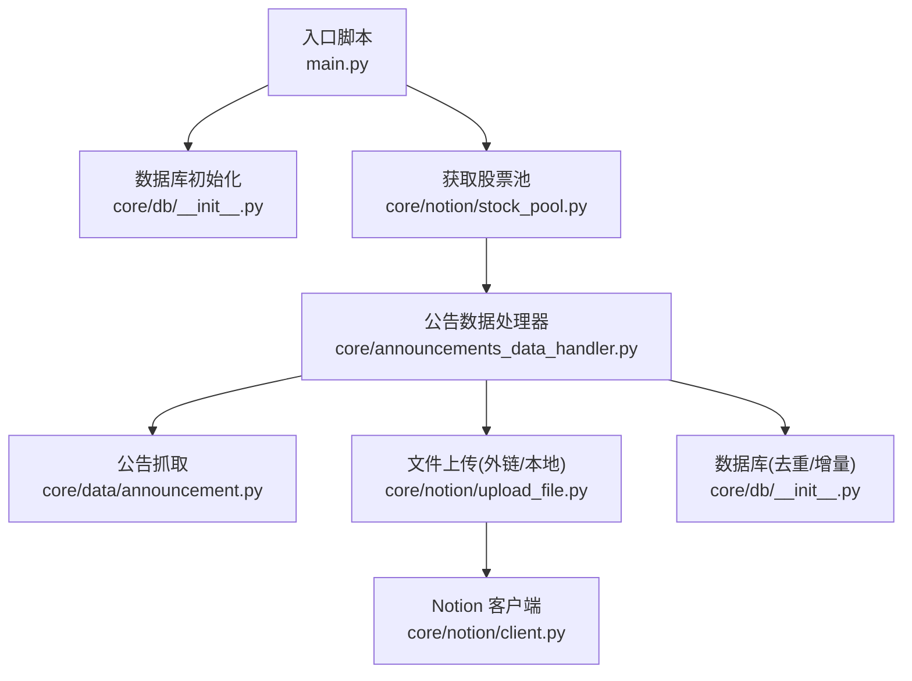
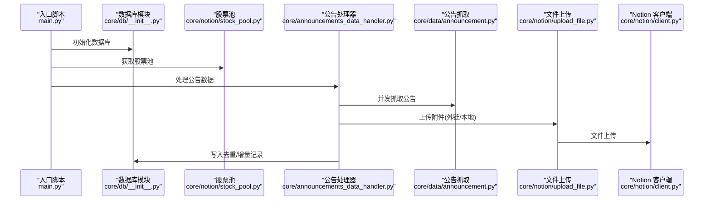
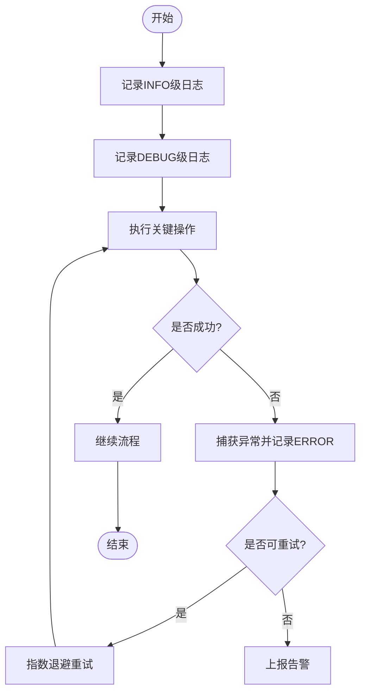
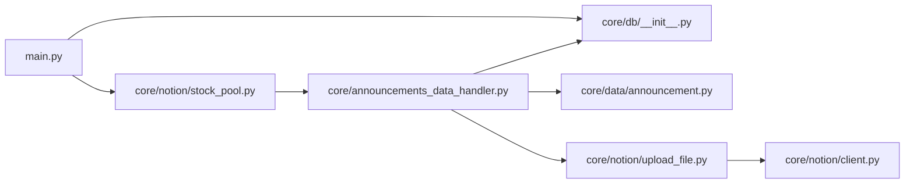

# 监控与日志

<cite>
**本文引用的文件**
- [main.py](file://main.py)
- [announcements_data_handler.py](file://core/announcements_data_handler.py)
- [announcement.py](file://core/data/announcement.py)
- [upload_file.py](file://core/notion/upload_file.py)
- [stock_pool.py](file://core/notion/stock_pool.py)
- [client.py](file://core/notion/client.py)
- [db_init.py](file://core/db/__init__.py)
- [scheduler_init.py](file://core/scheduler/__init__.py)
</cite>

## 目录
1. [简介](#简介)
2. [项目结构](#项目结构)
3. [核心组件](#核心组件)
4. [架构总览](#架构总览)
5. [详细组件分析](#详细组件分析)
6. [依赖关系分析](#依赖关系分析)
7. [性能考量](#性能考量)
8. [故障排查指南](#故障排查指南)
9. [结论](#结论)
10. [附录](#附录)

## 简介
本文件面向“股票公告自动化系统”的运维与开发团队，提供一套系统化的监控与日志管理方案。内容涵盖：
- 应用程序监控指标与性能指标采集建议
- 告警配置思路与触发条件
- 日志级别、日志格式与日志轮转策略
- 错误追踪、异常监控与系统健康检查机制
- Prometheus 监控集成、Grafana 仪表板配置与告警规则建议
- 日志分析工具使用、性能瓶颈定位与故障诊断方法

当前仓库中，系统已具备基础的日志记录能力（INFO/ERROR/DEBUG 等），但尚未集成统一的监控指标导出、日志轮转与健康检查端点。本文在现有基础上提出可落地的增强方案。

## 项目结构
系统采用模块化设计，入口脚本负责初始化数据库与获取股票池，随后调用公告数据处理器完成数据抓取、文件上传与页面创建。数据库模块提供去重与增量更新所需的时间戳记录；Notion 客户端模块负责与 Notion API 交互；PDF 分割与上传模块负责大文件拆分与上传。

图表来源
- [main.py](file://main.py#L15-L39)
- [db_init.py](file://core/db/__init__.py#L62-L94)
- [stock_pool.py](file://core/notion/stock_pool.py#L23-L48)
- [announcements_data_handler.py](file://core/announcements_data_handler.py#L21-L116)
- [announcement.py](file://core/data/announcement.py#L36-L112)
- [upload_file.py](file://core/notion/upload_file.py#L28-L61)
- [client.py](file://core/notion/client.py#L1-L6)

章节来源
- [main.py](file://main.py#L15-L39)
- [db_init.py](file://core/db/__init__.py#L62-L94)

## 核心组件
- 入口与调度
  - 入口脚本负责加载环境变量、初始化数据库、获取股票池并启动公告处理流程。
  - 调度器模块提供异步调度器实例，可用于后续定时任务部署。
- 数据抓取与处理
  - 公告抓取模块负责调用第三方接口获取公告列表，并进行过滤与清洗。
  - 公告处理器负责按时间分组、并发抓取、PDF 分割与上传、创建 Notion 页面。
- 文件上传与轮询
  - 支持外链直传与本地下载后上传两种模式，内置轮询等待与指数退避重试。
- 数据库与去重
  - 提供异步连接管理、表初始化、哈希去重、增量时间戳记录等功能。
- Notion 集成
  - 通过 Notion Async Client 进行文件上传与页面创建。

章节来源
- [main.py](file://main.py#L15-L39)
- [scheduler_init.py](file://core/scheduler/__init__.py#L1-L7)
- [announcement.py](file://core/data/announcement.py#L36-L112)
- [announcements_data_handler.py](file://core/announcements_data_handler.py#L21-L116)
- [upload_file.py](file://core/notion/upload_file.py#L28-L61)
- [db_init.py](file://core/db/__init__.py#L97-L185)
- [client.py](file://core/notion/client.py#L1-L6)

## 架构总览
下图展示从入口到各子系统的调用关系与数据流向，便于理解监控与日志的覆盖范围与关键观测点。

图表来源
- [main.py](file://main.py#L20-L35)
- [db_init.py](file://core/db/__init__.py#L62-L94)
- [stock_pool.py](file://core/notion/stock_pool.py#L23-L48)
- [announcements_data_handler.py](file://core/announcements_data_handler.py#L21-L116)
- [announcement.py](file://core/data/announcement.py#L36-L112)
- [upload_file.py](file://core/notion/upload_file.py#L28-L61)
- [client.py](file://core/notion/client.py#L1-L6)

## 详细组件分析

### 日志与错误追踪
- 日志级别
  - INFO：关键流程节点（如“获取公告信息”、“上传完成”、“获取股票池”）。
  - ERROR：上传失败、网络异常、Notion API 失败、数据库异常等。
  - DEBUG：调试细节（如轮询状态、分页抓取进度、PDF 分片数量）。
- 日志格式规范
  - 建议统一格式：时间戳、级别、模块名、消息体、附加字段（如文件名、耗时、状态码）。
  - JSON 格式便于日志分析工具解析与检索。
- 日志轮转策略
  - 基于大小轮转（如 100MB）与基于时间轮转（每日/每周）结合。
  - 保留最近 14 天/30 份日志，避免磁盘占用过大。
- 错误追踪与异常监控
  - 对外链下载、Notion 文件上传、数据库写入等关键路径增加 try-except 并记录异常堆栈。
  - 对轮询超时、HTTP 状态码异常、Notion 导入失败等进行分类统计与告警。

图表来源
- [upload_file.py](file://core/notion/upload_file.py#L153-L176)
- [upload_file.py](file://core/notion/upload_file.py#L64-L96)
- [upload_file.py](file://core/notion/upload_file.py#L124-L150)

章节来源
- [main.py](file://main.py#L15-L17)
- [announcement.py](file://core/data/announcement.py#L55-L95)
- [upload_file.py](file://core/notion/upload_file.py#L34-L36)
- [upload_file.py](file://core/notion/upload_file.py#L58-L60)
- [upload_file.py](file://core/notion/upload_file.py#L82-L90)
- [upload_file.py](file://core/notion/upload_file.py#L138-L146)

### 性能指标采集建议
- 关键指标
  - 公告抓取吞吐量（QPS）、平均/95 分位响应时间、失败率。
  - 文件上传成功率、平均上传耗时、分片数量分布。
  - 数据库写入耗时、去重命中率、增量更新覆盖率。
  - Notion API 调用延迟与错误率。
- 指标来源
  - 公告抓取：在抓取函数前后记录时间戳，计算耗时与速率。
  - 文件上传：统计成功/失败计数、耗时分布、分片数。
  - 数据库：记录哈希去重前后数据量差值与写入耗时。
  - Notion：记录文件上传创建、轮询状态变化与最终结果。
- 指标暴露
  - 使用指标库（如 Prometheus 客户端）在进程内暴露指标端点，或通过 Exporter 方式上报。

章节来源
- [announcement.py](file://core/data/announcement.py#L36-L112)
- [upload_file.py](file://core/notion/upload_file.py#L28-L61)
- [db_init.py](file://core/db/__init__.py#L97-L151)

### 健康检查机制
- 健康检查端点
  - 提供 /health 接口，返回数据库连接可用性、Notion 客户端认证状态、关键依赖可用性。
- 自动化探测
  - 定时任务周期性调用健康检查，失败时触发告警。
- 故障隔离
  - 对数据库与 Notion API 设置独立的健康阈值，避免相互影响导致误报。

章节来源
- [db_init.py](file://core/db/__init__.py#L62-L94)
- [client.py](file://core/notion/client.py#L1-L6)

### 告警配置
- 触发条件建议
  - 公告抓取失败率超过阈值（如 5%）持续 5 分钟。
  - 文件上传失败率超过阈值（如 3%）且平均耗时异常升高。
  - 数据库写入耗时 P95 超过阈值（如 5 秒）。
  - Notion API 连续失败或导入失败率上升。
- 告警渠道
  - 邮件、IM 机器人、电话通知分级。
- 告警抑制
  - 同一周期内同类告警合并发送，避免风暴。

章节来源
- [upload_file.py](file://core/notion/upload_file.py#L153-L176)
- [announcement.py](file://core/data/announcement.py#L79-L92)

### Prometheus 监控集成与 Grafana 仪表板
- 指标定义
  - scrape_duration_seconds：抓取耗时
  - scrape_success_total/scrape_failure_total：抓取成功/失败计数
  - upload_success_total/upload_failure_total：上传成功/失败计数
  - upload_duration_seconds：上传耗时
  - db_write_duration_seconds：数据库写入耗时
  - hash_dedup_ratio：哈希去重命中率
  - notion_api_duration_seconds：Notion API 调用耗时
- 仪表板建议
  - 总览面板：成功率、吞吐量、错误趋势
  - 组件面板：抓取、上传、数据库、Notion API
  - 告警面板：失败率、延迟、错误详情
- 告警规则示例
  - scrape_failure_rate > 0.05 over 5m
  - upload_failure_rate > 0.03 over 5m
  - db_write_duration_p95 > 5s over 5m
  - notion_api_failure_rate > 0.02 over 5m

章节来源
- [announcement.py](file://core/data/announcement.py#L36-L112)
- [upload_file.py](file://core/notion/upload_file.py#L28-L61)
- [db_init.py](file://core/db/__init__.py#L97-L151)

### 日志分析与故障诊断
- 日志分析工具
  - 使用 ELK/EFK 或 Loki + Promtail 收集与索引日志，建立查询面板。
  - 关键查询：按错误级别、模块、文件名、耗时排序，定位异常热点。
- 性能瓶颈定位
  - 结合指标与日志，识别慢接口、高失败率环节与资源占用高峰。
  - 对并发任务进行分段耗时统计，定位阻塞点。
- 故障诊断流程
  - 快速确认：健康检查、关键依赖可用性
  - 逐步回放：按模块重放抓取、上传、数据库写入流程
  - 根因定位：结合日志堆栈与指标异常区间，缩小范围

章节来源
- [upload_file.py](file://core/notion/upload_file.py#L153-L176)
- [announcement.py](file://core/data/announcement.py#L79-L92)

## 依赖关系分析
- 组件耦合
  - 入口脚本依赖数据库初始化与股票池获取；公告处理器依赖抓取与上传模块；上传模块依赖 Notion 客户端。
- 外部依赖
  - HTTP 客户端（异步）、Notion Async Client、SQLite（aiosqlite）、PDF 处理库。
- 潜在循环依赖
  - 当前模块间为单向依赖，未见循环。

图表来源
- [main.py](file://main.py#L12-L13)
- [announcements_data_handler.py](file://core/announcements_data_handler.py#L7-L16)
- [upload_file.py](file://core/notion/upload_file.py#L9-L11)
- [client.py](file://core/notion/client.py#L3-L5)

章节来源
- [main.py](file://main.py#L12-L13)
- [announcements_data_handler.py](file://core/announcements_data_handler.py#L7-L16)
- [upload_file.py](file://core/notion/upload_file.py#L9-L11)
- [client.py](file://core/notion/client.py#L3-L5)

## 性能考量
- 并发与批处理
  - 抓取阶段按更新时间分组，减少重复请求；上传阶段并发执行，提高吞吐。
- 缓存与去重
  - 使用哈希去重避免重复处理；对静态数据使用缓存（如股票映射）。
- 轮询与退避
  - 上传轮询采用指数退避，降低 Notion 侧压力与失败风险。
- I/O 优化
  - PDF 分片上传控制单次大小，平衡上传速度与稳定性。

章节来源
- [announcements_data_handler.py](file://core/announcements_data_handler.py#L40-L59)
- [db_init.py](file://core/db/__init__.py#L97-L128)
- [upload_file.py](file://core/notion/upload_file.py#L110-L121)
- [upload_file.py](file://core/notion/upload_file.py#L153-L176)

## 故障排查指南
- 常见问题与定位
  - 抓取失败：检查接口地址、参数拼接、分页逻辑；查看响应 JSON 结构变化。
  - 上传失败：区分外链与本地下载路径，检查 URL 可达性与 Notion 导入状态。
  - 数据库异常：确认连接池状态、事务回滚、主键冲突。
- 诊断步骤
  - 启用 DEBUG 日志，复现问题并收集上下文。
  - 对比指标与日志，确认异常区间与关联操作。
  - 临时降级：禁用部分功能（如 PDF 分片）验证问题根因。
- 回滚与恢复
  - 保留最近一次成功增量时间戳，必要时回滚到上一个稳定版本。

章节来源
- [announcement.py](file://core/data/announcement.py#L79-L92)
- [upload_file.py](file://core/notion/upload_file.py#L64-L96)
- [upload_file.py](file://core/notion/upload_file.py#L124-L150)
- [db_init.py](file://core/db/__init__.py#L188-L215)

## 结论
本方案在现有系统基础上，补充了统一的日志规范、性能指标采集、健康检查与告警机制，并给出了 Prometheus/Grafana 的集成建议。通过标准化的监控与日志体系，可显著提升系统的可观测性与可维护性，缩短故障定位时间并降低运营风险。

## 附录
- 环境变量
  - NOTION_TOKEN：Notion API Token
  - STOCK_POOL：股票池数据库 ID
- 建议新增
  - 指标导出端点与健康检查端点
  - 日志轮转与归档策略
  - 告警规则与通知模板