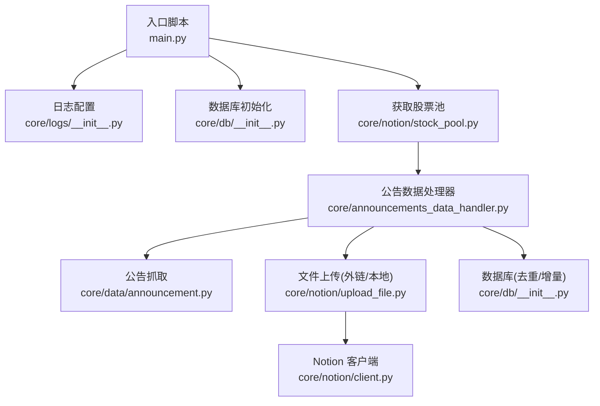
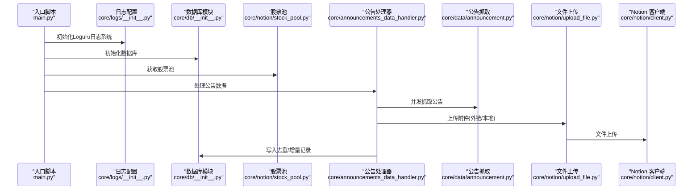
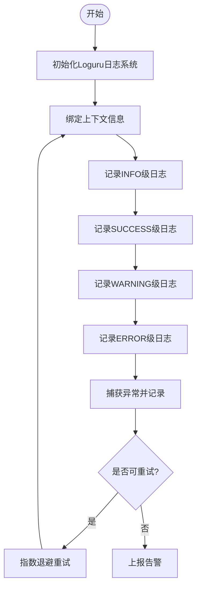
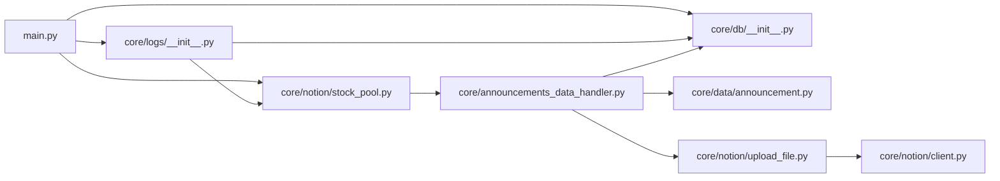

# 监控与日志

<cite>
**本文引用的文件**
- [main.py](file://main.py)
- [core/logs/__init__.py](file://core/logs/__init__.py)
- [announcements_data_handler.py](file://core/announcements_data_handler.py)
- [announcement.py](file://core/data/announcement.py)
- [upload_file.py](file://core/notion/upload_file.py)
- [stock_pool.py](file://core/notion/stock_pool.py)
- [client.py](file://core/notion/client.py)
- [db_init.py](file://core/db/__init__.py)
- [scheduler_init.py](file://core/scheduler/__init__.py)
</cite>

## 更新摘要
**变更内容**
- 新增Loguru日志系统配置与使用指南
- 更新日志级别与格式规范，支持结构化日志
- 增加彩色输出与JSON序列化功能
- 提供拦截标准logging的兼容性配置
- 更新所有模块的日志记录方式

## 目录
1. [简介](#简介)
2. [项目结构](#项目结构)
3. [核心组件](#核心组件)
4. [架构总览](#架构总览)
5. [详细组件分析](#详细组件分析)
6. [依赖关系分析](#依赖关系分析)
7. [性能考量](#性能考量)
8. [故障排查指南](#故障排查指南)
9. [结论](#结论)
10. [附录](#附录)

## 简介
本文件面向"股票公告自动化系统"的运维与开发团队，提供一套系统化的监控与日志管理方案。内容涵盖：
- 应用程序监控指标与性能指标采集建议
- 告警配置思路与触发条件
- 日志级别、日志格式与日志轮转策略
- 错误追踪、异常监控与系统健康检查机制
- Prometheus 监控集成、Grafana 仪表板配置与告警规则建议
- 日志分析工具使用、性能瓶颈定位与故障诊断方法

系统已全面采用Loguru日志系统，提供结构化日志、彩色输出、JSON序列化等现代化日志功能，替代传统的Python标准logging模块。

## 项目结构
系统采用模块化设计，入口脚本负责初始化数据库与获取股票池，随后调用公告数据处理器完成数据抓取、文件上传与页面创建。数据库模块提供去重与增量更新所需的时间戳记录；Notion 客户端模块负责与 Notion API 交互；PDF 分割与上传模块负责大文件拆分与上传。

**图表来源**
- [main.py](file://main.py#L1-L46)
- [core/logs/__init__.py](file://core/logs/__init__.py#L1-L66)
- [db_init.py](file://core/db/__init__.py#L62-L94)
- [stock_pool.py](file://core/notion/stock_pool.py#L23-L48)
- [announcements_data_handler.py](file://core/announcements_data_handler.py#L21-L116)
- [announcement.py](file://core/data/announcement.py#L36-L112)
- [upload_file.py](file://core/notion/upload_file.py#L28-L61)
- [client.py](file://core/notion/client.py#L1-L6)

**章节来源**
- [main.py](file://main.py#L1-L46)
- [core/logs/__init__.py](file://core/logs/__init__.py#L1-L66)
- [db_init.py](file://core/db/__init__.py#L62-L94)

## 核心组件
- 入口与调度
  - 入口脚本负责加载环境变量、初始化数据库、获取股票池并启动公告处理流程。
  - 调度器模块提供异步调度器实例，可用于后续定时任务部署。
- 日志系统
  - **新增** Loguru日志系统配置，提供结构化日志、彩色输出、JSON序列化等功能。
  - 支持多输出目标：控制台彩色输出、文件JSON输出、错误日志分离。
  - 拦截标准logging模块，确保第三方库的日志也能被统一管理。
- 数据抓取与处理
  - 公告抓取模块负责调用第三方接口获取公告列表，并进行过滤与清洗。
  - 公告处理器负责按时间分组、并发抓取、PDF 分割与上传、创建 Notion 页面。
- 文件上传与轮询
  - 支持外链直传与本地下载后上传两种模式，内置轮询等待与指数退避重试。
- 数据库与去重
  - 提供异步连接管理、表初始化、哈希去重、增量时间戳记录等功能。
- Notion 集成
  - 通过 Notion Async Client 进行文件上传与页面创建。

**章节来源**
- [main.py](file://main.py#L1-L46)
- [core/logs/__init__.py](file://core/logs/__init__.py#L1-L66)
- [scheduler_init.py](file://core/scheduler/__init__.py#L1-L7)
- [announcement.py](file://core/data/announcement.py#L36-L112)
- [announcements_data_handler.py](file://core/announcements_data_handler.py#L21-L116)
- [upload_file.py](file://core/notion/upload_file.py#L28-L61)
- [db_init.py](file://core/db/__init__.py#L97-L185)
- [client.py](file://core/notion/client.py#L1-L6)

## 架构总览
下图展示从入口到各子系统的调用关系与数据流向，便于理解监控与日志的覆盖范围与关键观测点。

**图表来源**
- [main.py](file://main.py#L1-L46)
- [core/logs/__init__.py](file://core/logs/__init__.py#L1-L66)
- [db_init.py](file://core/db/__init__.py#L62-L94)
- [stock_pool.py](file://core/notion/stock_pool.py#L23-L48)
- [announcements_data_handler.py](file://core/announcements_data_handler.py#L21-L116)
- [announcement.py](file://core/data/announcement.py#L36-L112)
- [upload_file.py](file://core/notion/upload_file.py#L28-L61)
- [client.py](file://core/notion/client.py#L1-L6)

## 详细组件分析

### Loguru日志系统配置

**新增** 系统已全面采用Loguru日志系统，提供现代化的日志管理功能。

#### 日志配置特性
- **多输出目标**：同时支持控制台彩色输出和文件JSON输出
- **结构化日志**：支持绑定上下文信息，如股票代码、文件名等
- **彩色输出**：控制台显示彩色日志，便于快速识别日志级别
- **JSON序列化**：文件输出采用JSON格式，便于日志分析工具解析
- **日志轮转**：支持按时间轮转和压缩归档
- **错误分离**：错误日志单独输出到独立文件

#### 配置详情
- 控制台输出：彩色格式，包含时间、级别、函数名和消息
- 文件输出：JSON格式，按天轮转，保留30天
- 错误输出：独立文件，保留90天
- 标准logging拦截：确保第三方库日志统一管理

**章节来源**
- [core/logs/__init__.py](file://core/logs/__init__.py#L1-L66)

### 日志与错误追踪

**更新** 系统已完全迁移到Loguru日志系统，提供结构化日志记录。

#### 日志级别
- **INFO**：关键流程节点（如"开始处理股票列表"、"公告信息获取完成"）
- **SUCCESS**：操作成功状态（如"数据库初始化完成"、"成功创建页面"）
- **WARNING**：潜在问题警告（如"传入的日期不是季度末"）
- **ERROR**：上传失败、网络异常、Notion API 失败、数据库异常等
- **DEBUG**：调试细节（如轮询状态、分页抓取进度、PDF分片数量）

#### 结构化日志格式
- **绑定上下文**：使用`logger.bind()`绑定股票代码、文件名、任务ID等
- **参数化消息**：支持格式化字符串和参数传递
- **异常追踪**：自动包含异常堆栈信息
- **性能指标**：可记录耗时、成功率等性能相关数据

#### 日志轮转策略
- **应用日志**：按天轮转，保留30天，自动压缩
- **错误日志**：按天轮转，保留90天，便于长期故障分析
- **文件命名**：使用日期模板，如`app_2026-02-14.log`
- **磁盘空间**：自动清理过期日志，避免磁盘占用过大

#### 错误追踪与异常监控
- **自动异常捕获**：使用`task_logger.exception()`记录异常堆栈
- **重试机制**：上传失败自动重试，记录重试过程
- **状态监控**：轮询超时、HTTP状态码异常、Notion导入失败等
- **性能监控**：记录关键操作的耗时和成功率

**图表来源**
- [core/logs/__init__.py](file://core/logs/__init__.py#L1-L66)
- [announcements_data_handler.py](file://core/announcements_data_handler.py#L31-L33)
- [upload_file.py](file://core/notion/upload_file.py#L159-L160)

**章节来源**
- [main.py](file://main.py#L10-L11)
- [core/logs/__init__.py](file://core/logs/__init__.py#L1-L66)
- [announcements_data_handler.py](file://core/announcements_data_handler.py#L31-L33)
- [upload_file.py](file://core/notion/upload_file.py#L159-L160)
- [db_init.py](file://core/db/__init__.py#L100-L101)

### 性能指标采集建议

**更新** Loguru日志系统提供了更好的性能监控能力。

#### 关键指标
- **公告抓取吞吐量**：QPS、平均/95分位响应时间、失败率
- **文件上传成功率**：平均上传耗时、分片数量分布
- **数据库写入耗时**：哈希去重命中率、增量更新覆盖率
- **Notion API调用延迟**：API调用耗时、错误率
- **系统资源使用**：内存占用、CPU使用率、并发任务数

#### 指标来源
- **公告抓取**：在抓取函数前后记录时间戳，计算耗时与速率
- **文件上传**：统计成功/失败计数、耗时分布、分片数
- **数据库**：记录哈希去重前后数据量差值与写入耗时
- **Notion**：记录文件上传创建、轮询状态变化与最终结果
- **日志系统**：利用Loguru的结构化日志记录性能数据

#### 指标暴露
- 使用指标库（如 Prometheus 客户端）在进程内暴露指标端点
- 通过Loguru的结构化日志进行性能数据收集
- 支持 Exporter 方式上报到监控系统

**章节来源**
- [announcement.py](file://core/data/announcement.py#L36-L112)
- [upload_file.py](file://core/notion/upload_file.py#L28-L61)
- [db_init.py](file://core/db/__init__.py#L97-L151)

### 健康检查机制

**更新** Loguru日志系统增强了健康检查的可观测性。

#### 健康检查端点
- 提供 `/health` 接口，返回数据库连接可用性、Notion客户端认证状态、关键依赖可用性
- 使用结构化日志记录健康检查结果
- 支持详细的依赖状态检查

#### 自动化探测
- 定时任务周期性调用健康检查，失败时触发告警
- 使用Loguru记录每次健康检查的详细结果
- 支持分级告警和抑制机制

#### 故障隔离
- 对数据库与 Notion API 设置独立的健康阈值
- 使用结构化日志区分不同组件的健康状态
- 避免相互影响导致误报

**章节来源**
- [db_init.py](file://core/db/__init__.py#L62-L94)
- [client.py](file://core/notion/client.py#L1-L6)

### 告警配置

**更新** Loguru日志系统提供了更好的告警支持。

#### 触发条件建议
- **公告抓取失败率**：超过阈值（如5%）持续5分钟
- **文件上传失败率**：超过阈值（如3%）且平均耗时异常升高
- **数据库写入耗时**：P95超过阈值（如5秒）
- **Notion API连续失败**：导入失败率上升
- **系统资源异常**：内存使用率过高、CPU负载异常

#### 告警渠道
- 邮件、IM机器人、电话通知分级
- 使用Loguru记录告警触发和处理过程
- 支持告警抑制和合并机制

#### 告警抑制
- 同一周期内同类告警合并发送
- 使用结构化日志跟踪告警状态
- 避免告警风暴

**章节来源**
- [upload_file.py](file://core/notion/upload_file.py#L153-L176)
- [announcement.py](file://core/data/announcement.py#L79-L92)

### Prometheus 监控集成与 Grafana 仪表板

**更新** Loguru日志系统与Prometheus集成更加便捷。

#### 指标定义
- `scrape_duration_seconds`：抓取耗时
- `scrape_success_total/scrape_failure_total`：抓取成功/失败计数
- `upload_success_total/upload_failure_total`：上传成功/失败计数
- `upload_duration_seconds`：上传耗时
- `db_write_duration_seconds`：数据库写入耗时
- `hash_dedup_ratio`：哈希去重命中率
- `notion_api_duration_seconds`：Notion API调用耗时
- **新增** `loguru_log_level_counts`：Loguru日志级别统计

#### 仪表板建议
- 总览面板：成功率、吞吐量、错误趋势、日志级别分布
- 组件面板：抓取、上传、数据库、Notion API、日志系统
- 告警面板：失败率、延迟、错误详情、日志分析
- **新增** 日志分析面板：结构化日志查询、异常模式识别

#### 告警规则示例
- `scrape_failure_rate > 0.05 over 5m`
- `upload_failure_rate > 0.03 over 5m`
- `db_write_duration_p95 > 5s over 5m`
- `notion_api_failure_rate > 0.02 over 5m`
- **新增** `loguru_error_count > 10 over 1m`：错误日志异常增长

**章节来源**
- [announcement.py](file://core/data/announcement.py#L36-L112)
- [upload_file.py](file://core/notion/upload_file.py#L28-L61)
- [db_init.py](file://core/db/__init__.py#L97-L151)

### 日志分析与故障诊断

**更新** Loguru日志系统提供了强大的日志分析能力。

#### 日志分析工具
- 使用 ELK/EFK 或 Loki + Promtail 收集与索引日志
- **新增** 支持Loguru的结构化日志查询
- 关键查询：按错误级别、模块、文件名、耗时排序，定位异常热点
- **新增** 支持按绑定的上下文信息（如股票代码、文件ID）进行查询

#### 性能瓶颈定位
- 结合指标与日志，识别慢接口、高失败率环节与资源占用高峰
- 对并发任务进行分段耗时统计，定位阻塞点
- **新增** 使用Loguru的结构化日志进行性能分析

#### 故障诊断流程
- 快速确认：健康检查、关键依赖可用性
- 逐步回放：按模块重放抓取、上传、数据库写入流程
- 根因定位：结合日志堆栈与指标异常区间，缩小范围
- **新增** 使用Loguru的结构化日志进行根因分析

**章节来源**
- [upload_file.py](file://core/notion/upload_file.py#L153-L176)
- [announcement.py](file://core/data/announcement.py#L79-L92)

## 依赖关系分析

**更新** 新增Loguru日志系统的依赖关系。

- 组件耦合
  - 入口脚本依赖日志配置模块；数据库初始化与股票池获取依赖日志系统
  - 公告处理器依赖抓取与上传模块；上传模块依赖 Notion 客户端
  - 所有模块都依赖Loguru日志系统进行结构化日志记录

- 外部依赖
  - HTTP 客户端（异步）、Notion Async Client、SQLite（aiosqlite）、PDF 处理库
  - **新增** Loguru日志库、JSON序列化库

- 潜在循环依赖
  - 当前模块间为单向依赖，未见循环
  - **新增** Loguru日志系统作为全局依赖，所有模块都依赖它

**图表来源**
- [main.py](file://main.py#L1-L46)
- [core/logs/__init__.py](file://core/logs/__init__.py#L1-L66)
- [announcements_data_handler.py](file://core/announcements_data_handler.py#L7-L16)
- [upload_file.py](file://core/notion/upload_file.py#L9-L11)
- [client.py](file://core/notion/client.py#L3-L5)

**章节来源**
- [main.py](file://main.py#L1-L46)
- [core/logs/__init__.py](file://core/logs/__init__.py#L1-L66)
- [announcements_data_handler.py](file://core/announcements_data_handler.py#L7-L16)
- [upload_file.py](file://core/notion/upload_file.py#L9-L11)
- [client.py](file://core/notion/client.py#L3-L5)

## 性能考量

**更新** Loguru日志系统对性能的影响。

- 并发与批处理
  - 抓取阶段按更新时间分组，减少重复请求；上传阶段并发执行，提高吞吐
  - **新增** Loguru的异步日志写入，支持enqueue参数避免阻塞

- 缓存与去重
  - 使用哈希去重避免重复处理；对静态数据使用缓存（如股票映射）
  - **新增** Loguru的结构化日志缓存，减少重复格式化开销

- 轮询与退避
  - 上传轮询采用指数退避，降低 Notion 侧压力与失败风险
  - **新增** Loguru的性能监控，记录轮询过程和耗时

- I/O 优化
  - PDF 分片上传控制单次大小，平衡上传速度与稳定性
  - **新增** Loguru的日志轮转和压缩，优化磁盘I/O性能

**章节来源**
- [announcements_data_handler.py](file://core/announcements_data_handler.py#L40-L59)
- [db_init.py](file://core/db/__init__.py#L97-L128)
- [upload_file.py](file://core/notion/upload_file.py#L110-L121)
- [upload_file.py](file://core/notion/upload_file.py#L153-L176)

## 故障排查指南

**更新** Loguru日志系统提供的故障排查能力。

### 常见问题与定位
- **抓取失败**：检查接口地址、参数拼接、分页逻辑；查看响应 JSON 结构变化
- **上传失败**：区分外链与本地下载路径，检查 URL 可达性与 Notion 导入状态
- **数据库异常**：确认连接池状态、事务回滚、主键冲突
- **日志异常**：检查Loguru配置、文件权限、磁盘空间

### 诊断步骤
- 启用 DEBUG 日志，复现问题并收集上下文
- **新增** 使用Loguru的结构化日志绑定功能，收集完整的上下文信息
- 对比指标与日志，确认异常区间与关联操作
- **新增** 使用Loguru的异常追踪功能，获取完整的异常堆栈

### 回滚与恢复
- 保留最近一次成功增量时间戳，必要时回滚到上一个稳定版本
- **新增** 使用Loguru的日志轮转功能，快速定位问题发生的时间段

**章节来源**
- [announcement.py](file://core/data/announcement.py#L79-L92)
- [upload_file.py](file://core/notion/upload_file.py#L64-L96)
- [upload_file.py](file://core/notion/upload_file.py#L124-L150)
- [db_init.py](file://core/db/__init__.py#L188-L215)

## 结论
本方案在现有系统基础上，补充了统一的日志规范、性能指标采集、健康检查与告警机制，并给出了 Prometheus/Grafana 的集成建议。**新增的Loguru日志系统**提供了结构化日志、彩色输出、JSON序列化等现代化功能，显著提升了系统的可观测性和可维护性。通过标准化的监控与日志体系，可显著提升系统的可观测性与可维护性，缩短故障定位时间并降低运营风险。

## 附录

### 环境变量
- NOTION_TOKEN：Notion API Token
- STOCK_POOL：股票池数据库 ID

### 建议新增
- 指标导出端点与健康检查端点
- 日志轮转与归档策略
- 告警规则与通知模板
- **新增** Loguru日志系统的配置参数和最佳实践

### Loguru配置参数
- `colorize=True`：启用彩色输出
- `serialize=True`：启用JSON序列化
- `rotation="00:00"`：按天轮转
- `retention="30 days"`：保留30天
- `compression="zip"`：启用压缩
- `enqueue=True`：启用异步队列