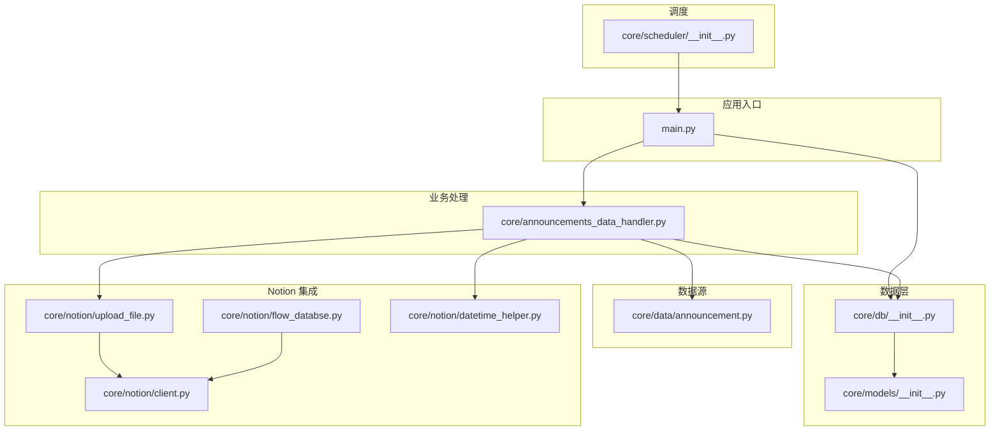
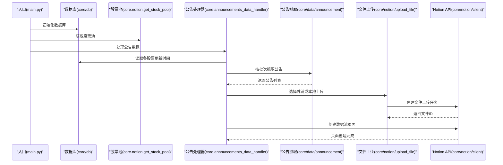
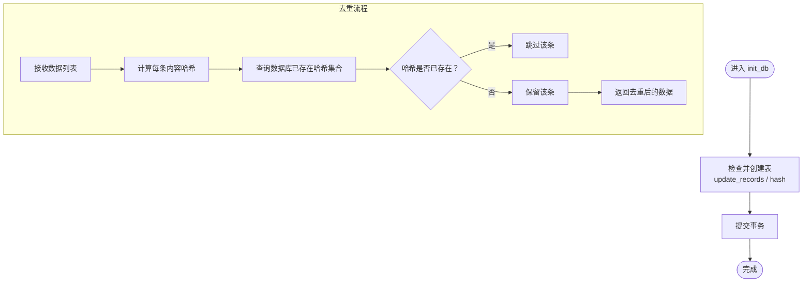
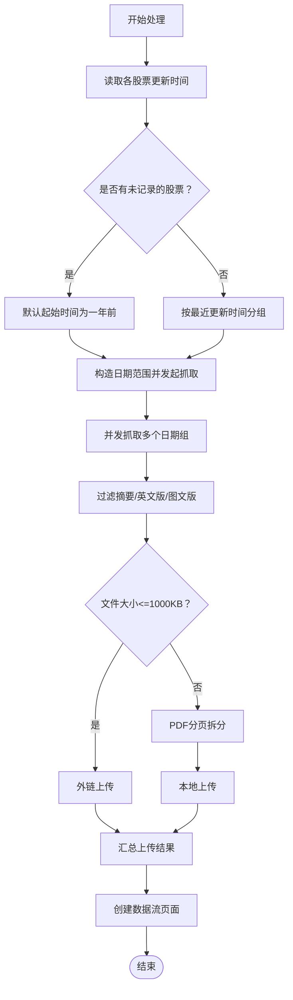
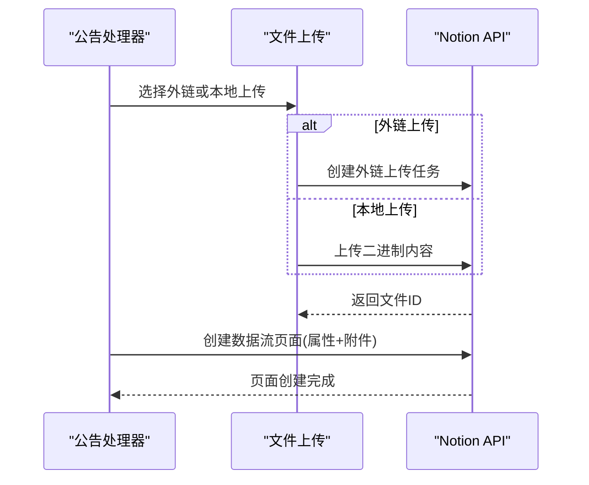
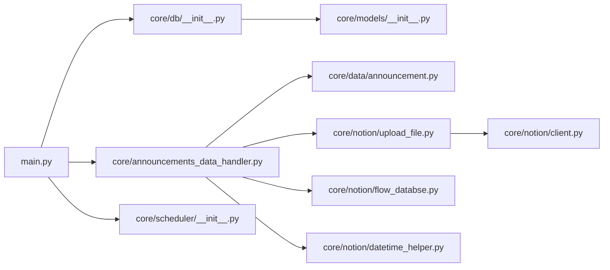
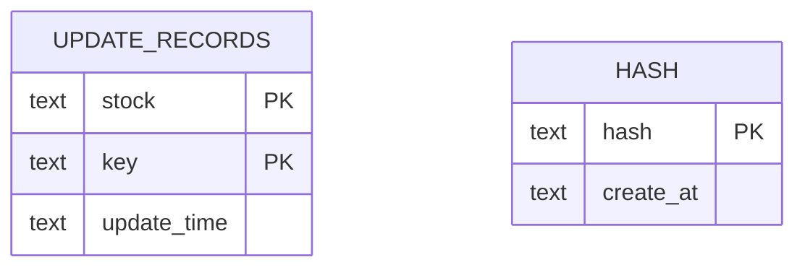

# 部署配置

<cite>
**本文引用的文件**
- [main.py](file://main.py)
- [.gitignore](file://.gitignore)
- [core/db/__init__.py](file://core/db/__init__.py)
- [core/data/announcement.py](file://core/data/announcement.py)
- [core/announcements_data_handler.py](file://core/announcements_data_handler.py)
- [core/models/__init__.py](file://core/models/__init__.py)
- [core/notion/client.py](file://core/notion/client.py)
- [core/notion/flow_databse.py](file://core/notion/flow_databse.py)
- [core/notion/upload_file.py](file://core/notion/upload_file.py)
- [core/notion/datetime_helper.py](file://core/notion/datetime_helper.py)
- [core/scheduler/__init__.py](file://core/scheduler/__init__.py)
</cite>

## 目录
1. [简介](#简介)
2. [项目结构](#项目结构)
3. [核心组件](#核心组件)
4. [架构总览](#架构总览)
5. [详细组件分析](#详细组件分析)
6. [依赖关系分析](#依赖关系分析)
7. [性能考量](#性能考量)
8. [故障排查指南](#故障排查指南)
9. [结论](#结论)
10. [附录](#附录)

## 简介
本部署配置文档面向“股票公告自动化系统”，目标是帮助运维与开发团队在不同环境下完成生产级部署与运行维护。文档覆盖以下方面：
- 生产环境部署步骤与系统要求
- 环境变量配置与配置文件管理
- 数据库初始化流程与数据模型
- Docker 容器化部署、云平台部署与本地部署方案
- 监控、日志、备份与故障恢复策略
- 部署检查清单、健康检查与运维指南
- 安全配置、权限管理与合规建议

## 项目结构
该项目采用模块化组织，核心功能围绕“公告抓取—去重校验—文件上传—Notion 页面创建”展开，数据库使用嵌入式 SQLite，通过异步客户端与 Notion API 交互。

图表来源
- [main.py](file://main.py#L1-L40)
- [core/db/__init__.py](file://core/db/__init__.py#L1-L218)
- [core/data/announcement.py](file://core/data/announcement.py#L1-L141)
- [core/announcements_data_handler.py](file://core/announcements_data_handler.py#L1-L116)
- [core/notion/client.py](file://core/notion/client.py#L1-L6)
- [core/notion/flow_databse.py](file://core/notion/flow_databse.py#L1-L67)
- [core/notion/upload_file.py](file://core/notion/upload_file.py#L1-L180)
- [core/notion/datetime_helper.py](file://core/notion/datetime_helper.py#L1-L38)
- [core/scheduler/__init__.py](file://core/scheduler/__init__.py#L1-L7)

章节来源
- [main.py](file://main.py#L1-L40)
- [.gitignore](file://.gitignore#L1-L44)

## 核心组件
- 应用入口与启动流程：加载环境变量、初始化日志、初始化数据库、拉取股票池、执行公告处理流程。
- 数据库层：SQLite 嵌入式数据库，提供连接上下文管理、去重哈希校验、更新时间记录等能力。
- 数据源层：对接巨潮资讯网公告接口，支持分页与过滤。
- Notion 集成层：封装 Notion 异步客户端、文件上传、页面创建、日期转换与类型映射。
- 调度层：基于 APScheduler 的异步调度器，支持定时任务。

章节来源
- [main.py](file://main.py#L1-L40)
- [core/db/__init__.py](file://core/db/__init__.py#L1-L218)
- [core/data/announcement.py](file://core/data/announcement.py#L1-L141)
- [core/announcements_data_handler.py](file://core/announcements_data_handler.py#L1-L116)
- [core/notion/client.py](file://core/notion/client.py#L1-L6)
- [core/notion/flow_databse.py](file://core/notion/flow_databse.py#L1-L67)
- [core/notion/upload_file.py](file://core/notion/upload_file.py#L1-L180)
- [core/notion/datetime_helper.py](file://core/notion/datetime_helper.py#L1-L38)
- [core/scheduler/__init__.py](file://core/scheduler/__init__.py#L1-L7)

## 架构总览
系统采用“异步 I/O + 嵌入式数据库 + 第三方 API”的轻量架构。核心流程如下：

图表来源
- [main.py](file://main.py#L1-L40)
- [core/db/__init__.py](file://core/db/__init__.py#L1-L218)
- [core/announcements_data_handler.py](file://core/announcements_data_handler.py#L1-L116)
- [core/data/announcement.py](file://core/data/announcement.py#L1-L141)
- [core/notion/upload_file.py](file://core/notion/upload_file.py#L1-L180)
- [core/notion/client.py](file://core/notion/client.py#L1-L6)

## 详细组件分析

### 数据库初始化与去重机制
- 初始化：创建两张表，分别用于记录“股票+键”的更新时间与“哈希值”去重。
- 去重：对内容计算哈希，查询已存在哈希并过滤新数据，避免重复入库。
- 更新时间：按股票与键维度记录最近更新时间，支持增量抓取。

图表来源
- [core/db/__init__.py](file://core/db/__init__.py#L62-L94)
- [core/db/__init__.py](file://core/db/__init__.py#L97-L128)

章节来源
- [core/db/__init__.py](file://core/db/__init__.py#L1-L218)

### 公告抓取与分批处理
- 抓取接口：调用巨潮资讯网历史公告查询接口，支持分页与日期范围过滤。
- 分批策略：根据上次更新时间聚合股票，减少请求次数；默认从一年前开始增量抓取。
- PDF 处理：对大文件进行分页拆分，便于 Notion 导入限制。

图表来源
- [core/announcements_data_handler.py](file://core/announcements_data_handler.py#L21-L116)
- [core/data/announcement.py](file://core/data/announcement.py#L36-L112)
- [core/notion/upload_file.py](file://core/notion/upload_file.py#L28-L61)
- [core/notion/upload_file.py](file://core/notion/upload_file.py#L110-L121)

章节来源
- [core/announcements_data_handler.py](file://core/announcements_data_handler.py#L1-L116)
- [core/data/announcement.py](file://core/data/announcement.py#L1-L141)
- [core/notion/upload_file.py](file://core/notion/upload_file.py#L1-L180)

### Notion 集成与页面创建
- 客户端：通过环境变量注入 Token 初始化异步客户端。
- 文件上传：支持外链直传与本地内容上传，内置轮询与指数退避重试。
- 页面创建：根据类型映射与关联关系创建数据流页面，支持附加原文链接与附件。

图表来源
- [core/notion/upload_file.py](file://core/notion/upload_file.py#L124-L150)
- [core/notion/upload_file.py](file://core/notion/upload_file.py#L64-L96)
- [core/notion/flow_databse.py](file://core/notion/flow_databse.py#L25-L67)
- [core/notion/client.py](file://core/notion/client.py#L1-L6)

章节来源
- [core/notion/flow_databse.py](file://core/notion/flow_databse.py#L1-L67)
- [core/notion/upload_file.py](file://core/notion/upload_file.py#L1-L180)
- [core/notion/client.py](file://core/notion/client.py#L1-L6)

### 时间与类型映射
- 时间转换：统一使用东八区时区，日期/时间与 Notion 日期字符串互转。
- 类型映射：将“公告披露”等中文类型映射为 Notion select 字段的内部 ID。

章节来源
- [core/notion/datetime_helper.py](file://core/notion/datetime_helper.py#L1-L38)
- [core/notion/flow_databse.py](file://core/notion/flow_databse.py#L14-L20)

## 依赖关系分析
- 运行时依赖：aiosqlite、xxhash、httpx、pymupdf、notion-client、apscheduler、python-dateutil。
- 环境变量：NOTION_TOKEN、FLOW_DATABASE。
- 日志与缓存：标准库 logging、functools.lru_cache。

图表来源
- [main.py](file://main.py#L1-L40)
- [core/db/__init__.py](file://core/db/__init__.py#L1-L218)
- [core/announcements_data_handler.py](file://core/announcements_data_handler.py#L1-L116)
- [core/data/announcement.py](file://core/data/announcement.py#L1-L141)
- [core/notion/upload_file.py](file://core/notion/upload_file.py#L1-L180)
- [core/notion/client.py](file://core/notion/client.py#L1-L6)
- [core/notion/flow_databse.py](file://core/notion/flow_databse.py#L1-L67)
- [core/models/__init__.py](file://core/models/__init__.py#L1-L8)
- [core/notion/datetime_helper.py](file://core/notion/datetime_helper.py#L1-L38)
- [core/scheduler/__init__.py](file://core/scheduler/__init__.py#L1-L7)

章节来源
- [main.py](file://main.py#L1-L40)
- [core/scheduler/__init__.py](file://core/scheduler/__init__.py#L1-L7)

## 性能考量
- 异步 I/O：HTTP 请求与数据库操作均采用异步，提升吞吐。
- 批量与分页：对巨潮接口进行分组与分页，减少请求次数。
- 哈希去重：通过内容哈希快速判断重复，避免重复入库与上传。
- 文件拆分：对大 PDF 进行分页拆分，满足 Notion 导入限制。
- 重试策略：文件上传采用指数退避轮询，提高导入成功率。

章节来源
- [core/data/announcement.py](file://core/data/announcement.py#L79-L92)
- [core/db/__init__.py](file://core/db/__init__.py#L97-L128)
- [core/notion/upload_file.py](file://core/notion/upload_file.py#L153-L176)

## 故障排查指南
- 环境变量缺失
  - 症状：Notion 客户端初始化失败或页面创建报错。
  - 排查：确认 NOTION_TOKEN 是否正确设置；确认 FLOW_DATABASE 是否存在且可访问。
- 数据库异常
  - 症状：初始化失败或查询/写入异常。
  - 排查：检查数据库文件路径与权限；确认 SQLite 可用；查看事务提交/回滚逻辑。
- 文件上传失败
  - 症状：外链/本地上传失败或超时。
  - 排查：检查网络连通性；查看轮询状态与错误码；确认 Notion 导入配额与限制。
- 页面创建失败
  - 症状：创建页面报错。
  - 排查：核对类型映射、关联关系与属性完整性；查看日志输出。

章节来源
- [core/notion/client.py](file://core/notion/client.py#L1-L6)
- [core/notion/flow_databse.py](file://core/notion/flow_databse.py#L59-L67)
- [core/notion/upload_file.py](file://core/notion/upload_file.py#L153-L176)
- [core/db/__init__.py](file://core/db/__init__.py#L45-L51)

## 结论
本系统通过异步与嵌入式数据库实现了轻量、可扩展的公告自动化采集与归档能力。生产部署需重点关注环境变量、数据库初始化、文件上传稳定性与页面创建一致性。建议结合调度器实现定时任务，并完善监控与日志体系以保障长期稳定运行。

## 附录

### 系统要求
- Python 版本：建议使用与项目依赖兼容的版本（详见依赖声明）。
- 运行时依赖：aiosqlite、xxhash、httpx、pymupdf、notion-client、apscheduler、python-dateutil。
- 存储：SQLite 文件位于数据库模块目录内，需具备读写权限。
- 网络：可访问巨潮资讯网与 Notion API。

章节来源
- [core/db/__init__.py](file://core/db/__init__.py#L1-L218)
- [core/data/announcement.py](file://core/data/announcement.py#L1-L141)
- [core/notion/upload_file.py](file://core/notion/upload_file.py#L1-L180)

### 环境变量配置
- NOTION_TOKEN：Notion 私人集成 Token。
- FLOW_DATABASE：数据流数据库的 ID 或可识别标识。
- LOG_LEVEL：可通过环境变量控制日志级别（当前入口使用 DEBUG）。

章节来源
- [core/notion/client.py](file://core/notion/client.py#L1-L6)
- [core/notion/flow_databse.py](file://core/notion/flow_databse.py#L22-L22)
- [main.py](file://main.py#L15-L17)

### 数据库初始化流程
- 初始化步骤
  - 启动时调用数据库初始化函数，创建 update_records 与 hash 两张表。
  - 通过连接上下文管理器确保事务提交与回滚。
- 数据模型
  - update_records：主键(股票, 键)，记录最近更新时间。
  - hash：主键(哈希)，记录创建时间。

图表来源
- [core/db/__init__.py](file://core/db/__init__.py#L77-L93)

章节来源
- [core/db/__init__.py](file://core/db/__init__.py#L62-L94)

### 配置文件与环境变量管理
- .env 文件：用于本地开发加载环境变量（由入口脚本加载）。
- .gitignore：忽略虚拟环境、IDE、数据库文件与 .env 文件，避免敏感信息泄露。

章节来源
- [main.py](file://main.py#L3-L6)
- [.gitignore](file://.gitignore#L38-L44)

### 部署方案

#### 本地部署
- 步骤
  - 准备 Python 运行环境与依赖。
  - 设置环境变量（NOTION_TOKEN、FLOW_DATABASE）。
  - 运行入口脚本，触发数据库初始化与公告处理流程。
- 适用场景：开发调试、小规模运行。

章节来源
- [main.py](file://main.py#L1-L40)
- [core/db/__init__.py](file://core/db/__init__.py#L62-L94)

#### Docker 容器化部署（建议）
- 构建镜像
  - 基于官方 Python 运行时镜像，安装系统依赖与 Python 依赖。
  - 复制项目代码，设置工作目录与环境变量。
- 运行容器
  - 挂载持久化卷用于 SQLite 数据文件。
  - 通过环境变量注入 NOTION_TOKEN、FLOW_DATABASE。
  - 可选：使用定时任务或调度器实现周期性执行。
- 优势：隔离性强、便于迁移与扩展。

[本节为通用容器化建议，不直接对应具体源文件]

#### 云平台部署（建议）
- 方案选择
  - 无服务器函数：适合短期任务与低频触发。
  - 容器服务：适合长期运行与可扩展场景。
  - 任务编排：结合调度器实现定时执行。
- 安全
  - 使用平台密钥管理服务存储 Token。
  - 限制网络访问与最小权限原则。
- 监控
  - 开启日志导出与指标上报。
  - 设置健康检查与告警阈值。

[本节为通用云平台建议，不直接对应具体源文件]

### 监控、日志与备份

- 日志
  - 入口脚本使用 DEBUG 级别日志；可在运行环境中调整。
  - 各模块使用标准库 logging 输出关键信息与错误。
- 监控
  - 建议接入平台日志服务与指标监控。
  - 对公告抓取、文件上传、页面创建等关键环节增加计数与耗时指标。
- 备份
  - 备份 SQLite 数据库文件与重要配置。
  - 建立定期快照与异地容灾策略。
- 故障恢复
  - 快速回滚至上一稳定版本。
  - 基于哈希去重与更新时间记录实现断点续跑。

章节来源
- [main.py](file://main.py#L15-L17)
- [core/notion/upload_file.py](file://core/notion/upload_file.py#L153-L176)
- [core/db/__init__.py](file://core/db/__init__.py#L97-L128)

### 部署检查清单
- 环境变量
  - [ ] 已设置 NOTION_TOKEN
  - [ ] 已设置 FLOW_DATABASE
- 数据库
  - [ ] 数据库初始化成功
  - [ ] update_records 与 hash 表存在
- 网络
  - [ ] 可访问巨潮资讯网接口
  - [ ] 可访问 Notion API
- 运行
  - [ ] 启动脚本可正常执行
  - [ ] 日志输出正常
- 安全
  - [ ] .env 未纳入版本控制
  - [ ] 仅授予必要权限的 Token

章节来源
- [.gitignore](file://.gitignore#L38-L44)
- [core/db/__init__.py](file://core/db/__init__.py#L62-L94)
- [core/notion/client.py](file://core/notion/client.py#L1-L6)

### 健康检查与运维指南
- 健康检查
  - 数据库可用性：尝试查询 update_records。
  - Notion 连通性：尝试创建一个测试页面或文件上传。
  - 网络连通性：访问公告接口与静态资源地址。
- 运维建议
  - 定期巡检日志与错误统计。
  - 对大文件上传设置超时与重试上限。
  - 基于哈希与更新时间实现幂等与断点续跑。

章节来源
- [core/db/__init__.py](file://core/db/__init__.py#L153-L185)
- [core/notion/upload_file.py](file://core/notion/upload_file.py#L153-L176)

### 安全配置、权限管理与合规
- 安全配置
  - 使用 HTTPS 与最小权限 Token。
  - 限制数据库文件与 .env 的访问权限。
- 权限管理
  - 仅授予必要的数据库与 Notion 写入权限。
  - 使用平台密钥管理与环境变量注入。
- 合规要求
  - 遵守巨潮资讯网与 Notion 的使用条款。
  - 对个人数据与文件内容遵循隐私保护与数据留存要求。

[本节为通用安全与合规建议，不直接对应具体源文件]