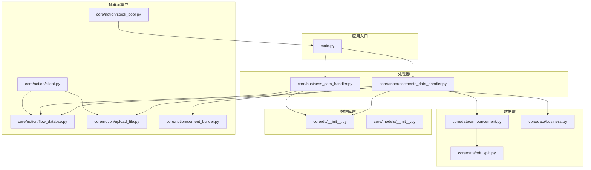
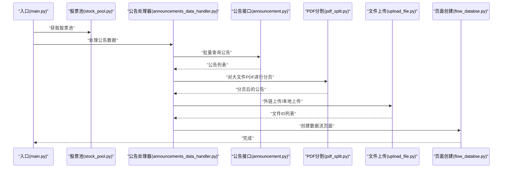
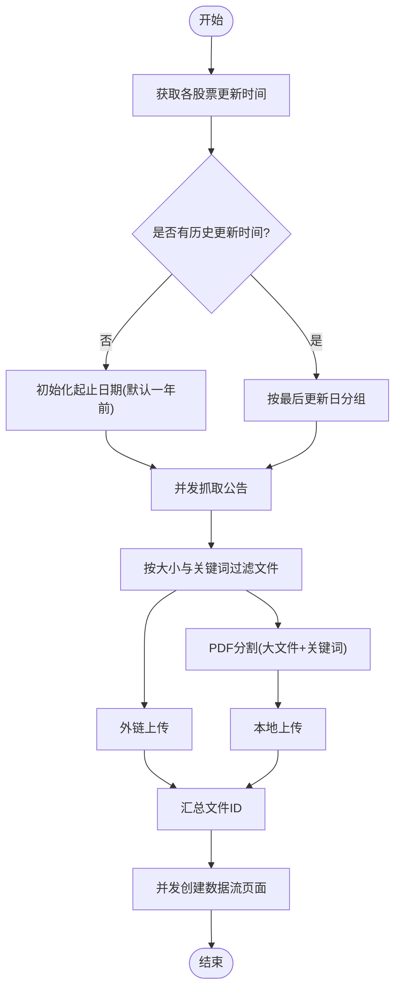
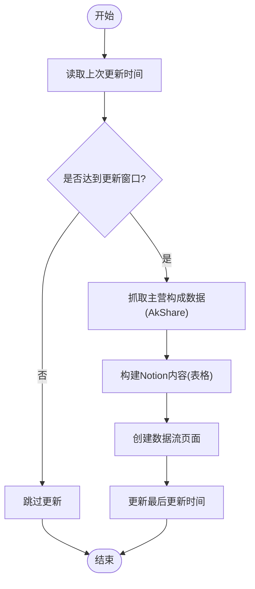
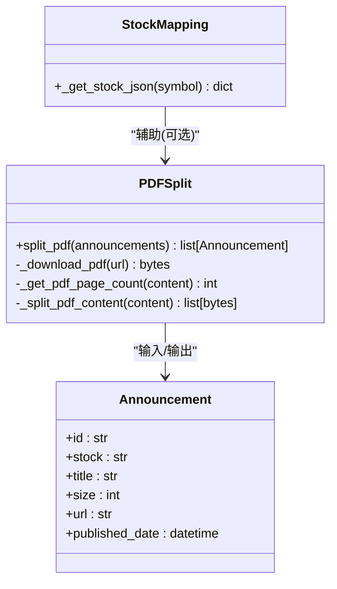
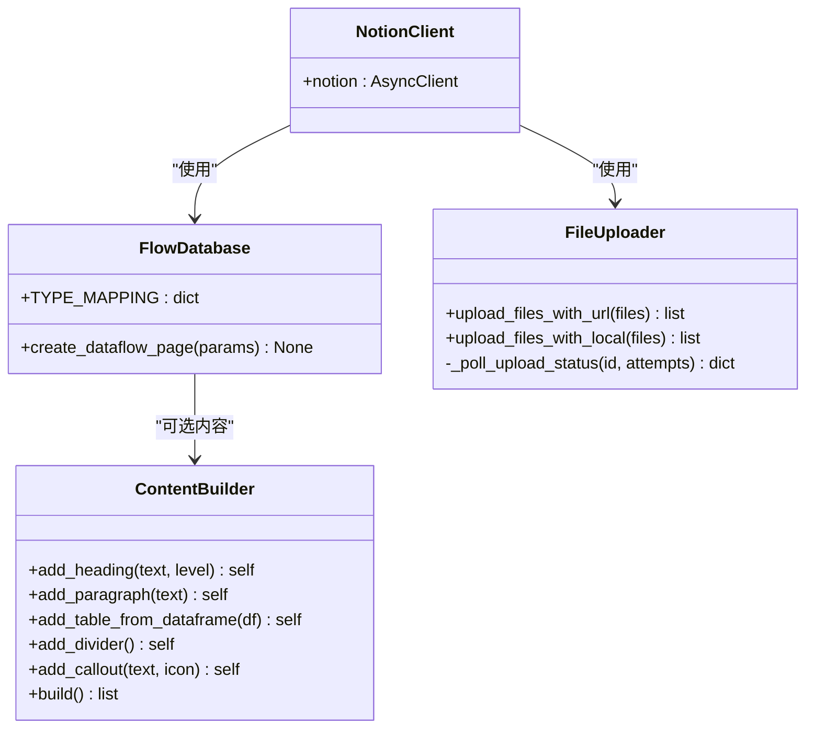
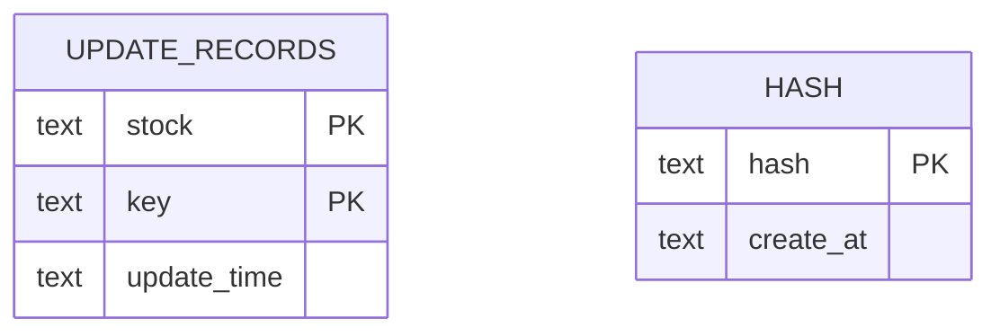
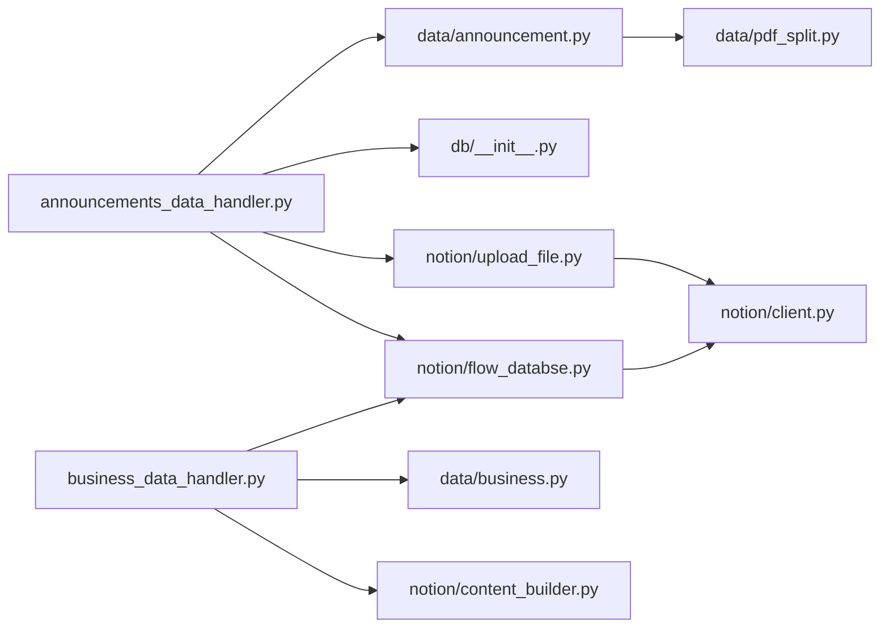

# 项目概述

<cite>
**本文档引用的文件**
- [main.py](file://main.py)
- [pyproject.toml](file://pyproject.toml)
- [core/announcements_data_handler.py](file://core/announcements_data_handler.py)
- [core/business_data_handler.py](file://core/business_data_handler.py)
- [core/data/announcement.py](file://core/data/announcement.py)
- [core/data/business.py](file://core/data/business.py)
- [core/data/pdf_split.py](file://core/data/pdf_split.py)
- [core/db/__init__.py](file://core/db/__init__.py)
- [core/models/__init__.py](file://core/models/__init__.py)
- [core/notion/client.py](file://core/notion/client.py)
- [core/notion/flow_databse.py](file://core/notion/flow_databse.py)
- [core/notion/upload_file.py](file://core/notion/upload_file.py)
- [core/notion/content_builder.py](file://core/notion/content_builder.py)
- [core/notion/stock_pool.py](file://core/notion/stock_pool.py)
- [tests/test_announcements_data_handler.py](file://tests/test_announcements_data_handler.py)
- [tests/test_models.py](file://tests/test_models.py)
- [module_test.py](file://module_test.py)
</cite>

## 目录
1. [引言](#引言)
2. [项目结构](#项目结构)
3. [核心组件](#核心组件)
4. [架构总览](#架构总览)
5. [详细组件分析](#详细组件分析)
6. [依赖关系分析](#依赖关系分析)
7. [性能考量](#性能考量)
8. [故障排除指南](#故障排除指南)
9. [结论](#结论)
10. [附录](#附录)

## 引言
本项目旨在实现股票公告的自动化采集与同步，核心目标是从巨潮资讯网批量抓取上市公司公告，并将这些信息智能地同步到 Notion 数据库中，形成统一的“资讯流”页面。系统采用异步编程模型，结合模块化设计与并发处理能力，显著提升数据采集与导入效率。技术栈涵盖 Python 3.8+、asyncio、httpx、aiosqlite、pymupdf、notion-client 等，既满足初学者的学习需求，也为有经验的开发者提供了清晰的扩展路径。

## 项目结构
项目采用按功能域划分的模块化组织方式，核心目录与职责如下：
- core/data：数据采集与预处理（公告、主营构成、PDF 分割）
- core/db：本地 SQLite 异步持久化（更新时间记录、去重哈希）
- core/models：类型定义（如 NotionDate）
- core/notion：Notion 客户端、页面创建、文件上传、内容构建器、股票池读取
- core/scheduler：调度器（预留）
- core/announcements_data_handler.py：公告数据处理主流程
- core/business_data_handler.py：主营构成数据处理主流程
- tests：单元与集成测试
- main.py：应用入口，初始化数据库与调度任务
- pyproject.toml：测试配置与标记

图表来源
- [main.py](file://main.py#L20-L39)
- [core/announcements_data_handler.py](file://core/announcements_data_handler.py#L21-L116)
- [core/business_data_handler.py](file://core/business_data_handler.py#L17-L108)
- [core/data/announcement.py](file://core/data/announcement.py#L36-L112)
- [core/data/pdf_split.py](file://core/data/pdf_split.py#L15-L73)
- [core/db/__init__.py](file://core/db/__init__.py#L62-L217)
- [core/models/__init__.py](file://core/models/__init__.py#L1-L8)
- [core/notion/client.py](file://core/notion/client.py#L1-L6)
- [core/notion/flow_databse.py](file://core/notion/flow_databse.py#L25-L67)
- [core/notion/upload_file.py](file://core/notion/upload_file.py#L28-L180)
- [core/notion/content_builder.py](file://core/notion/content_builder.py#L1-L103)
- [core/notion/stock_pool.py](file://core/notion/stock_pool.py#L23-L52)

章节来源
- [main.py](file://main.py#L1-L40)
- [pyproject.toml](file://pyproject.toml#L1-L21)

## 核心组件
- 异步入口与调度
  - 应用入口负责加载环境变量、初始化数据库、拉取股票池、并调度公告与主营构成处理流程。
- 公告数据处理器
  - 负责根据股票池与更新时间策略批量抓取公告、按大小与关键词策略选择外链或本地上传、PDF 分割、创建 Notion 页面。
- 主营构成数据处理器
  - 负责按半年周期判断是否需要更新，抓取 AkShare 数据，构建 Notion 内容块，创建数据流页面并更新时间戳。
- 数据采集与预处理
  - 巨潮资讯网公告接口封装、主营构成数据抓取、PDF 分割与页码标注。
- Notion 集成
  - 异步客户端、页面创建、文件上传（外链与本地）、内容构建器、股票池读取。
- 数据库与模型
  - 异步 SQLite 存储更新时间与去重哈希，类型别名 NotionDate 统一日期格式。

章节来源
- [main.py](file://main.py#L20-L39)
- [core/announcements_data_handler.py](file://core/announcements_data_handler.py#L21-L116)
- [core/business_data_handler.py](file://core/business_data_handler.py#L17-L108)
- [core/data/announcement.py](file://core/data/announcement.py#L36-L112)
- [core/data/business.py](file://core/data/business.py#L33-L96)
- [core/data/pdf_split.py](file://core/data/pdf_split.py#L15-L73)
- [core/notion/flow_databse.py](file://core/notion/flow_databse.py#L25-L67)
- [core/notion/upload_file.py](file://core/notion/upload_file.py#L28-L180)
- [core/notion/content_builder.py](file://core/notion/content_builder.py#L1-L103)
- [core/notion/stock_pool.py](file://core/notion/stock_pool.py#L23-L52)
- [core/db/__init__.py](file://core/db/__init__.py#L62-L217)
- [core/models/__init__.py](file://core/models/__init__.py#L1-L8)

## 架构总览
系统采用“异步采集 + 并发上传 + 智能分页 + 页面创建”的流水线式架构。数据从巨潮资讯网与 AkShare 接口异步抓取，经过本地缓存与去重策略后，统一写入 Notion 数据库。并发策略贯穿文件下载、PDF 分割、文件上传与页面创建，显著提升吞吐量。

图表来源
- [main.py](file://main.py#L20-L39)
- [core/notion/stock_pool.py](file://core/notion/stock_pool.py#L23-L52)
- [core/announcements_data_handler.py](file://core/announcements_data_handler.py#L21-L116)
- [core/data/announcement.py](file://core/data/announcement.py#L36-L112)
- [core/data/pdf_split.py](file://core/data/pdf_split.py#L15-L73)
- [core/notion/upload_file.py](file://core/notion/upload_file.py#L28-L180)
- [core/notion/flow_databse.py](file://core/notion/flow_databse.py#L25-L67)

## 详细组件分析

### 公告数据处理器（异步并发流水线）
- 更新时间策略
  - 为空的股票默认从一年前开始；已有更新时间的股票按最后更新日期分组，减少重复请求。
- 并发抓取与聚合
  - 使用 asyncio.gather 并发执行多组查询，随后展平为单一公告列表。
- 文件上传策略
  - 小文件或不含关键词的文件走外链上传；大文件且含关键词的文件先分割再本地上传。
- 页面创建
  - 为每条公告创建数据流页面，填充标题、发布时间、来源接口、数据类型、关联股票、附件ID与原文链接。

图表来源
- [core/announcements_data_handler.py](file://core/announcements_data_handler.py#L21-L116)
- [core/data/announcement.py](file://core/data/announcement.py#L36-L112)
- [core/data/pdf_split.py](file://core/data/pdf_split.py#L15-L73)
- [core/notion/upload_file.py](file://core/notion/upload_file.py#L28-L180)
- [core/notion/flow_databse.py](file://core/notion/flow_databse.py#L25-L67)

章节来源
- [core/announcements_data_handler.py](file://core/announcements_data_handler.py#L21-L116)

### 主营构成数据处理器（半载更新策略）
- 更新判定
  - 仅在季度末（6月30日、12月31日）之后才允许更新，避免重复抓取。
- 数据抓取与内容构建
  - 通过 AkShare 获取主营构成数据，按行业/产品/地区三类构建表格内容。
- 页面创建与时间更新
  - 创建数据流页面并更新数据库中的最后更新时间。

图表来源
- [core/business_data_handler.py](file://core/business_data_handler.py#L17-L108)
- [core/data/business.py](file://core/data/business.py#L33-L96)
- [core/notion/content_builder.py](file://core/notion/content_builder.py#L1-L103)
- [core/notion/flow_databse.py](file://core/notion/flow_databse.py#L25-L67)
- [core/db/__init__.py](file://core/db/__init__.py#L153-L217)

章节来源
- [core/business_data_handler.py](file://core/business_data_handler.py#L17-L108)
- [core/data/business.py](file://core/data/business.py#L33-L96)

### 数据采集与预处理
- 公告接口
  - 封装巨潮资讯网历史公告查询接口，支持分页与过滤摘要/英文版/图文版等无关版本。
- PDF 分割
  - 基于 pymupdf 对大文档进行分段，保留页码范围标注，便于后续上传与检索。
- 股票映射
  - 缓存巨潮股票代码与机构ID映射，减少重复网络请求。

图表来源
- [core/data/announcement.py](file://core/data/announcement.py#L12-L34)
- [core/data/pdf_split.py](file://core/data/pdf_split.py#L15-L73)
- [core/data/announcement.py](file://core/data/announcement.py#L115-L141)

章节来源
- [core/data/announcement.py](file://core/data/announcement.py#L36-L141)
- [core/data/pdf_split.py](file://core/data/pdf_split.py#L15-L128)

### Notion 集成
- 客户端与环境
  - 通过环境变量加载 Notion Token，创建异步客户端实例。
- 页面创建
  - 统一属性映射（标题、发布时间、来源接口、数据类型、关联股票、附件、原文链接），支持条件字段。
- 文件上传
  - 支持外链与本地上传两种模式，内置轮询机制与指数退避重试，保障上传稳定性。
- 内容构建器
  - 提供标题、段落、表格、分隔线、Callout 等常用块的构建方法，便于结构化展示。

图表来源
- [core/notion/client.py](file://core/notion/client.py#L1-L6)
- [core/notion/flow_databse.py](file://core/notion/flow_databse.py#L25-L67)
- [core/notion/upload_file.py](file://core/notion/upload_file.py#L28-L180)
- [core/notion/content_builder.py](file://core/notion/content_builder.py#L1-L103)

章节来源
- [core/notion/client.py](file://core/notion/client.py#L1-L6)
- [core/notion/flow_databse.py](file://core/notion/flow_databse.py#L25-L67)
- [core/notion/upload_file.py](file://core/notion/upload_file.py#L28-L180)
- [core/notion/content_builder.py](file://core/notion/content_builder.py#L1-L103)

### 数据库与模型
- 数据库初始化
  - 创建 update_records 与 hash 两张表，分别用于记录更新时间与去重哈希。
- 更新时间管理
  - 读取/更新两条原子操作，保证并发一致性。
- 去重哈希
  - 对内容序列化后计算 xxhash，批量查询与保存，避免重复导入。
- 类型别名
  - NotionDate 作为字符串别名，统一日期格式与比较行为。

图表来源
- [core/db/__init__.py](file://core/db/__init__.py#L77-L94)
- [core/db/__init__.py](file://core/db/__init__.py#L153-L217)
- [core/models/__init__.py](file://core/models/__init__.py#L1-L8)

章节来源
- [core/db/__init__.py](file://core/db/__init__.py#L62-L217)
- [core/models/__init__.py](file://core/models/__init__.py#L1-L8)

## 依赖关系分析
- 模块耦合
  - 处理器模块依赖数据采集与 Notion 集成模块，数据库模块提供跨模块共享的持久化能力。
- 外部依赖
  - httpx（异步HTTP）、aiosqlite（异步SQLite）、pymupdf（PDF处理）、notion-client（Notion SDK）、xxhash（去重哈希）。
- 并发与缓存
  - 使用 asyncio.gather 实现高并发；alru_cache 缓存巨潮股票映射；轮询上传状态保障可靠性。

图表来源
- [core/announcements_data_handler.py](file://core/announcements_data_handler.py#L7-L16)
- [core/business_data_handler.py](file://core/business_data_handler.py#L4-L12)
- [core/data/announcement.py](file://core/data/announcement.py#L6-L7)
- [core/data/pdf_split.py](file://core/data/pdf_split.py#L4-L5)
- [core/notion/upload_file.py](file://core/notion/upload_file.py#L6-L7)
- [core/notion/client.py](file://core/notion/client.py#L3)

章节来源
- [core/announcements_data_handler.py](file://core/announcements_data_handler.py#L1-L116)
- [core/business_data_handler.py](file://core/business_data_handler.py#L1-L108)
- [core/data/announcement.py](file://core/data/announcement.py#L1-L141)
- [core/data/pdf_split.py](file://core/data/pdf_split.py#L1-L128)
- [core/notion/upload_file.py](file://core/notion/upload_file.py#L1-L180)
- [core/notion/client.py](file://core/notion/client.py#L1-L6)

## 性能考量
- 异步并发
  - 使用 asyncio.gather 并发抓取与上传，显著缩短整体耗时。
- 请求合并
  - 按更新时间分组，合并同一日期的股票查询，降低接口调用次数。
- 上传优化
  - 外链上传与本地上传分流，PDF 分割避免单次上传过大导致失败。
- 缓存与去重
  - alru_cache 减少重复网络请求；哈希去重避免重复入库。
- 轮询与退避
  - 文件上传轮询采用指数退避，平衡成功率与资源占用。

## 故障排除指南
- 环境变量缺失
  - 确保设置 NOTION_TOKEN 与 STOCK_POOL、FLOW_DATABASE 等环境变量。
- Notion API 失败
  - 检查数据源 ID 与权限；查看日志中的错误堆栈；确认 TYPE_MAPPING 与属性键一致。
- 文件上传失败
  - 查看轮询返回的错误信息；确认 URL 可访问性与 PDF 分割是否成功。
- 数据库异常
  - 检查 update_records 与 hash 表结构；确认事务提交与回滚逻辑。
- 单元测试运行
  - 使用 pytest 标记运行异步测试，参考测试配置与标记定义。

章节来源
- [pyproject.toml](file://pyproject.toml#L1-L21)
- [tests/test_announcements_data_handler.py](file://tests/test_announcements_data_handler.py#L1-L367)
- [tests/test_models.py](file://tests/test_models.py#L1-L67)
- [core/notion/flow_databse.py](file://core/notion/flow_databse.py#L65-L67)
- [core/notion/upload_file.py](file://core/notion/upload_file.py#L153-L177)
- [core/db/__init__.py](file://core/db/__init__.py#L28-L52)

## 结论
本项目通过异步编程与模块化设计，实现了从巨潮资讯网到 Notion 的高效自动化公告同步。其并发抓取、智能分页与上传、统一页面创建的流水线，既保证了数据质量，也提升了处理吞吐量。建议在生产环境中结合调度器与监控体系，进一步增强稳定性与可观测性。

## 附录
- 快速开始
  - 安装依赖：pip install -r requirements.txt（若存在）或安装 httpx、aiosqlite、pymupdf、notion-client、xxhash、akshare、pytest 等。
  - 设置环境变量：NOTION_TOKEN、STOCK_POOL、FLOW_DATABASE。
  - 运行入口：python main.py。
  - 运行测试：pytest tests/ -m asyncio。
- 示例脚本
  - 单文件上传示例：module_test.py。

章节来源
- [module_test.py](file://module_test.py#L1-L7)
- [pyproject.toml](file://pyproject.toml#L1-L21)